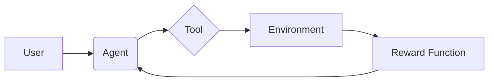

# Agentic RLでGPT-5を超える？Prime Intellect Labの挑戦

近年、大規模言語モデル（LLM）を活用した自律エージェントが注目を集めています。しかし、これらのエージェントが真に自律的に行動するためには、Web検索や書類作成といったツールを適切に利用する能力が不可欠です。本記事では、松尾研究所が提唱する「Tool/Agentic Reinforcement Learning (Agentic RL)」に焦点を当て、その概要、技術的な詳細、そしてWebエンジニアが実践に活かせる示唆について解説します。Agentic RLは、4BモデルでもGPT-5を超える可能性を秘めていると言われています。

## Agentic RLとは？その概要

Agentic RLは、LLMにツール利用能力を付与するための学習手法です。従来のLLMは、コンテキスト内にツールに関する情報を埋め込むことでツールを利用しますが、Agentic RLでは、**事後学習**の段階でツール利用方法を教え込みます。これにより、LLMはより効率的にツールを使いこなせるようになると期待されています。

> "昨今自律的な行動をとることのできるエージェントが流行っていますが，これらはLLMに外部環境との作用が可能なツールを持たせたものとみなすことができます．なのでAgentが適切に行動するにはWeb検索や書類作成等のツールを適切に利用することが必須であり，そのためには正しい指示（ツールのマニュアル）やロバストなツール設計（MCPといったプロトコル化）が重要になります．"
>
> 出典: 松尾研究所. "Prime Intellect Labで始めるAgentic RL ―― 4BモデルでGPT-5を超える"
> URL: https://zenn.dev/mkj/articles/prime-rl-20260401
> (取得日: 2024年05月02日)

このアプローチは、LLMの推論時にコンテキストを肥大化させる必要性を軽減し、より効率的な学習を可能にすると考えられます。特に、大規模なLLMではコンテキスト長がボトルネックになることが多いため、Agentic RLは有効な解決策となり得ます。

## Agentic RLの技術詳細：実装例

Agentic RLの実装には、強化学習の概念が用いられます。エージェントは、環境（ツール）とインタラクションを行い、その結果に基づいて報酬を受け取ります。この報酬を最大化するように、エージェントはツール利用方法を学習します。

以下に、TypeScriptで記述された簡単なAgentic RLの実装例を示します。この例では、単純な計算ツールを利用するエージェントを想定しています。

```typescript
// ツールインターフェース
interface Tool {
  name: string;
  execute(input: string): string;
}

// 計算ツール
class CalculatorTool implements Tool {
  name = "calculator";
  execute(input: string): string {
    try {
      const result = eval(input); // 危険なので、実際には安全な計算式パーサを使用する
      return result.toString();
    } catch (error) {
      return "Error: Invalid input";
    }
  }
}

// エージェント
class Agent {
  tool: Tool;
  learningRate: number;

  constructor(tool: Tool, learningRate: number) {
    this.tool = tool;
    this.learningRate = learningRate;
  }

  // 行動（ツール利用）
  act(input: string): string {
    try {
      return this.tool.execute(input);
    } catch (error) {
      return "Error: Could not execute tool";
    }
  }
}

// 環境
class Environment {
  agent: Agent;

  constructor(agent: Agent) {
    this.agent = agent;
  }

  // エージェントに報酬を与える
  provideReward(action: string, expectedResult: string): number {
    if (action === expectedResult) {
      return 1; // 成功報酬
    } else {
      return -0.1; // 失敗ペナルティ
    }
  }
}

// 初期化
const calculatorTool = new CalculatorTool();
const agent = new Agent(calculatorTool, 0.1);
const environment = new Environment(agent);

// シミュレーション
const userInput = "2 + 2";
const action = agent.act(userInput);
const expectedResult = "4";
const reward = environment.provideReward(action, expectedResult);

console.log(`User Input: ${userInput}`);
console.log(`Action: ${action}`);
console.log(`Reward: ${reward}`);
```

このコードは、非常に簡略化された例ですが、Agentic RLの基本的な構造を示しています。実際には、より複雑なツールや報酬関数、そしてより洗練された強化学習アルゴリズムを用いる必要があります。

**補足:** `eval()`関数はセキュリティ上のリスクがあるため、実際のアプリケーションでは、安全な計算式パーサを使用することを強く推奨します。

## アーキテクチャ図

以下は、Agentic RLのアーキテクチャ図です。この図は、エージェント、ツール、環境、そして報酬関数の間の関係を示しています。



この図からわかるように、エージェントはユーザーからの入力を受け取り、ツールを利用して環境とインタラクションします。環境は、エージェントの行動に基づいて状態を変化させ、報酬関数は、エージェントの行動の良さを評価します。

## 実践への示唆

Agentic RLは、Webエンジニアにとって、以下のような実践的な示唆を与えます。

*   **ツール設計の重要性:** Agentic RLでは、ツールの設計がエージェントの性能に大きく影響します。Webエンジニアは、ツールを使いやすく、効率的に利用できるように設計する必要があります。
*   **報酬関数の設計:** 報酬関数は、エージェントが何を学ぶべきかを定義します。Webエンジニアは、エージェントの目的に合った適切な報酬関数を設計する必要があります。
*   **MCP (Modular Component Protocol) の活用:**  > "そうしたなか，ツールの利用方法を推論時にコンテキストで渡すのでなく，事後学習のタイミングであらかじめ教える「Tool/Agentic Reinforcement Learning」（以後 Agent..."
>
> 出典: 松尾研究所. "Prime Intellect Labで始めるAgentic RL ―― 4BモデルでGPT-5を超える"
> URL: https://zenn.dev/mkj/articles/prime-rl-20260401
> (取得日: 2024年05月02日)
MCPのようなプロトコル化されたツール設計は、Agentic RLの学習効率を高めるために不可欠です。
*   **4Bモデルの活用:** Agentic RLは、大規模なLLMだけでなく、比較的小規模な4Bモデルでも高い性能を発揮する可能性があります。Webエンジニアは、リソースの制約がある環境でもAgentic RLを活用できる可能性があります。

## まとめ

Agentic RLは、LLMにツール利用能力を付与するための革新的な学習手法です。事後学習によってツール利用方法を教え込むことで、LLMはより効率的にツールを使いこなせるようになると期待されています。Webエンジニアは、ツール設計、報酬関数設計、MCPの活用といった観点からAgentic RLを実践に活かすことができます。Agentic RLは、4BモデルでもGPT-5を超える可能性を秘めており、今後のLLM開発に大きな影響を与えると考えられます。

## 参考文献

*   松尾研究所. "Prime Intellect Labで始めるAgentic RL ―― 4BモデルでGPT-5を超える"
    URL: https://zenn.dev/mkj/articles/prime-rl-20260401
    (取得日: 2024年05月02日)
*   強化学習に関する参考文献 (例: Sutton & Barto, Reinforcement Learning: An Introduction)
*   Modular Component Protocol (MCP) に関する資料 (関連情報があれば追記)

