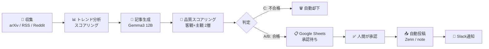
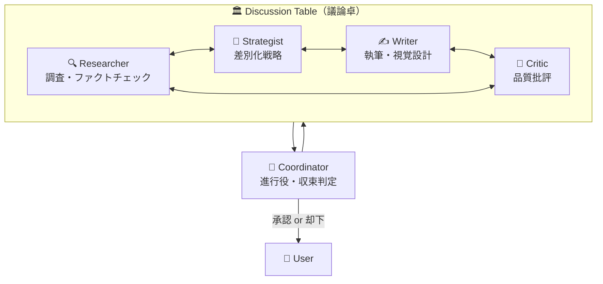

## はじめに — なぜ「AIが書く」だけでは足りないのか

LLMに「記事を書いて」と頼めば、それなりの文章は出てくる。しかし**品質のばらつき**が大きく、ファクトチェックも甘い。AI記事量産時代において差別化できるのは、**生成プロセス自体の設計**だ。

本記事では、5つの専門AIエージェントが「専門家会議」形式で議論し、収集から投稿まで完全自動で行うシステムの設計と実装を解説する。ランニングコストは**0円**。ローカルLLMとOSSだけで構築した。

> **リポジトリ:** [github.com/kento-cell/ai-article-auto-publisher](https://github.com/kento-cell/ai-article-auto-publisher)
> ソースコード全体を公開中。

---

## システム全体像 — 収集から投稿までのパイプライン

まず全体の流れを示す。



ポイントは**品質スコアがC（不合格）の記事は人間の目に触れる前に自動却下**される点。承認ワークフローに流れるのは一定品質を超えたものだけだ。

---

## アーキテクチャ — 技術スタック

| レイヤー | 技術 | 選定理由 |
|---------|------|---------|
| LLM | Ollama + Gemma3 12B | ローカル実行、APIコスト0円 |
| 言語 | Python 3.12 | エコシステムの充実 |
| 遠隔操作 | Slack Bot (Socket Mode) | スマホから全操作可能 |
| 承認管理 | Google Sheets API | 非エンジニアでも扱える |
| Zenn投稿 | Git push (自動) | Zenn公式のGit連携 |
| note投稿 | Selenium + Brave | APIがないためブラウザ自動化 |
| 図表変換 | mermaid-cli + Playwright | Mermaid→PNG（note用） |

### ディレクトリ構成

```
ai-article-auto-publisher/
├── main.py                    # メインパイプライン
├── bot/slack_bot.py           # Slack Bot（遠隔操作）
├── collectors/                # 収集モジュール群
│   ├── arxiv_collector.py     #   arXiv論文（7カテゴリ）
│   ├── rss_collector.py       #   日本語+韓国+グルメ RSS
│   ├── reddit_collector.py    #   Reddit
│   └── trend_detector.py      #   トレンドスコア計算
├── generators/                # 生成・評価モジュール群
│   ├── local_llm.py           #   Ollama連携
│   ├── objective_scorer.py    #   客観スコア（足切り）
│   ├── subjective_evaluator.py#   主観スコア（根拠必須）
│   ├── score_aggregator.py    #   A/B/C判定
│   └── cover_generator.py     #   カバー画像自動生成
├── publishers/                # 投稿モジュール群
│   ├── zenn_publisher.py      #   Zenn（Git push）
│   ├── note_publisher.py      #   note（Selenium）
│   └── slack_notifier.py      #   Slack通知
├── utils/                     # ユーティリティ
│   ├── article_store.py       #   記事保存（JSON）
│   └── sheets_manager.py      #   Sheets 14列ダッシュボード
└── config/
    ├── prompts.yaml           # プロンプト定義
    └── settings.yaml          # システム設定
```

---

## 5エージェント協議システム — パイプライン型ではなく専門家会議

このシステムの最大の特徴は、**パイプライン型（工場ライン）ではなくディスカッション型（専門家会議）** のアーキテクチャだ。



### 各エージェントの役割

**Researcher（調査担当）** — 全ての土台を作る。一次情報の収集、ソースの信用度をTier 1〜4で評価し、主要な主張は3ソース以上でクロス検証する。この成果物の質が記事全体の信用度の上限を決める。

**Strategist（戦略担当）** — 既存記事との差別化角度を決定する。「この切り口は既にN件の記事がある」「この視点が欠けている」といった分析に基づき、コンテンツ戦略を立案する。

**Writer（執筆担当）** — リサーチブリーフと戦略ブリーフを基に、リッチテキスト記事を執筆する。Mermaid図、テーブル、コールアウト、引用ブロックなどの視覚要素を織り込む。

**Critic（批評担当）** — **常に否定から入る**。「本当にそうか？根拠は？」が基本姿勢。Researcherの調査結果とドラフトを照合し、未検証の主張が断定されていれば即座に指摘する。ただし、他エージェントがエビデンス付きで反論すれば、それは認める。

**Coordinator（統括担当）** — 議論の進行役。Writer↔Criticの議論を最大2ラウンド（例外時3ラウンド）で管理し、収束条件を判定する。

### ディスカッションの流れ

1. **Phase 1（土台構築）:** Researcherが調査し、リサーチブリーフを作成
2. **Phase 2（議論）:** 全員がリサーチブリーフを共有基盤として議論
3. **Phase 3（スコアリング）:** 議論過程のエビデンスからスコアを導出
4. **Phase 4（収束判定）:** Criticの未解消指摘が0件になったら収束

:::message
**設計上の重要ポイント:** スコアは「LLMに点数をつけさせる」のではなく、ディスカッション過程で蓄積されたエビデンスから導出する。これにより評価の透明性と再現性を確保している。
:::

---

## 品質管理 — 2層スコアリングで品質を担保する

品質評価は**客観スコア（プログラム計測）**と**主観スコア（LLM評価）**の2層構造だ。

### 客観スコア（足切り）

| 指標 | A | B | C（即不合格） |
|------|---|---|-------------|
| エビデンスレベル（Tier1-2率） | 80%以上 | 60-79% | 60%未満 |
| 引用数 | 5個以上 | 3-4個 | 0-2個 |
| 視覚要素（図表・画像） | 5個以上 | 3-4個 | 0-2個 |
| 禁止フレーズ | 0件 | — | 1件以上で即Fail |

:::message alert
**客観スコアにCが1つでもあれば、総合評価はC以下に確定する。** 主観スコアがどんなに高くても覆らない。これが「足切り」の意味だ。
:::

### 主観スコア（根拠必須）

独自性・正確性・可読性・引き込みの4軸で評価する。重要なのは**根拠が必須**という点。「独自性B、理由: 既存記事Xと角度が類似」のように、なぜその評価かを常に記録する。

### 総合判定とその後の処理

```python
# score_aggregator.py の判定ロジック（簡略版）
総合 = min(客観スコアの最低値, 主観スコアの平均)

# A → Sheetsに「承認推奨」として登録
# B → Sheetsに「要確認」として登録
# C → 自動却下（人間の目に触れない）
```

---

## Slackからの遠隔操作

Slack Bot（Socket Mode）により、スマホから全操作が可能だ。

```
#ai-publisher チャンネルで使えるコマンド:

generate  — 収集→生成→スコアリング→Sheets登録
publish   — 承認済み記事を投稿
collect   — 収集+トレンドランクのみ
dryrun    — 生成+スコアまで（投稿なし）
stop      — 実行中タスク停止
status    — 現在の状態確認
sheets    — Google Sheetsリンク表示
help      — コマンド一覧
```

外出先でもスマホのSlackアプリから `generate` と打つだけで、記事の収集・生成・品質評価・Sheets登録まで自動で走る。承認もSheetsのプルダウンを変更するだけだ。

---

## ランニングコスト — 月額0円の構成

| 項目 | コスト | 備考 |
|------|--------|------|
| LLM（Ollama + Gemma3） | 0円 | ローカル実行 |
| Google Sheets API | 0円 | 無料枠内 |
| Slack Bot | 0円 | 無料プラン |
| Zenn投稿 | 0円 | Git連携 |
| note投稿 | 0円 | Selenium |
| **合計** | **0円/月** | |

ただし、ローカルLLMを快適に動かすには以下のスペックが必要だ:

- **RAM:** 32GB以上
- **GPU:** 8GB以上のVRAM（NVIDIA推奨）
- Gemma3 12Bモデルで約8GBのVRAMを消費する

---

## 今後の展望

- **note投稿の画像対応:** 現在Mermaid図はPNG変換して挿入しているが、写真・イラストの自動挿入にも対応予定
- **定期実行の安定化:** 毎日22:00の自動実行をより堅牢にする
- **品質スコアの継続改善:** フィードバックループを回し、スコアリング精度を向上させる
- **マルチLLM対応:** Gemma3以外のモデル（Llama 3等）への切り替えを容易にする

---

## まとめ

「AIに記事を書かせる」のは簡単だが、**品質を担保する仕組み**がなければ使い物にならない。本システムは5つの専門エージェントによるディスカッション、2層スコアリングによる品質管理、そしてSlackからの遠隔操作を組み合わせることで、**人間は承認ボタンを押すだけ**のワークフローを実現した。

しかもランニングコスト0円。ローカルLLMの進化により、個人でもこのレベルのシステムが構築できる時代になった。

ぜひリポジトリを覗いてみてほしい。

> **GitHub:** [github.com/kento-cell/ai-article-auto-publisher](https://github.com/kento-cell/ai-article-auto-publisher)

