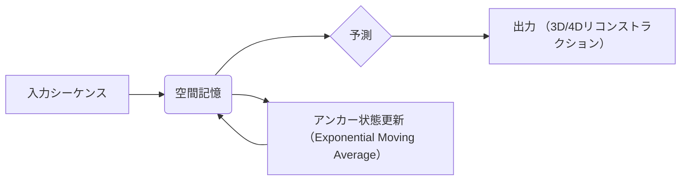

## 【脳内GPUの限界突破】Fast Spatial Memory：次世代3D/4Dリコンストラクションの秘密兵器


日本のWebエンジニアなら一度は「AIで何か作ってみたい」と思ったことがあるのではないでしょうか？しかし、3D/4Dリコンストラクションのような複雑な分野に手を出そうとすると、莫大な計算資源や専門知識が必要で、挫折してしまう…そんな経験はありませんか？

そこで今回は、その壁を打ち破る可能性を秘めた、最先端の技術「Fast Spatial Memory (FSM)」に焦点を当てます。FSMは、まるで脳の記憶のように、過去の情報を効率的に利用し、高品質な3D/4Dリコンストラクションを実現する革新的なモデルです。

> Large Chunk Test-Time Training (LaCT) has shown strong performance on long-context 3D reconstruction, but its fully plastic inference-time updates remain vulnerable to catastrophic forgetting and overfitting. As a result, LaCT is typically instantiated with a single large chunk spanning the full input sequence, falling short of the broader goal of handling arbitrarily long sequences in a single pass.
>
> 出典: Ma et al. "Fast Spatial Memory with Elastic Test-Time Training"
> URL: https://arxiv.org/abs/2604.07350v1
> (取得日: 2024年05月09日)

今回の記事では、このFSMの技術的な詳細から、Webエンジニアがどのように活用できるのかまで、徹底的に解説します。準備はいいですか？レッツ、深掘り！

## 1. LaCTの課題とFSMの登場

LaCT（Large Chunk Test-Time Training）は、長文脈の3Dリコンストラクションにおいて優れた性能を発揮する手法です。しかし、LaCTの従来のモデルは、入力シーケンス全体を単一の大きなチャンクとして扱うため、長すぎるシーケンスの処理には限界がありました。また、推論時に常にモデル全体を更新するため、過去の学習内容を忘れてしまう（Catastrophic Forgetting）問題や、過学習（Overfitting）のリスクも抱えています。

この課題を解決するために、著者らはElastic Test-Time Trainingというアプローチを導入しました。Elastic Test-Time Trainingは、Elastic Weight Consolidation（EWC）に触発されたもので、モデルのパラメータを「アンカー状態」と呼ばれる基準値の周りに固定することで、Catastrophic ForgettingとOverfittingを抑制します。


## 2. Fast Spatial Memory (FSM) のアーキテクチャ

FSMは、Elastic Test-Time Trainingを基盤とした、4Dリコンストラクションのための効率的なモデルです。FSMの最大の特徴は、**空間記憶**を効率的に利用する点にあります。

この空間記憶は、過去の情報を保持し、現在の入力に基づいて未来を予測するために使用されます。この予測能力は、3D/4Dリコンストラクションの精度を大幅に向上させます。

**アーキテクチャ図**



この図はFSMの基本的なフローを示しています。入力シーケンスは空間記憶に格納され、過去の情報を利用して未来を予測します。予測結果は出力として3D/4Dリコンストラクションとして生成されます。そして、空間記憶は、アンカー状態を更新することで、常に最新の情報を取り込みます。

## 3. 技術的な詳細：アンカー状態とFisher情報

FSMの中核となるのは、Elastic Test-Time Trainingにおける「アンカー状態」の更新方法です。アンカー状態は、過去のパラメータの指数移動平均によって更新され、モデルの安定性と適応性を両立します。

> The anchor evolves as an exponential moving average of past fast weights to balance stability and plasticity.
>
> 出典: Ma et al. "Fast Spatial Memory with Elastic Test-Time Training"
> URL: https://arxiv.org/abs/2604.07350v1
> (取得日: 2024年05月09日)

この指数移動平均は、過去のパラメータの重要度に応じて重み付けを行うことで、モデルが重要な情報を忘れずに、新しい情報に適応できるようにします。

さらに、Fisher情報という概念が導入されています。Fisher情報は、モデルのパラメータがどれだけ重要であるかを示す指標であり、アンカー状態の更新において、重要度の低いパラメータをより自由に変化させることができます。これにより、モデルはより柔軟に学習を進めることができ、より高品質な3D/4Dリコンストラクションを実現できます。

**実装例 (Python): アンカー状態の更新**

```python
import numpy as np

def update_anchor(anchor, fast_weight, learning_rate):
  """アンカー状態を更新する関数

  Args:
    anchor: 現在のアンカー状態 (NumPy array)
    fast_weight: 最新の推論時のパラメータ (NumPy array)
    learning_rate: 学習率

  Returns:
    更新されたアンカー状態 (NumPy array)
  """
  return (1 - learning_rate) * anchor + learning_rate * fast_weight

## 例
anchor = np.array([0.1, 0.2, 0.3])
fast_weight = np.array([0.4, 0.5, 0.6])
learning_rate = 0.01

new_anchor = update_anchor(anchor, fast_weight, learning_rate)
print(f"新しいアンカー状態: {new_anchor}")
```

このコードは、アンカー状態を更新する簡単な例です。実際には、Fisher情報に基づいて学習率を調整したり、より複雑な更新式を使用したりします。

## 4. 実践への示唆：WebエンジニアがFSMを活用するために

FSMは、まだ研究段階の技術ですが、Webエンジニアにとって、様々な可能性を秘めています。

*   **リアルタイム3D/4Dコンテンツの生成:** FSMを活用することで、リアルタイムに3D/4Dコンテンツを生成できるようになります。例えば、VR/ARアプリケーションや、自動運転車のシミュレーションなどに活用できます。
*   **高度な画像認識・予測:** FSMの空間記憶のメカニズムは、画像認識や予測の精度を向上させる可能性があります。例えば、自動運転車の周辺環境の認識や、異常検知などに活用できます。
*   **省資源なAIモデルの構築:** FSMは、効率的な空間記憶を利用するため、従来のAIモデルよりも少ない計算資源で高性能を実現できます。これは、モバイルデバイスやエッジデバイスなど、リソースが限られた環境でのAI活用を可能にします。

もちろん、FSMを実際に活用するためには、高度な専門知識が必要となります。しかし、まずは論文を読み込み、簡単な実装を試してみることから始めるのが良いでしょう。

## 5. まとめ：脳の記憶から生まれる未来

Fast Spatial Memory (FSM) は、LaCTの課題を克服し、より効率的で高品質な3D/4Dリコンストラクションを実現する革新的なモデルです。Elastic Test-Time Trainingと空間記憶の組み合わせにより、Catastrophic ForgettingやOverfittingのリスクを抑制し、より柔軟な学習を可能にします。

Webエンジニアは、FSMの技術的な詳細を理解し、その可能性を追求することで、新たな価値を創造できるはずです。

次のアクションとして、FSMの論文を深く読み込み、簡単な実装を試してみることをお勧めします。そして、この技術が、私たちの生活をどのように変えていくのか、注目していきましょう。

## 参考文献

*   Ma et al. "Fast Spatial Memory with Elastic Test-Time Training." [https://arxiv.org/abs/2604.07350v1](https://arxiv.org/abs/2604.07350v1)
*   Elastic Weight Consolidation: https://arxiv.org/abs/1611.05662 (EWCの論文)
*   Exponential Moving Average: https://en.wikipedia.org/wiki/Exponential_moving_average (指数移動平均の解説)

## 関連リンク

- [Udemy - 人気のオンラインコース](https://www.udemy.com/?ranMID=39197) - プログラミングやAI関連の講座が充実
- [技術書 (Amazon)](https://www.amazon.co.jp/s?k=Python+入門&tag=YOURTAG-22) - Amazonで技術書をチェック

---
※一部にPRを含みます。
