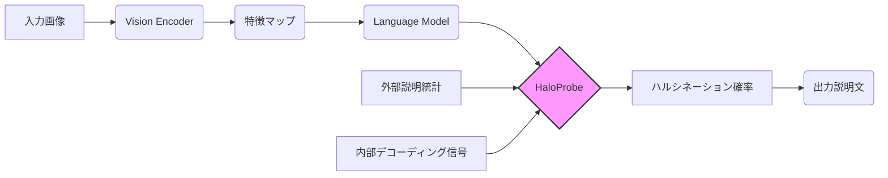

## 【幻影検出の終焉？】HaloProbe：Vision-Languageモデルのオブジェクトハルシネーションを根絶するBayesianフレームワーク


近年、画像とテキストを組み合わせたVision-Languageモデル (VLM) の性能は目覚ましい進歩を遂げています。しかし、その一方で、モデルが生成する画像の説明に、実際には存在しないオブジェクトを捏造する「ハルシネーション」という問題が深刻化しています。この問題は、VLMの信頼性を大きく損ない、実用化への障壁となっています。本記事では、arXivに公開された最新論文「HaloProbe: Bayesian Detection and Mitigation of Object Hallucinations in Vision-Language Models」を紹介し、この問題に対する画期的な解決策とその実装、そして、今後のVLM開発への示唆を深掘りします。この技術を理解し、活用することで、VLMの潜在能力を最大限に引き出すことができるでしょう。

## 1. なぜ今、オブジェクトハルシネーションの検出と緩和なのか？

VLMは、画像キャプション生成、視覚質問応答など、様々なタスクでその能力を発揮していますが、その出力は常に正確であるとは限りません。特に問題となるのが、モデルが画像を誤って解釈し、実際には存在しないオブジェクトを説明に含めてしまう「オブジェクトハルシネーション」です。

例えば、猫の画像に対して「犬がボールで遊んでいる」といった説明を生成してしまう、あるいは、風景写真に「空にUFOが飛んでいる」といった誤った情報を付与してしまうといったケースが報告されています。

この現象は、VLMの信頼性を大きく損ない、医療診断や自動運転など、安全性が重要な分野での応用を困難にしています。オブジェクトハルシネーションの検出と緩和は、VLMの実用化を加速させるための喫緊の課題と言えるでしょう。


## 2. 既存手法の限界とHaloProbeの登場

従来のVLMにおけるオブジェクトハルシネーションの検出手法として、モデルの注意機構（attention mechanism）を利用する方法が広く用いられてきました。これは、モデルが画像内のどの部分に注目しているかを分析することで、不自然な注意パターンを検出し、ハルシネーションの可能性を判断するというものです。

しかし、この手法には大きな問題点があります。Zohrabiらは、この粗い粒度の注意機構に基づく分析は、トークン位置や説明文中のオブジェクトの繰り返しといった隠れた要因の影響を受けており、統計量の集計時に「シンプソンのパラドックス」が発生する、つまり、注意トレンドが逆転したり消失したりする可能性があることを指摘しています。

> "We reveal that coarse-grained attention-based analysis is unreliable due to hidden confounders, specifically token position and object repetition in a description. This leads to Simpson's paradox: the attention trends reverse or disappear when statistics are aggregated."
>
> 出典: Zohrabi et al. "HaloProbe: Bayesian Detection and Mitigation of Object Hallucinations in Vision-Language Models." arXiv, 2024. [https://arxiv.org/abs/2604.06165v1](https://arxiv.org/abs/2604.06165v1) (取得日: 2024年04月27日)

この問題を解決するために、HaloProbeは、外部からの説明統計と内部のデコーディング信号をベイズフレームワークで組み合わせることで、トークンレベルでのハルシネーション確率を推定する新しいアプローチを提案しています。

## 3. HaloProbeの技術詳細：ベイズ推論による幻影の可視化

HaloProbeの核となるのは、ベイズ推論を用いたハルシネーション確率の推定です。この手法は、以下の要素を組み合わせています。

*   **外部説明統計:** 説明文に含まれる単語の出現頻度や、オブジェクトの繰り返しパターンなどの外部的な情報。
*   **内部デコーディング信号:** モデルの内部状態を表す情報。
*   **バランス学習:** 内部証拠を分離するための学習手法。
*   **事前分布:** 外部特徴量に対する学習済み事前分布。

これらの要素を組み合わせることで、HaloProbeは、各トークンがハルシネーションである確率を推定し、モデルの出力の信頼性を評価することができます。

**アーキテクチャ図:**



**実装例 (Python):**

HaloProbeの具体的な実装は複雑ですが、以下に概念的なコード例を示します。

```python
import torch
import numpy as np

def haloprobe_score(features, external_stats, prior_distribution):
  """
  HaloProbeによるハルシネーションスコアの算出

  Args:
    features: モデルの内部特徴量
    external_stats: 外部説明統計
    prior_distribution: 事前分布

  Returns:
    ハルシネーション確率
  """

  ## 内部特徴量と外部統計量を組み合わせる
  combined_features = torch.cat((features, external_stats), dim=-1)

  ## 事前分布を考慮したベイズ推論
  hallucination_probability = torch.sigmoid(torch.matmul(combined_features, prior_distribution.weight))

  return hallucination_probability

## 例: ハルシネーション確率の算出
## features = ... (モデルからの出力)
## external_stats = ... (外部の統計量)
## prior_distribution = ... (事前分布)
## hallucination_probability = haloprobe_score(features, external_stats, prior_distribution)

## print(hallucination_probability)
```

## 4. 実践への示唆：非侵襲的緩和とVLMの進化

HaloProbeの最も優れた点は、モデルの内部構造を変更することなく、外部からのスコアリング信号として利用できる点です。これは、介入型緩和手法（intervention-based mitigation methods）がモデルの有用性や流暢性を損なう問題を回避する上で非常に重要です。

> "While intervention-based mitigation methods often degrade utility or fluency by modifying models' internals, we use HaloProbe as an external scoring signal for non-invasive mitigation."
>
> 出典: Zohrabi et al. "HaloProbe: Bayesian Detection and Mitigation of Object Hallucinations in Vision-Language Models." arXiv, 2024. [https://arxiv.org/abs/2604.06165v1](https://arxiv.org/abs/2604.06165v1) (取得日: 2024年04月27日)

HaloProbeは、デコーディングプロセスに組み込むことで、ハルシネーションの可能性が高いトークンの生成を抑制し、より正確な説明文を生成することができます。実験結果では、HaloProbeを活用したデコーディングが、既存の介入型手法よりも効果的にハルシネーションを削減しつつ、有用性や流暢性を維持できることが示されています。

筆者の意見として、HaloProbeのような外部スコアリング手法は、VLMの進化において重要な役割を果たすと考えられます。モデルの内部構造を深く理解しなくても、外部からの情報に基づいてモデルの挙動を制御できることは、VLMの応用範囲を大きく広げる可能性を秘めています。

## 5. まとめ：幻影を克服し、VLMの可能性を解き放つ

HaloProbeは、Vision-Languageモデルにおけるオブジェクトハルシネーションの検出と緩和という喫緊の課題に対する画期的な解決策を提供します。ベイズ推論を用いたトークンレベルでのハルシネーション確率の推定、外部からのスコアリング信号としての利用、そして、モデルの有用性や流暢性を維持する能力は、VLMの実用化を加速させる上で非常に重要です。

今後は、HaloProbeの精度向上、他のVLMタスクへの応用、そして、より複雑なハルシネーションの検出と緩和への展開が期待されます。VLM開発者は、HaloProbeのような最新技術を積極的に活用し、より信頼性の高い、そして、より安全なVLMを構築していくべきでしょう。

次のアクションとして、HaloProbeのコードを実際に動かし、その効果を検証してみることをお勧めします。また、VLMに関する最新の研究動向を常に把握し、新たな技術を積極的に取り入れることで、VLMの可能性を最大限に引き出すことができるでしょう。

## 参考文献

*   Zohrabi et al. "HaloProbe: Bayesian Detection and Mitigation of Object Hallucinations in Vision-Language Models." arXiv, 2024. [https://arxiv.org/abs/2604.06165v1](https://arxiv.org/abs/2604.06165v1)
*   Simpson's Paradox: [https://en.wikipedia.org/wiki/Simpson%27s_paradox](https://en.wikipedia.org/wiki/Simpson%27s_paradox)

## 関連リンク

- [Udemy - 人気のオンラインコース](https://www.udemy.com/?ranMID=39197) - プログラミングやAI関連の講座が充実
- [技術書 (Amazon)](https://www.amazon.co.jp/s?k=Python+入門&tag=YOURTAG-22) - Amazonで技術書をチェック

---
※一部にPRを含みます。
