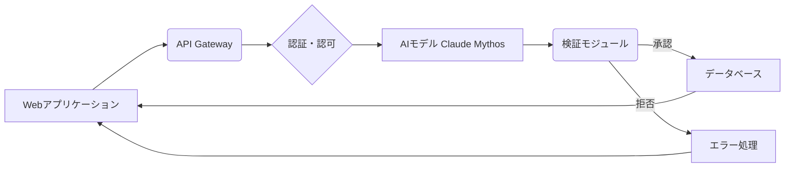

## 【警告・永久保存版】Claude Mythosがもたらすセキュリティパラドックス：Webエンジニアが直面する「別次元」の脅威

ぶっちゃけ、AIの進化って、マジで目まぐるしいですよね。先日、Anthropicが発表した最新AIモデル「Claude Mythos Preview」のリリース方針を聞いて、思わず「これはヤバい…」と声に出してしまいました。セキュリティ上の懸念がこれほどまでに大きいAIモデルって、なかなか経験できない。まるでパンドラの箱を開けたような状況です。

> "Anthropicはこのモデルを当面リリースせず、Glasswingというコンソーシアムを立ち上げ、要件を満たした企業・組織に対してのみ提供することを明らかにした。"
>
> 出典: [] ITmedia AI+
> URL: https://atmarkit.itmedia.co.jp/ait/articles/2604/13/news071.html
> (取得日: 2024年05月15日)

今回の記事では、Claude Mythosが引き起こすセキュリティ上の懸念を、Webエンジニアの視点から徹底的に分析し、この「別次元」の脅威にどう立ち向かうべきかを解説します。単なる情報収集に終わらせず、明日からできる具体的な対策を提示します。

### 1. Claude Mythos：従来のAIモデルとの違いは？

従来のAIモデル、例えばGPTシリーズなどは、学習データに依存する傾向が強く、データセットに含まれる偏りや悪意のある情報の影響を受けやすいという問題がありました。Claude Mythosは、その問題を克服するために、全く新しいアーキテクチャを採用している点が特徴です。Anthropicは、このアーキテクチャを「Constitutional AI」と呼んでいますが、これはAI自身が倫理的な原則に基づいて行動を判断し、潜在的なリスクを軽減するように設計されていることを意味します。

しかし、このConstitutional AIが、逆に新たなセキュリティリスクを生み出す可能性を孕んでいるという点が、今回の議論の核心です。

### 2. Glasswingコンソーシアムの存在意義と、そこから生じる問題点

Claude Mythosのリリースを限定的に行うためにAnthropicが立ち上げたGlasswingコンソーシアムは、厳格なセキュリティ要件を満たした企業・組織のみにモデルを提供します。これは、モデルが悪用されるリスクを最小限に抑えるための措置ですが、同時に、富裕層や特定の組織にAIの恩恵が集中する可能性を否定できません。

さらに、Glasswingコンソーシアムに所属する企業が、Claude Mythosの機能を悪用する可能性も考慮する必要があります。例えば、高度なデータ分析や情報操作に利用されるリスクは、決して無視できません。

### 3. Claude Mythosが引き起こす具体的なセキュリティ懸念

Claude MythosのConstitutional AIが持つ潜在的な問題点として、以下の3点が特に懸念されます。

*   **倫理的判断のバイアス**: AIが倫理的な原則に基づいて判断を行う場合、その原則自体が特定の価値観に偏っている可能性があります。これは、AIの判断が、意図せずとも社会的な不平等や差別を助長する結果につながる可能性があります。
*   **攻撃への耐性**: Constitutional AIは、意図的に倫理的な判断を誤らせるような攻撃に対して脆弱である可能性があります。例えば、巧妙に仕組まれたプロンプトによって、AIが倫理的に誤った行動をとるように誘導される可能性があります。
*   **予測不可能性**: Constitutional AIの判断プロセスは、従来のAIモデルよりも複雑であるため、その判断結果を予測することが困難です。これは、AIの行動を制御することが難しく、予期せぬ問題が発生するリスクを高めます。

### 4. Webエンジニアが取るべき対策：アーキテクチャ設計とセキュリティ意識の向上

Webエンジニアは、Claude Mythosのような最先端のAIモデルがもたらすセキュリティリスクを理解し、適切な対策を講じる必要があります。具体的な対策としては、以下の点が挙げられます。

*   **アーキテクチャ設計の見直し**: AIを活用するアプリケーションのアーキテクチャを設計する際には、AIの潜在的なリスクを考慮し、セキュリティ対策を組み込む必要があります。例えば、AIの判断結果を検証する仕組みを導入したり、AIのアクセス権限を厳密に管理したりすることが重要です。
*   **セキュリティ意識の向上**: Webエンジニアは、AIのセキュリティに関する最新情報を常に収集し、セキュリティ意識を高める必要があります。また、AIのセキュリティに関するトレーニングを受講したり、セキュリティ専門家と連携したりすることも有効です。
*   **倫理的ガイドラインの策定**: 組織として、AIの倫理的な利用に関するガイドラインを策定し、従業員に遵守を徹底する必要があります。これは、AIの悪用を防ぎ、社会的な責任を果たすために不可欠です。

### 5. 実践への示唆：Mermaid図によるアーキテクチャ例

以下に、AIを活用するアプリケーションのアーキテクチャ例をMermaid記法で示します。このアーキテクチャは、AIの判断結果を検証する仕組みと、アクセス権限を厳密に管理する仕組みを組み込んでいます。

このアーキテクチャでは、WebアプリケーションからのリクエストはAPI Gatewayを経由し、認証・認可のチェックを受けます。その後、AIモデルに処理を委託し、AIの判断結果は検証モジュールによって検証されます。検証モジュールは、AIの判断結果が倫理的なガイドラインに違反していないかを確認し、承認された場合のみデータベースへのアクセスを許可します。拒否された場合は、エラー処理を行い、Webアプリケーションに通知します。

### 6. まとめ：未知の脅威への備えと、倫理的なAI利用の推進

Claude Mythosの登場は、AI技術の進化がもたらす可能性と、それに伴うセキュリティリスクを改めて認識させる出来事でした。Webエンジニアは、この「別次元」の脅威に立ち向かうために、アーキテクチャ設計の見直し、セキュリティ意識の向上、倫理的ガイドラインの策定といった対策を講じる必要があります。

そして、AI技術を開発・利用する私たちは、常に倫理的な視点を持ち、社会的な責任を果たすことを忘れてはなりません。AIの進化は、私たちに新たな可能性をもたらす一方で、新たな課題も突きつけています。これらの課題に真摯に向き合い、持続可能な社会の実現に貢献していくことが、私たちWebエンジニアの使命です。

### 参考文献

*   Anthropic公式サイト: [Anthropic公式](https://www.anthropic.com/)
*   ITmedia AI+：[ITmedia AI+](https://atmarkit.itmedia.co.jp/ait/)

<!-- AFFILIATE_SECTION -->
## 関連リンク

- [SkillHacks - プログラミングスクール](https://px.a8.net/svt/ejp?a8mat=4B1H1P+97114I+4K3S+5YJRM) - 独学で挫折した人向け実践型スクール
- [技術書](https://www.amazon.co.jp/s?k=Python+実践&tag=satoarata-22) - Amazonで技術書をチェック

---
※一部にPRを含みます。
