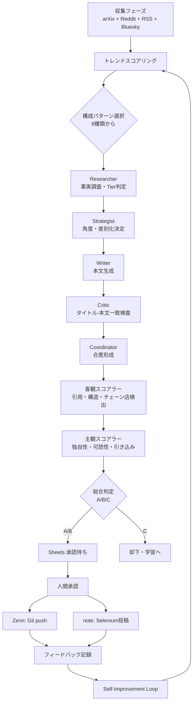

> **仕事中も、遊んでる時も、寝てる間も — AIがネタを掘り、5人で議論し、記事化して投稿まで。独自の自己学習で"あなたの読者"にだけ刺す。**


## はじめに — なぜ作ったのか

ブログを書き続けるのは、だいたい次の3つで死ぬ。

1. **ネタ切れ** — 毎日トレンドを追うのは仕事より重い
2. **質のブレ** — 疲れた日の記事は見るに堪えない
3. **投稿の手間** — Markdown、画像、ハッシュタグ、プラットフォーム差分

これを全部「夜寝てる間にAIが片付けてくれる」にしたい。ただし量産ブログではなく、**ニッチに刺す濃い記事だけ**を出したい。

というわけで、5体のAIエージェントが議論して記事を作る自走パイプラインを構築した。この記事は、**そのツール自身によって題材化された、セルフメタな1本**である。

---

## アーキテクチャ全景



設計の肝は3つ。

1. **ディスカッション型の多段評価** — 1体のLLMに書かせて終わりではない。Criticは常に"否定"から入り、Coordinatorが合意を取る
2. **客観と主観の二層スコアリング** — 客観で足切り、主観で上積み。客観Cが1つでもあれば自動却下
3. **人間はSheets上で承認だけ** — 書く・校正する時間はゼロ

---

## 収集フェーズ — ネタは自動で集まってくる


ソースは用途別に分けてある。

| ターゲット | 主な収集元 |
|----------|----------|
| Zenn(技術) | arXiv 7カテゴリ / OpenAI News / TechCrunch AI / VentureBeat / The Verge / SemiAnalysis / HN AI |
| note(一般) | はてなホットエントリ / 韓国エンタメ / 美容・ファッション / 食べログ / コーヒー系 / Bluesky |

トレンドスコアは `スコア = 反応量 × 新鮮度 × ソース信頼度` で正規化。スコア上位から記事化候補に回す。

**収集ツールの面白ポイント:**
- Bluesky API から個人店グルメの投稿だけを抽出 (チェーン店は後段で自動除外)
- 韓国系RSSは日本語翻訳層を挟んで note のバズ層を狙う
- Anthropic は公式RSSが無いのでHN経由で動向を拾う

---

## 5体のエージェントが議論する

Writerが書いたドラフトはいきなり評価されない。まず **Critic が否定から入る**。

```python
# generators/critic.py (抜粋)
def review(self, draft: Article) -> CriticFeedback:
    issues = []
    # タイトルで煽った内容を本文で回収できているか
    if not self._title_body_consistency(draft):
        issues.append("タイトル負け: 本文が公約を果たしていない")
    # 架空の店名・メニューを検出
    if self._has_fabricated_facts(draft):
        issues.append("ハルシネーション: 元ソースにない固有名詞")
    return CriticFeedback(pass_=not issues, issues=issues)
```

Criticが issues を返すと、Writerは該当箇所だけを書き直す (全文再生成ではない)。Coordinator は最大3ラウンド回し、合意が取れなければ**その記事ごと却下**する。

これが品質のブレを抑える最大の仕組みだ。

---

## 客観スコアラー — 足切りの番人


```python
# generators/objective_scorer.py (抜粋)
metrics = [
    ("citation_format",  self._score_citation_format(article)),
    ("visual_count",     self._score_visual_count(article)),
    ("word_count",       self._score_word_count(article)),
    ("evidence_level",   self._score_evidence_level(article)),
    ("banned_phrases",   self._score_banned_phrases(article)),
    ("heading_structure",self._score_heading_structure(article)),
    ("chain_stores",     self._score_chain_stores(article, blacklist)),
]
# 1つでもCがあれば総合C → 自動却下
if any(m["grade"] == "C" for m in metrics):
    return Grade.C
```

**興味深い知見:** Codex で事実根拠を固めた note 記事を走らせたら、`citation_count` で軒並み却下された。原因は引用が本文に溶け込んでいて `## 参考文献` のリストを持たないこと。スコアラーの前提が旧世代の Ollama 生成に固定されていた。

そこで citation_count はブロッキングから外し、word_count の受容帯も 1300–4500 に広げた。**生成パスを変えたらスコアラーの前提も合わせて見直す**という教訓は `docs/knowledge/` に昇格して残している。

---

## 自己学習ループ — "あなたの読者" に刺さる方へ収束する

投稿後、note の ♥ 数や Zenn のトレンド掲載を毎日スクレイピングして `FeedbackRecorder` に蓄積する。週次で:

- **高反応だった記事の共通要素** (H2構造、文字数、イントロの型、絵文字密度) を抽出
- `docs/knowledge/note-trends/prompt_suggestions.md` を自動更新
- 次回の Strategist がこれを読んで角度決定に反映

つまり**ツールを使えば使うほど、あなたの読者層に刺さる方向へ prompt が自動チューニングされていく**。汎用のAI記事生成と違うのはここだ。

---

## スクラップ降格 — 量産しないための安全弁

```python
# main.py (抜粋)
if platform == "zenn":
    if numeric_score >= 82.5:
        url = _publish_zenn(...)          # 本記事として投稿
    else:
        url = _save_scrap_draft(...)      # Zennスクラップに降格
```

B グレード記事を無理に本記事にしない。**Zenn スクラップ** という「ラフノート」枠に流して、作者としての信頼を守る。量産ブログとの最大の違いはこの自制だ。

---

## 実運用の数字 (2026-04現在)

| 指標 | 値 |
|------|---|
| 1日あたり収集件数 | 80–100件 |
| うち記事化候補 | 10–15件 |
| 最終投稿 | 2–4件/日 |
| 却下率 (Grade C) | 約30% |
| 人間の介入時間 | 承認クリックのみ (月10分) |

---

## 今後の展望

- **v1.1**: 画像 Vision による「本文と画像の一致度」検査
- **v1.2**: 有料記事のA/Bタイトルテスト
- **v1.3**: 読者コメントから次のネタを自動逆算

---

## まとめ

- ネタ集めから投稿まで全自動、人間は承認だけ
- 5体のエージェントが議論することで品質のブレを抑える
- 客観/主観の二層スコアリングで"雑な記事"を構造的に排除
- 自己学習で "あなたの読者" に刺さる方向へ収束する

**「書かないブロガーが月100本出す時代」**は、5体のAIが議論する設計によって"量より濃さ"で成立する。

リポジトリ公開は近日中に予定している。興味があればコメントかDMで。
