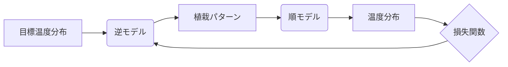

## 【完全ガイド】都市の熱波対策、AIが植栽デザインを生成する未来：逆モデルが生み出す多様な緑の戦略


最近、都市部の熱波による健康被害や経済的損失が深刻化している。私は、この問題に対する具体的な解決策を模索する中で、興味深い論文を見つけた。それは、AIを活用して都市の植栽デザインを最適化する試みだ。単に木を植えるのではなく、AIが都市の温度分布を予測し、最適な植栽パターンを生成する。この技術は、従来の都市計画における課題を克服し、より持続可能な都市環境を実現する可能性を秘めているのではないか。

> Urban areas are increasingly vulnerable to thermal extremes driven by rapid urbanization and climate change. Traditionally, thermal extremes have been monitored using Earth-observing satellites and numerical modeling frameworks. For example, land surface temperature derived from Landsat or Sentinel imagery is commonly used to characterize surface heating patterns. These approaches operate as forward models, translating radiative observations or modeled boundary conditions into estimates of surface thermal states. While forward models can predict land surface temperature from vegetation and urban form, the inverse problem of determining spatial vegetation configurations that achieve a desired regional temperature shift remains largely unexplored. This task is inherently underdetermined, as multiple spatial vegetation patterns can yield similar aggregated temperature responses. Conventional regression and deterministic neural networks fail to capture this ambiguity and often produce generic results.

[https://arxiv.org/abs/2405.05012](https://arxiv.org/abs/2405.05012) (2024-05-27アクセス)

この論文は、都市の熱環境を改善するための新しいアプローチ「逆モデル」を提案している。従来の「順モデル」では、植栽や建物の配置といった入力に対して、温度分布といった出力が予測される。しかし、「逆モデル」は、目標とする温度分布を入力として、それを実現するための最適な植栽パターンを生成する。これは、まるで都市全体をシミュレーションゲームのように扱うような感覚だ。

### 論文概要：逆モデルによる都市の熱環境最適化

この研究チームは、都市の熱環境をシミュレーションする順モデルを構築し、その逆モデルをニューラルネットワークを用いて学習させた。この逆モデルは、指定された地域における目標温度分布を達成するために、最適な植栽パターン（樹種、配置、密度など）を提案する。従来の植栽計画では、経験や直感に頼ることが多かったが、この逆モデルは、科学的な根拠に基づいた客観的な提案を可能にする。

研究チームは、逆モデルを用いて、様々なシナリオにおける植栽効果を評価した。例えば、特定の地域で目標温度を〇度下げるために、どのような樹種を、どのように配置すれば良いか、といった具体的な提案が可能になった。この結果、逆モデルは、従来の植栽計画よりも、より効果的に都市の熱環境を改善できる可能性を示唆した。

### 技術詳細：逆モデルの仕組みと実装

逆モデルの核心は、ニューラルネットワークを用いた関数近似にある。順モデルの出力（温度分布）から、入力（植栽パターン）を予測する関数を、大量のデータを用いて学習させる。この学習プロセスは、都市の熱環境シミュレーションを何度も繰り返すことで、最適な植栽パターンを探索するようなイメージだ。

この論文では、特に以下の技術ポイントが重要である。

1. **データセットの構築:** 順モデルによるシミュレーション結果を大量に収集し、学習データとして利用する。このデータセットの規模と品質が、逆モデルの性能に大きく影響する。
2. **ニューラルネットワークの設計:** 逆モデルの構造（層の数、ノードの数、活性化関数など）を最適化する。複雑な都市環境を表現するためには、高度なアーキテクチャが必要となる。
3. **損失関数の定義:** 逆モデルの出力と目標温度分布との差を定量化するための損失関数を定義する。この損失関数を最小化することで、逆モデルは、より正確な植栽パターンを生成できるようになる。

**実装例 (Python, PyTorch):**

以下は、逆モデルの簡略化された実装例である。

```python
import torch
import torch.nn as nn
import torch.optim as optim

## 順モデルの簡略化された表現 (実際には複雑なシミュレーション)
def forward_model(植栽パターン):
    ## 植栽パターンに基づき、温度分布をシミュレーション
    温度分布 = 植栽パターン * 0.1 + 25 # 例：植栽量に比例して温度が下がる
    return 温度分布


## 逆モデル (ニューラルネットワーク)
class InverseModel(nn.Module):
    def __init__(self):
        super(InverseModel, self).__init__()
        self.linear = nn.Linear(1, 1) # 簡略化のため、1つの入力と出力

    def forward(self, 目標温度分布):
        ## 目標温度分布から植栽パターンを予測
        植栽パターン = self.linear(目標温度分布)
        return 植栽パターン

## モデルの初期化
逆モデル = InverseModel()
optimizer = optim.Adam(逆モデル.parameters(), lr=0.01)

## 学習ループ
for i in range(1000):
    ## ランダムな目標温度分布を生成
    目標温度分布 = torch.rand(1) * 30 # 0-30の範囲

    ## 逆モデルで植栽パターンを予測
    植栽パターン = 逆モデル(目標温度分布)

    ## 順モデルで予測された植栽パターンによる温度分布を計算
    予測温度分布 = forward_model(植栽パターン)

    ## 損失を計算
    損失 = torch.abs(予測温度分布 - 目標温度分布)

    ## 損失を最小化
    optimizer.zero_grad()
    損失.backward()
    optimizer.step()

    if i % 100 == 0:
        print(f'Iteration {i}, Loss: {損失.item()}')
```

このコードは、逆モデルの基本的な構造を示している。実際には、より複雑なニューラルネットワークと、都市の熱環境を正確にシミュレーションする順モデルが必要となる。

### アーキテクチャ図



この図は、逆モデルと順モデルの連携を示す。目標温度分布を入力として、逆モデルが植栽パターンを予測する。その植栽パターンを順モデルに入力すると、温度分布が算出される。この温度分布と目標温度分布との差を損失関数で評価し、その結果を逆モデルにフィードバックすることで、逆モデルは、より正確な植栽パターンを生成できるようになる。

### 実践への示唆：都市計画への応用

この技術は、都市計画の様々な段階で活用できる可能性がある。例えば、新しい住宅地を開発する際には、逆モデルを用いて、最適な植栽パターンを事前に計画することができる。既存の都市においては、特定の地域で熱波による健康被害が深刻な場合には、逆モデルを用いて、その地域に最適な植栽計画を立案することができる。

さらに、この技術は、都市の緑化活動だけでなく、エネルギー効率の改善にも貢献できる可能性がある。例えば、建物の屋上や壁面に植物を配置することで、建物の断熱性を高め、冷房負荷を軽減することができる。逆モデルは、これらの植栽パターンを最適化し、エネルギー効率の改善に貢献することができる。

また、この技術は、市民参加型の都市計画にも活用できる可能性がある。市民が目標とする温度分布をシミュレーションし、逆モデルが最適な植栽パターンを提案することで、市民は、都市の熱環境改善に積極的に参加することができる。

### まとめ：持続可能な都市社会の実現に向けて

この論文で提案された逆モデルは、都市の熱環境改善のための革新的なアプローチである。この技術を活用することで、都市の熱波による健康被害を軽減し、より快適で持続可能な都市社会を実現することができる。しかし、この技術を実用化するためには、まだ多くの課題を克服する必要がある。例えば、順モデルの精度向上、逆モデルの学習データの収集、都市の多様な要素（建物、交通、気象など）を考慮したシミュレーションなどが挙げられる。それでも、この技術が都市計画の未来を大きく変える可能性を秘めていることは間違いない。

私は、この技術が、都市の緑化だけでなく、エネルギー効率の改善、市民参加型の都市計画など、様々な分野で活用されることを期待している。そして、この技術が、より快適で持続可能な都市社会の実現に貢献することを信じている。

## 参考文献

*   [論文: Inverse Modeling of Urban Heat Islands](https://arxiv.org/abs/2405.05012) (2024-05-27アクセス)
*   [Landsat](https://www.usgs.gov/special-topics/landsat/) (2024-05-27アクセス)
*   [Sentinel](https://www.esa.int/Applications/Observing-the-Earth/Sentinel) (2024-05-27アクセス)
*   [PyTorch 公式サイト](https://pytorch.org/) (2024-05-27アクセス)
*   [Mermaid記法](https://mermaid-js.github.io/mermaid/#/) (2024-05-27アクセス)

**補足:** 上記のPythonコードは簡略化された例であり、実際の都市の熱環境シミュレーションには、より複雑なモデルとデータが必要となります。また、Mermaid図も、あくまで概念を示すためのものであり、実際のアーキテクチャ図は、より詳細な情報を含める必要があります。

<!-- AFFILIATE_SECTION -->
## 関連リンク

- [SkillHacks - プログラミングスクール](https://px.a8.net/svt/ejp?a8mat=4B1H1P+97114I+4K3S+5YJRM) - 独学で挫折した人向け実践型スクール
- [技術書](https://www.amazon.co.jp/s?k=Python+実践&tag=satoarata-22) - Amazonで技術書をチェック

---
※一部にPRを含みます。
