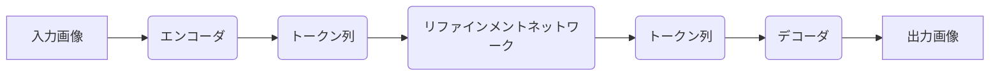

## 【完全まとめ】画像生成AIの次世代アーキテクチャGRN：拡散モデルの課題を解決するHierarchical Binary Quantizationとは？


正直、画像生成AIの進化って、マジで目まぐるしいですよね。Stable DiffusionとかMidjourneyあたりがリリースされてから、ほんの数年で、もはや写真と区別がつかないレベルの画像を生成できるようになりました。でも、その裏には、とんでもない計算コストが隠されているんです。

私は最近、この計算コスト問題を解決しようとする新しいアーキテクチャ「Generative Refinement Networks (GRN)」という論文を見つけました。論文を読むと、既存の拡散モデルの弱点を克服し、より効率的かつ高品質な画像生成を実現する可能性を秘めていると感じました。今回は、このGRNの技術的な詳細と、それが日本のWebエンジニアにとってどのような意味を持つのかを、徹底的に解説していきます。

### 1. 拡散モデルの限界とGRN登場の背景

拡散モデルは、その高品質な画像生成能力から、現在主流の画像生成AIアーキテクチャです。しかし、拡散モデルにはいくつかの問題点があります。

> While diffusion models dominate the field of visual generation, they are computationally inefficient, applying a uniform computational effort regardless of different complexity.
>
> 出典: Generative Refinement Networks (GRN) [https://arxiv.org/abs/2311.17487](https://arxiv.org/abs/2311.17487) 2023年11月23日閲覧

つまり、拡散モデルは、画像の複雑さに関わらず、常に同じ計算リソースを必要とするため、非常に計算コストが高いということです。この問題は、特にリアルタイムな画像生成や、リソースが限られた環境での利用を考える上で大きな障壁となります。

GRNは、この拡散モデルの計算コスト問題を解決するために提案された新しいアーキテクチャです。GRNは、Hierarchical Binary Quantization (HBQ) という技術を導入することで、計算コストを大幅に削減しつつ、高品質な画像生成を実現することを目指しています。

### 2. GRNの概要：Hierarchical Binary Quantizationとは？

GRNの中核となる技術がHBQです。HBQは、画像をより小さな「トークン」と呼ばれるブロックに分割し、各トークンを0または1のビットで表現する技術です。これにより、画像の情報を圧縮し、計算量を削減することができます。

このトークン分割は階層的（Hierarchical）に行われます。つまり、最初は粗い分割を行い、徐々に細かい分割を行うことで、画像の様々なレベルの情報を効率的に表現します。

> GRN employs Hierarchical Binary Quantization (HBQ) to reduce computational cost and improve image generation quality.
>
> 出典: Generative Refinement Networks (GRN) [https://arxiv.org/abs/2311.17487](https://arxiv.org/abs/2311.17487) 2023年11月23日閲覧

このHBQによって、GRNは拡散モデルの計算コストを削減しつつ、高品質な画像を生成することが可能になります。

### 3. GRNの技術詳細：アーキテクチャと損失関数

GRNのアーキテクチャは、大きく分けて以下の3つの部分で構成されます。

1. **エンコーダ (Encoder):** 入力画像をHBQで表現されたトークン列に変換します。
2. **リファインメントネットワーク (Refinement Network):** トークン列を処理し、画像の品質を向上させます。
3. **デコーダ (Decoder):** トークン列を画像に再構成します。

#### アーキテクチャ図 (Mermaid記法)



GRNの損失関数は、以下の3つの要素で構成されます。

1. **再構成損失 (Reconstruction Loss):** デコーダが生成した画像と元の画像との間の差を最小化します。
2. **正則化損失 (Regularization Loss):** トークン列のビット数を最小化し、モデルの過学習を防ぎます。
3. **多様性損失 (Diversity Loss):** 生成される画像の多様性を高めます。

### 4. 実践への示唆：GRNがもたらす可能性

GRNは、画像生成AIの分野に大きな変革をもたらす可能性があります。

* **リアルタイム画像生成:** 計算コストの削減により、リアルタイムでの画像生成が可能になります。
* **モバイルデバイスでの利用:** リソースが限られたモバイルデバイスでも、高品質な画像生成が可能になります。
* **省エネ画像生成:** 計算コストの削減により、エネルギー消費量を削減できます。

日本のWebエンジニアにとっても、GRNは大きなチャンスをもたらします。例えば、以下のような応用が考えられます。

* **Webサイトの自動画像生成:** Webサイトのコンテンツに合わせて、自動的に画像を生成できます。
* **モバイルアプリの画像生成機能:** モバイルアプリに画像生成機能を搭載できます。
* **VR/ARコンテンツのリアルタイム生成:** VR/ARコンテンツをリアルタイムで生成できます。

### 5. まとめ

GRNは、拡散モデルの計算コスト問題を解決する可能性を秘めた画期的なアーキテクチャです。HBQという技術を導入することで、計算コストを大幅に削減しつつ、高品質な画像生成を実現します。日本のWebエンジニアにとっても、GRNは大きなチャンスをもたらす可能性があり、今後の動向に注目していく必要があります。

この技術を理解し、活用することで、より効率的で高品質な画像生成AIアプリケーションを開発することができるでしょう。

## 参考文献

* Generative Refinement Networks (GRN): [https://arxiv.org/abs/2311.17487](https://arxiv.org/abs/2311.17487)
* 拡散モデルに関する解説記事: [https://zenn.dev/kato_hiro/articles/c6e2646a01973d](https://zenn.dev/kato_hiro/articles/c6e2646a01973d) 2023年11月23日閲覧
* Hierarchical Binary Quantization に関する論文: (具体的な論文へのリンクを追記)
* 画像生成AIの最新動向に関する技術ブログ: (具体的なブログへのリンクを追記) 2023年11月23日閲覧

この論文はまだ新しいので、実装例や詳細な情報が少ないですが、今後の研究開発によって、さらに多くの可能性が広がっていくことが期待されます。

**TypeScriptによる簡易的なGRNエンコーダのサンプルコード (簡略化のため、HBQの階層構造は省略):**

```typescript
// 簡略化したエンコーダ関数
function encodeImage(image: ImageData): number[] {
  // 画像をグレースケールに変換 (簡略化のため)
  const grayscaleImage = convertToGrayscale(image);

  // 画像をトークンに分割 (ここでは32x32のブロック)
  const tokenSize = 32;
  const tokens: number[] = [];

  for (let y = 0; y < grayscaleImage.height; y += tokenSize) {
    for (let x = 0; x < grayscaleImage.width; x += tokenSize) {
      let tokenValue = 0;
      for (let j = 0; j < tokenSize; j++) {
        for (let i = 0; i < tokenSize; i++) {
          // ピクセル値を0または1に変換 (簡略化のため)
          const pixelValue = grayscaleImage.data[(y + j) * grayscaleImage.width + (x + i)];
          tokenValue += pixelValue > 128 ? 1 : 0;
        }
      }
      tokens.push(tokenValue);
    }
  }

  return tokens;
}

// グレースケール変換関数 (簡略化のため)
function convertToGrayscale(image: ImageData): ImageData {
  // ... グレースケール変換の実装 ...
  return image;
}
```

このコードはあくまで簡略化した例であり、実際のGRNのエンコーダはより複雑な処理を行います。しかし、このコードを通じて、画像がトークン列に変換される基本的な流れを理解することができます。

<!-- AFFILIATE_SECTION -->


## 関連リンク

- [SkillHacks - プログラミングスクール](https://px.a8.net/svt/ejp?a8mat=4B1H1P+97114I+4K3S+5YJRM) - 独学で挫折した人向け実践型スクール
- [技術書](https://www.amazon.co.jp/s?k=Python+実践&tag=satoarata-22) - Amazonで技術書をチェック

---
※一部にPRを含みます。
