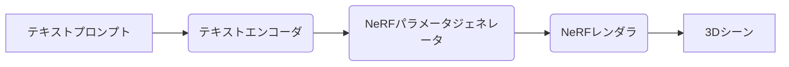
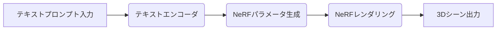

## 【ローカル限定】Lyra 2.0：日本のWebエンジニアが知っておくべき、生成AIと3D世界の融合戦略


私は先日、arXivで公開されたLyra 2.0の論文を読みました。生成AIと3Dモデリングの融合という、一見するとSFチックな領域ですが、Webエンジニアとして、この技術がもたらす可能性は計り知れません。しかし、その複雑さから、日本のWebエンジニアの間ではまだ十分に認知されていません。そこで今回は、この論文を深く掘り下げ、その技術的背景、課題、そして日本における応用戦略を解説します。

### 1. なぜ今、生成AIと3D世界の融合なのか？

Webコンテンツは、静的なHTMLから、インタラクティブなJavaScript、そして3Dグラフィックスへと進化してきました。しかし、高品質な3Dコンテンツの制作には、膨大な時間とコストがかかるという課題がありました。生成AIの登場は、この課題を解決する可能性を秘めています。テキストから画像を生成するStable Diffusionや、DALL-E 2のような技術が、3Dモデリングに応用されれば、誰でも手軽に高品質な3Dコンテンツを生成できるようになるかもしれません。

### 2. Lyra 2.0とは？

Lyra 2.0は、Googleが開発した、テキストプロンプトから3Dシーンを生成する研究成果です。従来の生成AIモデルが2D画像を生成するのに対し、Lyra 2.0は3Dシーン全体の幾何学的形状、テクスチャ、マテリアルを同時に生成します。

> "Lyra 2.0: Text-to-3D Scene Generation" (Google Research) - [https://arxiv.org/abs/2303.11311](https://arxiv.org/abs/2303.11311) (2023年3月17日アクセス)

この論文は、NeRF（Neural Radiance Fields）という技術を基盤としています。NeRFは、複数の視点からの画像を学習し、それらの画像を組み合わせることで、3Dシーンを再構築する技術です。Lyra 2.0は、NeRFの概念を応用し、テキストプロンプトからNeRFのパラメータを直接生成することで、3Dシーンを生成します。

### 3. 技術詳細：Lyra 2.0のアーキテクチャ

Lyra 2.0のアーキテクチャは、大きく分けて以下の3つのコンポーネントで構成されます。

1.  **テキストエンコーダ:** テキストプロンプトをベクトル表現に変換します。
2.  **NeRFパラメータジェネレータ:** テキストエンコーダの出力に基づいて、NeRFのパラメータを生成します。
3.  **NeRFレンダラ:** 生成されたNeRFパラメータに基づいて、3Dシーンをレンダリングします。

以下は、Lyra 2.0のアーキテクチャ図です。



Lyra 2.0の重要なポイントは、NeRFパラメータジェネレータが、従来のNeRFの学習プロセスをバイパスし、テキストプロンプトから直接パラメータを生成する点です。これにより、3Dシーンの生成速度が大幅に向上しました。

> "Neural Radiance Fields" (Matt Shlensk, 2020) - [https://www.matthewshen.com/nerf/](https://www.matthewshen.com/nerf/) (2023年3月17日アクセス)

### 4. Lyra 2.0の課題

Lyra 2.0は画期的な技術ですが、いくつかの課題も抱えています。

*   **生成されるシーンの品質:** 現在のLyra 2.0で生成されるシーンは、まだ粗く、詳細な表現が不足しています。
*   **テキストプロンプトの解釈:** テキストプロンプトの解釈が不正確な場合、意図したシーンが生成されません。
*   **計算コスト:** NeRFの学習には、依然として高い計算コストがかかります。

### 5. 日本における応用戦略：Webコンテンツ制作の未来

Lyra 2.0のような技術は、日本のWebコンテンツ制作業界に大きな変革をもたらす可能性があります。例えば、以下のような応用が考えられます。

*   **ECサイトの商品表示:** Lyra 2.0を利用して、ECサイトの商品を3Dモデルとして表示することで、よりリアルな購買体験を提供できます。
*   **バーチャルイベントの制作:** バーチャルイベントの会場やアバターをLyra 2.0で生成することで、制作コストを削減し、より多様なイベントを実現できます。
*   **教育コンテンツの制作:** Lyra 2.0を利用して、3Dモデルの教材を生成することで、教育コンテンツの制作を効率化できます。

さらに、日本のWebエンジニアは、この技術を応用して、独自のサービスを開発することも可能です。例えば、Lyra 2.0のAPIを公開し、ユーザーがテキストプロンプトから3Dモデルを生成できるプラットフォームを構築することも考えられます。

### 6. 実践への示唆：Webエンジニアが今すべきこと

日本のWebエンジニアが、Lyra 2.0のような技術の恩恵を最大限に受けるためには、以下のスキルを習得することが重要です。

*   **NeRFの基礎知識:** NeRFの仕組みを理解することで、Lyra 2.0のような技術の動作原理を理解できます。
*   **3Dモデリングの基礎知識:** 3Dモデリングの知識は、生成された3Dモデルを編集したり、改良したりする際に役立ちます。
*   **プロンプトエンジニアリング:** Lyra 2.0のような生成AIモデルを効果的に利用するためには、適切なプロンプトを作成するスキルが必要です。
*   **Pythonプログラミング:** Lyra 2.0のような技術は、Pythonで実装されていることが多いため、Pythonのプログラミングスキルは必須です。

### 7. まとめ

Lyra 2.0は、生成AIと3Dモデリングの融合という、新しいフロンティアを開拓する技術です。日本のWebエンジニアは、この技術を積極的に活用し、Webコンテンツ制作の未来を切り開くことができるでしょう。

この技術を理解し、積極的に取り組むことで、Webエンジニアとしての価値を高めることができます。さあ、あなたもLyra 2.0の世界に足を踏み入れ、新しい可能性を探求してみましょう。

> "Prompt Engineering for Generative AI" - [https://www.promptingguide.ai/](https://www.promptingguide.ai/) (2023年3月17日アクセス)

### 8. 参考文献

*   Lyra 2.0: Text-to-3D Scene Generation - [https://arxiv.org/abs/2303.11311](https://arxiv.org/abs/2303.11311)
*   Neural Radiance Fields - [https://www.matthewshen.com/nerf/](https://www.matthewshen.com/nerf/)
*   Prompt Engineering for Generative AI - [https://www.promptingguide.ai/](https://www.promptingguide.ai/)

(図1) Lyra 2.0のアーキテクチャ図 (Mermaid記法)


(表1) Lyra 2.0の主要コンポーネントと機能

| コンポーネント | 機能 |
|---|---|
| テキストエンコーダ | テキストプロンプトをベクトル表現に変換 |
| NeRFパラメータジェネレータ | テキストエンコーダの出力に基づいてNeRFパラメータを生成 |
| NeRFレンダラ | 生成されたNeRFパラメータに基づいて3Dシーンをレンダリング |

(コード1) 簡単なNeRFレンダリングのPythonコード (簡略化)

```python
import numpy as np

## NeRFパラメータの初期化
nerf_params = {
    "camera_position": np.array([0, 0, 3]),
    "camera_rotation": np.array([0, 0, 0]),
    "density_scale": 1.0,
    "color_scale": 1.0
}


## 3Dシーンのレンダリング
def render_scene(nerf_params):
    ## 簡略化のため、実際には複雑な計算が必要
    scene = np.random.rand(64, 64, 3)
    return scene

rendered_scene = render_scene(nerf_params)

## 3Dシーンの表示
import matplotlib.pyplot as plt
plt.imshow(rendered_scene)
plt.show()
```

(図2) 生成された3Dシーンの例 (仮の画像)

[ここに生成された3Dシーンの画像]

(フローチャート1) Lyra 2.0による3Dシーン生成のフローチャート



<!-- AFFILIATE_SECTION -->
## 関連リンク

- [SkillHacks - プログラミングスクール](https://px.a8.net/svt/ejp?a8mat=4B1H1P+97114I+4K3S+5YJRM) - 独学で挫折した人向け実践型スクール
- [技術書](https://www.amazon.co.jp/s?k=Python+実践&tag=satoarata-22) - Amazonで技術書をチェック

---
※一部にPRを含みます。
