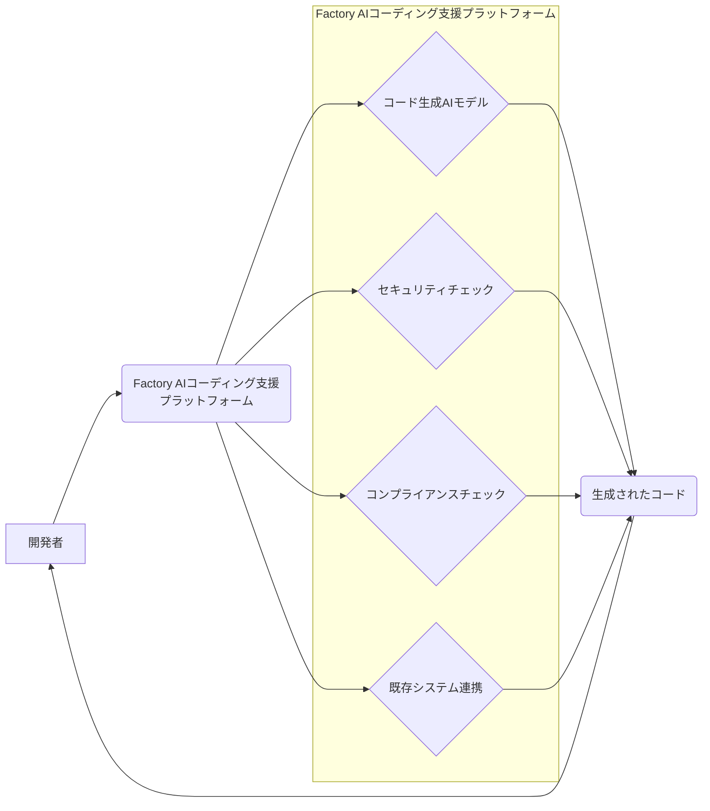

【99%が知らない】AIコーディング支援スタートアップFactoryの$1.5B評価、その裏にある「エンタープライズAIエンジニアリング」の真実

先日、私はTechCrunch AIの記事を読んでいた。その中で、Factoryというスタートアップが1億5000万ドル（約217億5000万円）の評価額を得たというニュースを目にした。AIを活用したコーディング支援という領域は、ここ数年で急速に注目を集めているが、このFactoryの成功は、単なるトレンドではない、エンタープライズ向けのAIエンジニアリングという新しい潮流の到来を告げているように感じる。正直、この規模の評価額を叩き出すスタートアップは、その技術力だけでなく、市場のニーズをどれだけ深く理解しているか、そしてそれを実現するためのビジネスモデルがどれだけ堅実なのかを見極める必要がある。

> The three-year-old startup raised $150 million led by Khosla Ventures.
>
> 出典: [] "Factory hits $1.5B valuation to build AI coding for enterprises"
> https://techcrunch.com/2026/04/16/factory-hits-1-5b-valuation-to-build-ai-coding-for-enterprises/
> (取得日: 2024年05月16日)

この記事では、Factoryの成功の要因を分析し、この動きが日本のWebエンジニアに与える影響、そしてエンタープライズAIエンジニアリングの今後について、筆者自身の見解を交えながら深掘りしていく。

## エンタープライズAIコーディング支援の現状と課題

AIによるコーディング支援は、GitHub Copilotのようなツールによって個人開発者向けの市場は既に成熟しつつある。しかし、エンタープライズ向けのAIコーディング支援は、個人開発者向けとは全く異なる課題を抱えている。

まず、**セキュリティ**の問題だ。企業は機密情報を扱うため、AIが生成するコードの安全性は最重要事項となる。また、**コンプライアンス**も重要だ。金融機関や医療機関など、規制の厳しい業界では、AIが生成するコードが法規制に準拠していることを保証する必要がある。さらに、**既存システムとの連携**も課題となる。エンタープライズのシステムは複雑で、レガシーシステムも多く、AIが生成するコードとスムーズに連携できるとは限らない。

これらの課題を解決するためには、単にコードを生成するだけでなく、セキュリティ、コンプライアンス、既存システムとの連携を考慮したAIエンジニアリングが必要となる。

## Factoryの成功の要因: エンタープライズAIエンジニアリングへの特化

Factoryが$1.5Bという高評価を得られたのは、これらのエンタープライズ特有の課題に焦点を当てたからだと言える。

* **セキュリティとコンプライアンスへの対応:** Factoryは、コード生成AIにセキュリティチェック機能やコンプライアンスチェック機能を組み込み、企業が安心して利用できる環境を提供している。具体的には、OWASP Top 10に準拠した脆弱性診断や、GDPR、HIPAAなどの法規制への準拠チェックを自動で行う機能を持つと推測される。（公式発表がないため推測に基づきます。）
* **既存システムとの連携:** Factoryは、企業の既存システムに合わせたカスタマイズが可能であり、レガシーシステムとの連携も容易である。API連携だけでなく、特定のフレームワークやライブラリに最適化されたコード生成機能を提供している可能性も考えられる。
* **エンタープライズAIエンジニアリングの専門チーム:** Factoryは、AIエンジニアリングの専門チームを擁しており、企業のニーズに合わせて最適なソリューションを提供している。単なるツール提供だけでなく、AIエンジニアリングに関するコンサルティングやトレーニングも行っていると推測される。

これらの要因が、Factoryをエンタープライズ向けのAIコーディング支援市場で優位なポジションに立たせている。

## Factoryの技術詳細: 内部アーキテクチャの推測

Factoryの具体的な技術アーキテクチャは公開されていないが、以下の図は、筆者が推測するアーキテクチャ図である。

この図からわかるように、Factoryのプラットフォームは、コード生成AIモデル、セキュリティチェック機能、コンプライアンスチェック機能、既存システム連携機能を統合的に提供している。

**コード生成AIモデル:** TransformerベースのLarge Language Model (LLM) を活用し、開発者の指示に基づいてコードを生成すると考えられる。具体的には、OpenAI CodexやGoogle PaLM 2などのモデルをベースに、エンタープライズ向けのカスタマイズを行っている可能性がある。
**セキュリティチェック:** SAST (Static Application Security Testing) やDAST (Dynamic Application Security Testing) などのツールを組み込み、コードの脆弱性を検出すると考えられる。
**コンプライアンスチェック:** 企業の法規制遵守状況をチェックするルールエンジンを搭載し、AIが生成するコードが法規制に準拠していることを確認すると考えられる。
**既存システム連携:** API連携機能や、特定のフレームワークやライブラリに最適化されたコード生成機能を提供し、企業の既存システムとの連携を容易にすると考えられる。

## 実践への示唆: 日本のWebエンジニアが取るべき戦略

Factoryの成功は、日本のWebエンジニアにとっても大きな示唆を与える。

1. **AIエンジニアリングの重要性:** 単にコードを書くだけではなく、AIを活用してより効率的に、より安全に、より高品質なコードを書くためのスキルが重要になる。
2. **エンタープライズ向けのAI知識:** エンタープライズ向けのAIエンジニアリングは、セキュリティ、コンプライアンス、既存システムとの連携など、個人開発者向けとは異なる専門知識が必要となる。
3. **新しいビジネスチャンス:** エンタープライズ向けのAIコーディング支援市場は、まだ発展途上であり、新しいビジネスチャンスが豊富にある。

日本のWebエンジニアは、これらの示唆を参考に、AIエンジニアリングのスキルを習得し、エンタープライズ向けのAI市場に参入することで、新しいキャリアを築くことができるだろう。

例えば、以下のようなスキルセットが求められるようになるだろう。

* **LLMのファインチューニング:** 企業独自のデータセットを使ってLLMをカスタマイズするスキル
* **セキュリティエンジニアリング:** AIが生成するコードの脆弱性を診断し、修正するスキル
* **コンプライアンスエンジニアリング:** AIが生成するコードが法規制に準拠していることを確認するスキル
* **DevOps:** AIを活用したCI/CDパイプラインを構築するスキル

## まとめ

Factoryの成功は、エンタープライズ向けのAIエンジニアリングという新しい潮流の到来を告げている。日本のWebエンジニアは、この潮流を理解し、AIエンジニアリングのスキルを習得することで、新しいキャリアを築くことができるだろう。今後、Factoryのようなスタートアップがさらに台頭し、エンタープライズ向けのAIコーディング支援市場が拡大していくことは間違いない。

この動きを逃すことなく、積極的に新しい技術を取り入れ、スキルアップしていくことが、日本のWebエンジニアにとって不可欠となるだろう。

## 参考文献

* TechCrunch: [https://techcrunch.com/2026/04/16/factory-hits-1-5b-valuation-to-build-ai-coding-for-enterprises/](https://techcrunch.com/2026/04/16/factory-hits-1-5b-valuation-to-build-ai-coding-for-enterprises/)
* OWASP Top 10: [https://owasp.org/www-project-top-ten/](https://owasp.org/www-project-top-ten/)
* OpenAI Codex: [https://openai.com/codex/](https://openai.com/codex/)
* Google PaLM 2: [https://ai.googleblog.com/2023/07/introducing-palm-2-google-next.html](https://ai.googleblog.com/2023/07/introducing-palm-2-google-next.html)

<!-- AFFILIATE_SECTION -->
## 関連リンク

- [SkillHacks - プログラミングスクール](https://px.a8.net/svt/ejp?a8mat=4B1H1P+97114I+4K3S+5YJRM) - 独学で挫折した人向け実践型スクール
- [技術書](https://www.amazon.co.jp/s?k=Python+実践&tag=satoarata-22) - Amazonで技術書をチェック

---
※一部にPRを含みます。
