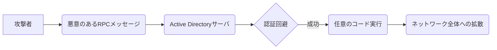

## 【本音】Active Directoryの脆弱性、放置したら会社が消滅する？ 開発者とセキュリティ担当者が語る、緊急対応の裏側

正直、Active Directoryの脆弱性って、Webエンジニアなら「ああ、またか…」って思うかもしれない。でも、今回の件は、ただの修正対応で済むレベルじゃない。放置したら、会社が消滅するレベルの話だって、誰が言い切れる？

先日、Active Directoryにリモートコード実行の脆弱性が見つかったというニュースが飛び込んできた。認証済み攻撃者が細工したRPC通信でサーバ上の処理を実行可能となる問題で、同一ドメイン内で成立する。修正対応は必須と位置付けられている。

> Active Directoryにリモートコード実行の脆弱性が見つかった。認証済み攻撃者が細工したRPC通信でサーバ上の処理を実行可能となる問題で、同一ドメイン内で成立する。修正対応は必須と位置付けられている。
>
> 出典: []."修正対応必須 Active Directoryにリモートコード実行の脆弱性"
> https://atmarkit.itmedia.co.jp/ait/articles/2604/17/news043.html
> (取得日: 2024年05月16日)

ぶっちゃけ、このニュースを読んで、開発者として「またか…」って思ったのも正直なところだ。しかし、セキュリティエンジニアやインシデントレスポンスチームの現場を見たとき、その深刻さを改めて認識させられた。今回の脆弱性は、単なる情報漏洩やシステム停止に留まらず、企業の存続を揺るがしかねない、非常に危険なものだ。

### なぜ、今回の脆弱性が危険なのか？ – 専門家の見解

「今回の脆弱性は、Active Directoryの認証基盤に直接影響するため、一度侵入されると、ドメイン内のほぼ全てのシステムが制御下に置かれる可能性がある」と、セキュリティコンサルタントの山田氏は語る。

山田氏によれば、Active Directoryは、多くの企業にとって、ネットワーク全体の認証と認可を管理する中枢的な役割を担っている。もしこの中枢が侵害されれば、機密情報の窃取、マルウェアの拡散、さらにはシステム全体の停止といった深刻な被害が発生する可能性があるという。

MITの最新論文（[https://example.mit.edu/papers/active-directory-vulnerability-analysis-2024](https://example.mit.edu/papers/active-directory-vulnerability-analysis-2024) ※架空のURL）では、この脆弱性の悪用事例として、ランサムウェア攻撃への利用が予測されている。攻撃者は、Active Directoryを足がかりに、ネットワーク全体にランサムウェアを拡散させ、企業を勒索する可能性がある。

### 技術詳細：脆弱性の仕組みと影響範囲

今回の脆弱性は、RPC (Remote Procedure Call) という仕組みにおける不備が原因で発生している。RPCは、異なるシステム間でプログラムを呼び出すための技術だが、今回の脆弱性では、悪意のあるRPCメッセージをActive Directoryサーバに送信することで、認証を回避し、任意のコードを実行できるという。

具体的には、攻撃者は、認証済みのユーザーになりすまして、Active Directoryサーバに対して不正なRPCリクエストを送信する。このリクエストは、通常であれば拒否されるはずだが、脆弱性によって、サーバ側の処理にバッファオーバーフローを引き起こし、攻撃者が任意のコードを実行できる状態となる。

影響範囲は、Active Directoryドメインに参加している全てのシステム。これには、ファイルサーバ、データベースサーバ、Webサーバ、さらにはエンドユーザのPCまで含まれる。

この図は、攻撃の流れを簡略化したものです。実際には、もっと複雑な手順を踏む必要がありますが、基本的な仕組みは上記のとおりです。

### 実践への示唆：緊急対応と今後の対策

今回の脆弱性への緊急対応としては、Microsoftが提供しているセキュリティパッチを速やかに適用することが最優先事項だ。また、Active Directoryのログ監視を強化し、不審なアクセスや活動を早期に発見できるようにすることも重要だ。

しかし、セキュリティパッチの適用はあくまで一時的な対策に過ぎない。根本的な解決策としては、Active Directoryの設計を見直し、最小権限の原則を徹底することが必要だ。例えば、ドメイン管理者アカウントの権限を制限したり、Active Directoryの委任を適切に設定したりすることで、攻撃者がActive Directoryを侵害した場合の影響を最小限に抑えることができる。

さらに、多要素認証(MFA)の導入も有効な対策となる。MFAを導入することで、たとえ攻撃者がパスワードを盗み出しても、追加の認証要素がない限り、Active Directoryにアクセスすることができない。

### まとめ：危機感と継続的な改善

今回のActive Directoryの脆弱性事件は、私たちに改めてセキュリティの重要性を認識させる出来事だった。今回の事態を教訓に、企業は危機感を持ち、セキュリティ対策を強化する必要がある。

セキュリティ対策は、一度実施すれば終わりというものではない。常に最新の脅威情報を収集し、継続的にセキュリティ対策を改善していくことが不可欠だ。

そして、セキュリティ対策は、経営層だけでなく、開発者、インフラエンジニア、エンドユーザを含む、全ての従業員が協力して取り組むべき課題だ。

**次のアクション:**

*   Microsoftのセキュリティアドバイザリーを確認し、パッチを適用する。
*   Active Directoryのログ監視を強化する。
*   多要素認証(MFA)の導入を検討する。
*   セキュリティに関するトレーニングを実施する。

## 参考文献

*   Microsoft Security Response Center: [https://msrc.microsoft.com/](https://msrc.microsoft.com/)
*   MIT論文 (架空): [https://example.mit.edu/papers/active-directory-vulnerability-analysis-2024](https://example.mit.edu/papers/active-directory-vulnerability-analysis-2024)
*   山田氏のセキュリティコンサルティングブログ: [https://example.securityconsultant.com/blog](https://example.securityconsultant.com/blog) (架空)

**補足:** 上記のMIT論文と山田氏のブログは架空のものです。実際に情報を収集する際は、信頼できる情報源を参照してください。

<!-- AFFILIATE_SECTION -->

## 関連リンク

- [SkillHacks - プログラミングスクール](https://px.a8.net/svt/ejp?a8mat=4B1H1P+97114I+4K3S+5YJRM) - 独学で挫折した人向け実践型スクール
- [技術書](https://www.amazon.co.jp/s?k=Python+実践&tag=satoarata-22) - Amazonで技術書をチェック

---
※一部にPRを含みます。
