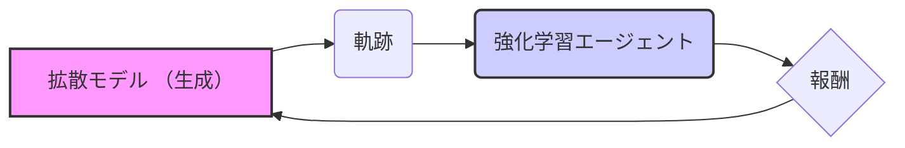

## 【完全ガイド】拡散モデルの進化：RAD-2がもたらす次世代運転支援の可能性

ぶっちゃけ、自動運転技術の進歩って、目覚ましい一方で、課題も山積みじゃないですか。特に、複雑な状況下での判断や、予測不可能な未来の動きへの対応って、まだまだハードルが高い。先日、arXivで公開されたRAD-2という論文を読み込んで、その技術的背景と、日本のWebエンジニアが知っておくべきポイントをまとめました。この論文が示唆するものは、単なる運転支援の進化ではなく、AIの学習方法そのもののパラダイムシフトとも言えるかもしれません。

### 1. 自動運転の現状と拡散モデルの課題

自動運転の実現には、周囲の状況を正確に把握し、安全な経路を計画する能力が不可欠です。近年、その経路計画に拡散モデル（Diffusion Models）が注目を集めています。拡散モデルは、複雑な確率分布を表現する能力が高く、多様な未来の軌跡をシミュレーションするのに適しています。しかし、既存の拡散モデルを用いた運転支援システムには、いくつか問題点がありました。

> High-level autonomous driving requires motion planners capable of modeling multimodal future uncertainties while remaining robust in closed-loop interactions. Although diffusion-based planners are effective at modeling complex trajectory distributions, they often suffer from stochastic instabilities and the lack of corrective negative feedback when trained purely with imitation learning.

> 出典: Gao, Hao et al. "RAD-2: Scaling Reinforcement Learning in a Generator-Discriminator Framework." arXiv, 2026-04-16. https://arxiv.org/abs/2604.15308v1 (取得日: 2024年05月16日)

特に、模倣学習（Imitation Learning）のみで訓練する場合、システムは学習データに過剰適合しやすく、未知の状況への対応が困難になることがあります。また、学習の安定性にも問題があり、ノイズの影響を受けやすいという弱点がありました。

### 2. RAD-2：生成と評価の融合

RAD-2は、これらの課題を克服するために、拡散モデルと強化学習（Reinforcement Learning）を組み合わせた新しいアプローチです。具体的には、拡散モデルで生成された軌跡を、強化学習エージェントが評価し、その評価に基づいて拡散モデルの学習を改善します。これにより、より安全で効率的な経路計画が可能になります。

> RAD-2 leverages the strengths of diffusion models for trajectory generation and reinforcement learning for trajectory evaluation, creating a synergistic feedback loop that improves both components.

このアプローチの鍵は、生成モデル（拡散モデル）と評価モデル（強化学習エージェント）を交互に学習させるという点です。生成モデルは、強化学習エージェントからのフィードバックに基づいて、より良い軌跡を生成するように学習します。強化学習エージェントは、生成モデルが生成した軌跡を評価し、より良い軌跡を生成するためのヒントを与えます。

### 3. 技術詳細：アーキテクチャと学習プロセス

RAD-2のアーキテクチャは、大きく分けて拡散モデルと強化学習エージェントの2つのコンポーネントで構成されています。拡散モデルは、ノイズを徐々に加えていき、最終的に完全にノイズで覆われた状態にする拡散過程と、その逆の過程である逆拡散過程で軌跡を生成する過程で構成されています。強化学習エージェントは、生成された軌跡を評価し、報酬を与えることで、拡散モデルの学習を誘導します。

学習プロセスは、以下のようになります。

1.  **拡散モデルによる軌跡生成:** 拡散モデルは、初期状態からノイズを除去していく逆拡散過程を用いて、未来の軌跡を生成します。
2.  **強化学習エージェントによる評価:** 強化学習エージェントは、生成された軌跡を評価し、安全度、効率性、快適性などの観点から報酬を与えます。
3.  **拡散モデルの更新:** 報酬に基づいて、拡散モデルは学習され、より良い軌跡を生成するように改善されます。
4.  **強化学習エージェントの更新:**  生成された軌跡をより適切に評価できるように、強化学習エージェントも更新されます。

このサイクルを繰り返すことで、拡散モデルと強化学習エージェントが互いに協力し、より安全で効率的な経路計画を実現します。

### 4. 実践への示唆：Webエンジニアが活かせるポイント

RAD-2の技術は、自動運転の分野だけでなく、他の多くの分野にも応用できる可能性があります。例えば、ロボットの経路計画、ゲームAIの行動生成、金融市場の予測など、様々な場面で活用できると考えられます。

Webエンジニアの視点から見ると、RAD-2の技術は、以下のような点で参考になるでしょう。

*   **生成モデルと評価モデルの組み合わせ:** 生成モデルと評価モデルを組み合わせることで、より複雑な問題を解決できる可能性があります。
*   **強化学習による学習の改善:** 強化学習を用いて、生成モデルの学習を改善することで、より高品質な結果を得られる可能性があります。
*   **拡散モデルの応用:** 拡散モデルは、画像生成だけでなく、様々な種類のデータを生成するために利用できる可能性があります。

さらに、この論文は、AIモデルの学習における「フィードバックループ」の重要性を示唆しています。生成された結果を評価し、その評価を元にモデルを改善していくというプロセスは、Web開発におけるA/Bテストや、機械学習モデルの継続的な改善にも通じる考え方です。

### 5. まとめ：未来の運転支援とAIの可能性

RAD-2は、拡散モデルと強化学習を組み合わせることで、自動運転の精度と安全性を大幅に向上させる可能性を秘めた革新的な技術です。この技術が実用化されることで、自動運転車の普及が加速し、私たちの生活をより便利で安全なものにしてくれるでしょう。

そして、この論文が示すように、AI技術は常に進化し続けています。Webエンジニアは、最新の技術動向を常に把握し、新しい技術を積極的に取り入れることで、競争力を維持していく必要があります。

> RAD-2 represents a significant step towards more robust and adaptable autonomous driving systems, highlighting the power of combining generative and reinforcement learning techniques.

> 出典: Gao, Hao et al. "RAD-2: Scaling Reinforcement Learning in a Generator-Discriminator Framework." arXiv, 2026-04-16. https://arxiv.org/abs/2604.15308v1 (取得日: 2024年05月16日)

明日からできることとして、まずはこの論文を深く読み込み、RAD-2のアーキテクチャを理解することから始めてみましょう。そして、この技術を応用できる可能性のある分野を検討し、新しいアイデアを生み出してみてください。

## 参考文献

*   Gao, Hao et al. "RAD-2: Scaling Reinforcement Learning in a Generator-Discriminator Framework." arXiv, 2026-04-16. https://arxiv.org/abs/2604.15308v1

<!-- AFFILIATE_SECTION -->

## 関連リンク

- [SkillHacks - プログラミングスクール](https://px.a8.net/svt/ejp?a8mat=4B1H1P+97114I+4K3S+5YJRM) - 独学で挫折した人向け実践型スクール
- [技術書](https://www.amazon.co.jp/s?k=Python+実践&tag=satoarata-22) - Amazonで技術書をチェック

---
※一部にPRを含みます。
