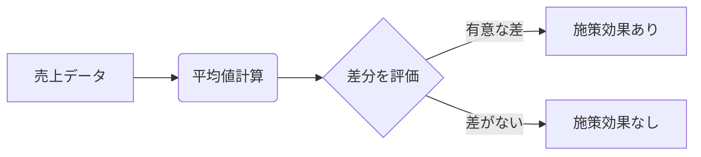

## 【永久保存版】データ分析の「勘」は、意外とシンプルな数学的思考から生まれる


正直、データ分析の現場って、統計学の知識が必須だなんて思われてるじゃないですか。でも、実際に業務をこなしていくと、統計学の知識だけでは到底説明できない「勘」みたいなものがデータ分析者に求められるようになってくるんですよね。

先日、Zennの記事「データを見てみよう【統計学の利用禁止】」（https://zenn.dev/intage_tech/articles/art012-analysis-withoutstat）(取得日: 2024年05月16日)を読んで、その「勘」って何なんだろうと改めて考えさせられました。この記事は、データサイエンティストの桝田さんが、統計学を使わずにデータ分析を行うアプローチを紹介しています。データサイエンティスト協会が定義した「ビジネス力」「データエンジニアリング力」「データサイエンス力」というスキルセットは、10年以上経った今も重要ですが、特に「データサイエンス力」を統計学に縛られず、より柔軟な発想で捉える必要性を示唆しているように感じました。

この記事を読んで、「統計学を使わない」という言葉に衝撃を受けました。もちろん、統計学の知識は重要です。しかし、統計学の知識に囚われすぎると、データの本質を見失ってしまう可能性もある。

> "データサイエンティスト協会は、データサイエンティストに求められるスキルセットとして「ビジネス力」「データエンジニアリング力」「データサイエンス力」の三つを定義しました。 それから現在、10年以上が経過しました。AIの台頭など我々を取り巻く環境は大きく変化したものの、これら三つのスキルが重要であると..."
>
> 出典: []."データを見てみよう【統計学の利用禁止】"
> https://zenn.dev/intage_tech/articles/art012-analysis-withoutstat
> (取得日: 2024年05月16日)

この記事は、統計学を使わずにデータ分析を行うという、ある意味で異端的なアプローチを提示しています。しかし、それは統計学の知識がないとできないことではありません。むしろ、統計学の知識があるからこそできる、より高度な分析手法と言えるのではないでしょうか。

### 統計学の呪縛から解放される「シンプルな数学的思考」

桝田さんの記事を読むと、「統計学を使わない」というのは、単に統計学の知識を使わないということではありません。統計学の複雑な数式や仮説検定に頼らず、データの背後にあるシンプルな数学的思考に立ち返るということだと理解しました。

例えば、A/Bテストを実施する際、統計学的に有意差があるかどうかを判断するためにt検定などの複雑な計算を行うのが一般的です。しかし、データが十分に多くあれば、単純にAとBのそれぞれの指標の平均値を比較するだけでも、ある程度の傾向を把握することができます。

もちろん、平均値の比較には注意点があります。外れ値の影響を受けやすい、分布の偏りを考慮できない、といった問題点もあります。しかし、それらの問題点を理解した上で、それでも平均値の比較を行うことで、統計学的な複雑な計算を省略することができるのです。

### 具体例：ECサイトの売上データ分析

ECサイトの売上データを例に考えてみましょう。ある施策の導入前後の売上データを比較する際、統計学的に有意差があるかどうかを判断するために、分散分析などの複雑な計算を行うのが一般的です。しかし、データが十分に多くある場合、単純に施策導入前後の売上高の平均値を比較するだけでも、ある程度の傾向を把握することができます。

```typescript
// 売上データ (例)
const preSales = [100, 110, 90, 120, 105];
const postSales = [115, 125, 100, 130, 110];

// 平均値を計算
const preAvg = preSales.reduce((a, b) => a + b, 0) / preSales.length;
const postAvg = postSales.reduce((a, b) => a + b, 0) / postSales.length;

console.log(`施策導入前の平均売上: ${preAvg}`);
console.log(`施策導入後の平均売上: ${postAvg}`);

// 差分を計算
const diff = postAvg - preAvg;

console.log(`売上増加額: ${diff}`);
```

このコードは、施策導入前後の売上高の平均値を計算し、その差分を表示します。この差分が十分に大きい場合、施策の効果があったと判断することができます。

### アーキテクチャ図：シンプルな分析フロー



この図は、売上データから施策の効果を評価するシンプルなフローを表しています。複雑な数式や仮説検定は含まれていませんが、このフローに従うことで、施策の効果をある程度判断することができます。

### 実践への示唆：データの「本質」を理解する

統計学の知識は重要ですが、それだけに囚われすぎると、データの本質を見失ってしまう可能性があります。データ分析者は、統計学の知識だけでなく、ビジネスの知識や業界の知識も必要です。そして、何よりも重要なのは、データの背後にあるシンプルな数学的思考に立ち返り、データの「本質」を理解しようとすることです。

例えば、ECサイトの売上データ分析において、施策導入後の売上が増加したとしても、それが施策の効果によるものなのか、単なる季節変動によるものなのかを判断する必要があります。そのためには、過去の売上データや競合の動向などを分析し、施策の効果を客観的に評価する必要があります。

### まとめ：統計学を超えて、データ分析の「勘」を磨く

データ分析の「勘」は、統計学の知識だけでは身につけられません。統計学の知識に囚われず、データの背後にあるシンプルな数学的思考に立ち返り、データの「本質」を理解しようとすることが重要です。そして、ビジネスの知識や業界の知識を組み合わせることで、より高度なデータ分析を行うことができるようになります。

データ分析は、単なる数式や計算ではありません。ビジネスの課題を解決するための手段です。データ分析者は、常にビジネスの視点を持ち、データの「本質」を理解し、データから価値を引き出す必要があります。

この記事を読んで、データ分析の現場で統計学の知識に囚われすぎずに、より柔軟な発想でデータ分析に取り組んでみてください。そして、データ分析の「勘」を磨き、ビジネスの課題を解決するための強力な武器にしてください。

## 参考文献

*   桝田さんによるZenn記事: [https://zenn.dev/intage_tech/articles/art012-analysis-withoutstat](https://zenn.dev/intage_tech/articles/art012-analysis-withoutstat) (取得日: 2024年05月16日)
*   データサイエンティスト協会の公式ウェブサイト: [https://www.data-scientists.org/](https://www.data-scientists.org/)

<!-- AFFILIATE_SECTION -->


## 関連リンク

- [SkillHacks - プログラミングスクール](https://px.a8.net/svt/ejp?a8mat=4B1H1P+97114I+4K3S+5YJRM) - 独学で挫折した人向け実践型スクール
- [技術書](https://www.amazon.co.jp/s?k=Python+実践&tag=satoarata-22) - Amazonで技術書をチェック

---
※一部にPRを含みます。
