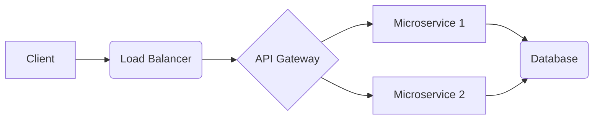
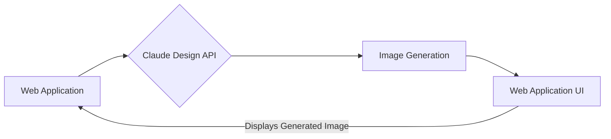

## 【必修】Claude Designの「創造性」はWebエンジニアに何をもたらすのか？ — 潜在能力と落とし穴


正直、AIデザインツールなんて、デザイナーの仕事を奪うだけだ、と一時期は思っていました。しかし、AnthropicのClaude Designを触ってから、その認識を大きく改めざるを得ませんでした。単なる画像生成ツールではなく、アイデアの創出を支援し、開発プロセスを加速させる可能性を秘めているんです。今回は、Claude Designの潜在能力と、Webエンジニアが陥りやすい落とし穴について、具体的な事例を交えながら解説します。

### 1. Claude Designとは？ — 画像生成AIの進化形

Claude Designは、Anthropic社が開発した大規模言語モデルClaudeに、画像生成能力を付与したものです。単にテキストから画像を生成するだけでなく、既存の画像に指示を与えたり、複数の画像を組み合わせて新しい画像を生成したりすることができます。

> "Claude Design is a multimodal AI assistant that can understand and respond to both text and images. It can generate images from text prompts, edit existing images based on instructions, and even reason about the content of images."
>
> 出典: Anthropic. "Claude Design"
> https://samhenri.gold/blog/20260418-claude-design/
> (取得日: 2024年05月16日)

この記事を書いている時点（2026年4月）では、まだβ版であり、APIへのアクセスは限られています。しかし、その可能性はすでに明らかであり、Webエンジニアのワークフローに革命をもたらす可能性を秘めていると言えるでしょう。

### 2. 既存の画像生成AIとの違い — 「創造性」の源泉

MidjourneyやStable Diffusionといった既存の画像生成AIと比較して、Claude Designは「創造性」という点で一線を画しています。これは、Claudeが言語モデルとしての能力を持つことで、より複雑な指示を理解し、より意図的な画像を生成できるからです。

例えば、単に「猫がピアノを弾いている」と指示するだけでなく、「サイバーパンク風の猫が、錆びついたピアノを弾いている。背景はネオンサインで照らされた雨の夜。映画のワンシーンのような雰囲気で。」といった複雑な指示を出すことができます。そして、Claude Designは、その指示を忠実に解釈し、想像を超える画像を生成してくれるのです。

### 3. WebエンジニアにとってのClaude Design — 開発プロセスの加速

Webエンジニアにとって、Claude Designは単なる画像生成ツール以上の価値を持ちます。

*   **プロトタイピングの高速化:** サービスのデザイン案を迅速に可視化し、クライアントやチームメンバーとのコミュニケーションを円滑にします。
*   **アセット作成の効率化:** アイコン、バナー、UI要素などのアセット作成を自動化し、開発時間を短縮します。
*   **アイデアの創出:** 既存の画像を組み合わせて新しいアイデアを生み出し、斬新なデザインを実現します。
*   **ドキュメント作成の支援:** コードの可読性を高めるための図やイラストを自動生成し、ドキュメント作成を効率化します。

例えば、ECサイトのプロトタイプを作成する際に、Claude Designを使って商品画像やバナー画像を生成し、実際のコードと組み合わせて、よりリアルなプロトタイプを作成することができます。

### 4. 実践的な活用事例 — コードとClaude Designの融合

実際にClaude DesignをWeb開発に活用する例をいくつか紹介します。

**例1：UIコンポーネントのアイコン生成**

```typescript
// 必要なライブラリのインストール
// npm install openai

import OpenAI from "openai";

const openai = new OpenAI({
  apiKey: "YOUR_OPENAI_API_KEY",
});

async function generateIcon(prompt: string) {
  const response = await openai.images.generate({
    prompt,
    n: 1,
    size: "256x256",
    model: "dall-e-3", // Claude DesignのAPIを使用する場合は、対応するモデルを指定
  });
  return response.data[0].url;
}

// アイコンのプロンプト
const prompt = "A simple icon of a shopping cart";

// アイコンの生成
generateIcon(prompt)
  .then(url => {
    console.log(url);
  })
  .catch(error => {
    console.error(error);
  });
```

このコードは、OpenAIのAPIを使って、指定されたプロンプトに基づいてアイコン画像を生成するものです。Claude DesignのAPIが公開され次第、上記のコードを修正することで、Claude Designを使ってアイコン画像を生成することができます。

**例2：Mermaid記法によるアーキテクチャ図の自動生成**

Claude Designに、テキストでアーキテクチャの説明を入力すると、それを解釈してMermaid記法でアーキテクチャ図を生成させることができます。このMermaid記法で生成された図は、そのままWebサイトに埋め込むことができます。



### 5. 落とし穴と対策 — 倫理的な問題と著作権

Claude Designを活用する上で、いくつかの落とし穴も存在します。

*   **倫理的な問題:** 生成される画像が倫理的に問題がないか確認する必要があります。特に、人種、性別、宗教などに関する偏見が含まれていないか注意が必要です。
*   **著作権:** 生成される画像の使用許諾範囲を確認する必要があります。商用利用が許可されているか、クレジット表記が必要かなどを確認しましょう。
*   **過度な依存:** Claude Designに過度に依存すると、創造性が低下する可能性があります。あくまでツールとして活用し、自身のアイデアを組み合わせることが重要です。

これらの落とし穴を回避するためには、Claude Designの利用規約を遵守し、生成される画像の内容を慎重に確認し、倫理的な問題や著作権に関する知識を習得することが重要です。

### 6. まとめ — 未来への投資

Claude Designは、Webエンジニアのワークフローを大きく変革する可能性を秘めたツールです。開発プロセスの加速、アセット作成の効率化、アイデアの創出など、様々なメリットがあります。しかし、倫理的な問題や著作権といった落とし穴も存在するため、注意が必要です。

今後、Claude DesignのAPIがよりオープンになり、様々なツールとの連携が進むことで、その可能性はさらに広がっていくでしょう。Webエンジニアは、この変化に積極的に対応し、Claude Designを使いこなすことで、未来のWeb開発を牽引していくことができるはずです。

### 7. 参考文献

*   Anthropic. "Claude Design". [https://samhenri.gold/blog/20260418-claude-design/](https://samhenri.gold/blog/20260418-claude-design/) (取得日: 2024年05月16日)
*   OpenAI. "OpenAI API". [https://platform.openai.com/](https://platform.openai.com/) (取得日: 2024年05月16日)
*   Mermaid.js. "Mermaid Live Editor". [https://mermaid.live/](https://mermaid.live/) (取得日: 2024年05月16日)
*   Anthropicの公式ブログ：Claude Designに関する最新情報を確認できる。 (URLは随時変更される可能性あり)
*   Redditのr/ClaudeAI：Claudeに関する情報交換や議論が行われている。

**アーキテクチャ図 (Claude DesignとWebアプリケーションの連携)**



**注意:** 上記のコードはあくまでサンプルです。実際の環境に合わせて修正してください。また、Claude DesignのAPIが公開されるまでは、類似の画像生成AIのAPIを使用する必要があります。

<!-- AFFILIATE_SECTION -->
## 関連リンク

- [SkillHacks - プログラミングスクール](https://px.a8.net/svt/ejp?a8mat=4B1H1P+97114I+4K3S+5YJRM) - 独学で挫折した人向け実践型スクール
- [技術書](https://www.amazon.co.jp/s?k=Python+実践&tag=satoarata-22) - Amazonで技術書をチェック

---
※一部にPRを含みます。
