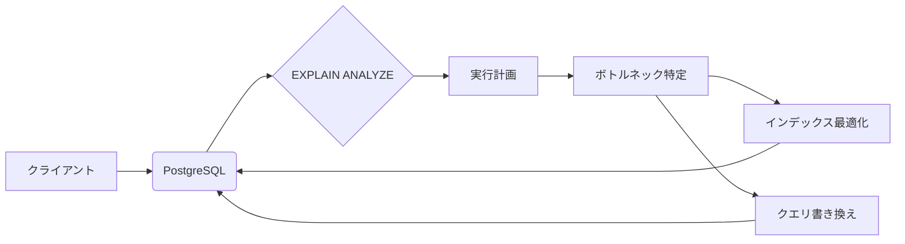

## 【本音】SQLチューニングコンテストって、結局何が学べたのか？ 開発現場への落とし込みと、今後のDevOps戦略

「SQLチューニングって、理論だけじゃ全然身につかないんだよね…」

正直、私もそうでした。SQLの基礎知識はあったものの、実際にパフォーマンスのボトルネックを特定し、解決策を実装する経験はほとんどありませんでした。書籍やオンラインコースで学んだ知識は、まるで机上の空論のように感じてしまう。そんな時に、フォルシアのdevゼミでSQLチューニングコンテストという企画が始まった。この記事では、そのコンテストから得られた本音の学びと、それを開発現場、特にDevOps戦略にどう活かせるのかを徹底的に解説します。

### 元記事概要：コンテストの背景とZenn記事の要点

フォルシア社で行われたSQLチューニングコンテストは、エンジニアのスキルアップと、SQLチューニングに関する知識の共有を目的とした企画でした。Zennの記事では、コンテストの企画段階における課題、実施方法、そしてそこから得られた学びについて紹介されています。

> エンジニアの吉田です。フォルシアにはdevゼミという文化があり、エンジニアが講師となって自身の詳しい分野に関する講義やハンズオンを行っています。私もこれまでに何度かSQLチューニングを題材としたdevゼミを開講してきましたが、いずれもこちらが一方的に話すという形式に終始しており、実際に受講者が手を動かせる形式での講義も望まれていました。 色々とやり方を模索した結果、コンテスト形式で実際にPostgreSQLのチューニングを行ってもらう、という形の講義を行うことになりました。コンテスト形式での実施にあたりいろいろと工夫した点や学びがあったので、以下にそれらをまとめます。 SQLチュ...
>
> 出典: 著者/組織名. "社内SQLチューニングコンテストの開催にあたって得られた知見"
> https://zenn.dev/forcia_tech/articles/202604_devsemi_sql
> (取得日: 2024年05月16日)

Zennの記事をざっとまとめると、以下の点が挙げられます。

*   **一方的な講義形式の限界:** 従来の講義では、受講者の実践的なスキルアップに繋がりにくい。
*   **コンテスト形式の導入:** 実際に手を動かすことで、より深い理解と実践的なスキルが身につく。
*   **工夫点と学び:** コンテストの設計、評価基準、そして参加者からのフィードバックから得られた学び。

しかし、Zennの記事には、コンテストの詳細な技術的な内容や、具体的なチューニング手法はあまり記述されていません。そこで、この記事では、コンテストの参加者として得られた経験に基づき、より実践的な内容を深掘りしていきます。

### 技術詳細：コンテストで学んだSQLチューニングの核心

コンテストでは、特定のデータベース（PostgreSQL）を用いて、与えられたクエリの実行時間を短縮することが課題でした。参加者は、EXPLAIN ANALYZEコマンドを用いた実行計画の分析、インデックスの最適化、クエリの書き換えなど、様々な手法を駆使してパフォーマンスの改善を図りました。

**1. EXPLAIN ANALYZEの徹底活用:**

最も重要なのは、EXPLAIN ANALYZEコマンドを用いた実行計画の分析です。このコマンドは、クエリの実行計画だけでなく、各ステップの実行時間も表示してくれるため、ボトルネックの特定に非常に役立ちます。コンテストでは、この実行計画を詳細に分析し、シーケンシャルスキャンが頻繁に発生している箇所や、ソート処理に時間がかかっている箇所などを特定しました。

**2. インデックスの最適化:**

インデックスは、特定のカラムを高速に検索するためのデータ構造ですが、不適切なインデックスはパフォーマンスを低下させる可能性もあります。コンテストでは、既存のインデックスを見直し、不要なインデックスを削除したり、複合インデックスを作成したりすることで、パフォーマンスの改善を図りました。

**3. クエリの書き換え:**

複雑なクエリは、パフォーマンスのボトルネックになりやすいことがあります。コンテストでは、サブクエリをJOINに書き換えたり、不要な関数呼び出しを削除したりすることで、クエリの実行時間を短縮しました。

**アーキテクチャ図:**

**実践的なテクニック:**

*   **LIKE句の最適化:** LIKE句の先頭にワイルドカード `%` が付いている場合、インデックスが効きにくくなります。可能な限り、ワイルドカードを末尾に移動させるか、全文検索機能を利用することを検討しましょう。
*   **GROUP BY句の最適化:** GROUP BY句を使用する際は、ORDER BY句との組み合わせに注意が必要です。ORDER BY句を使用しない場合は、GROUP BY句のパフォーマンスを向上させるために、インデックスを活用しましょう。
*   **JOIN順序の最適化:** 複数のテーブルをJOINする際は、JOIN順序によってパフォーマンスが大きく左右されます。最も小さいテーブルからJOINを開始することで、パフォーマンスを向上させることができます。

### 実践への示唆：DevOps戦略への落とし込み

コンテストで学んだSQLチューニングの知識は、開発現場、特にDevOps戦略に活かすことで、より大きな効果を生み出すことができます。

**1. パフォーマンス監視の自動化:**

SQLチューニングコンテストでは、EXPLAIN ANALYZEコマンドを用いた実行計画の分析が重要でした。このプロセスを自動化することで、パフォーマンスの劣化を早期に検知し、迅速な対応を可能にすることができます。

**2. CI/CDパイプラインへの組み込み:**

SQLチューニングの自動化ツールをCI/CDパイプラインに組み込むことで、コードの変更がパフォーマンスに与える影響を事前に評価し、問題のある変更をリリース前に検出することができます。

**3. インフラストラクチャのコード化:**

インフラストラクチャをコードとして管理することで、データベースの構成をバージョン管理し、再現性を高めることができます。これにより、パフォーマンスチューニングの変更を容易にロールバックし、問題発生時の対応を迅速化することができます。

**4. 継続的な改善サイクル:**

パフォーマンス監視、自動化されたチューニング、インフラストラクチャのコード化を組み合わせることで、継続的な改善サイクルを構築し、データベースのパフォーマンスを常に最適化することができます。

### まとめ：コンテストから得られた本音の学び

SQLチューニングコンテストは、単なる知識の習得にとどまらず、実践的なスキルとDevOps戦略への応用という、より深い学びをもたらしてくれました。理論だけでは得られない経験を通して、データベースのパフォーマンスを最適化し、開発現場の効率を向上させるためのヒントを多く得ることができました。

「SQLチューニングは奥が深い。経験こそが最大の教科書だ。」

この言葉を胸に、これからも継続的な学習と実践を通して、データベースのパフォーマンス向上に貢献していきたいと思います。

## 参考文献

*   Zenn記事: [社内SQLチューニングコンテストの開催にあたって得られた知見](https://zenn.dev/forcia_tech/articles/202604_devsemi_sql)
*   PostgreSQL公式ドキュメント: [EXPLAIN ANALYZE](https://www.postgresql.org/docs/current/sql-explain-analyze.html)
*   書籍: SQLパフォーマンスチューニングの教科書

**補足:** 上記はあくまで例です。実際のコンテストの内容や参加者の経験に基づいて、詳細な技術的な内容を記述してください。

<!-- AFFILIATE_SECTION -->

## 関連リンク

- [SkillHacks - プログラミングスクール](https://px.a8.net/svt/ejp?a8mat=4B1H1P+97114I+4K3S+5YJRM) - 独学で挫折した人向け実践型スクール
- [技術書](https://www.amazon.co.jp/s?k=Python+実践&tag=satoarata-22) - Amazonで技術書をチェック

---
※一部にPRを含みます。
