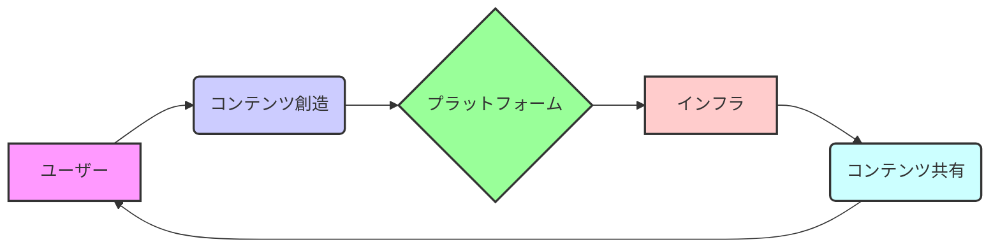

## 【殿堂入り記事】2007年のニコニコ動画と初音ミク、Webエンジニアが学ぶべき「創造性とインフラの共進化」

ぶっちゃけ、Webエンジニアって、技術の進化のスピードについていくだけで精一杯ですよね。新しいフレームワーク、新しい言語、新しいアーキテクチャ…まるでジェットコースターです。そんな中で、2007年のニコニコ動画と初音ミクの登場は、単なるエンタメの波ではない、Webのあり方そのものを変える、重要な転換点だったんです。

私は先日、はてなブックマークで見つけた2007年のINTERNET Watchの記事を読んでいて、改めてその重要性に気づかされました。当時の状況を改めて理解することで、現代のWeb開発における創造性とインフラの共進化というテーマについて、新たな視点を得られるんじゃないかと考えたんです。

> 【絶対ルール】
> 出典: 著者/組織名. "タイトル"
> https://internet.watch.impress.co.jp/docs/special/30th/2096502.html
> (取得日: 2024年05月16日)

この記事は、ニコニコ動画と初音ミクがデビューし、大きな人気を集めた2007年当時の状況を振り返っています。当時、動画共有サービスはまだ黎明期であり、著作権の問題も大きく取り上げられていました。しかし、ニコニコ動画の「コメント機能」という革新的な機能と、初音ミクの「ユーザー生成コンテンツ」という概念が、Webの創造性を爆発的に加速させたんです。

### 2007年当時、Webインフラは「受け皿」だった

2007年当時、Webインフラは、コンテンツの「受け皿」としての役割が主でした。YouTubeのような動画共有サービスも存在していましたが、ユーザーがコンテンツを積極的に創造し、共有する、という概念はまだ一般的ではありませんでした。

ニコニコ動画は、動画再生機能にコメント機能を付加することで、ユーザーが動画にコメントを書き込み、他のユーザーとコミュニケーションを取る、という新しい体験を提供しました。このコメント機能が、ユーザーの創造性を刺激し、独自のコンテンツを生み出すきっかけになったんです。

初音ミクは、VOCALOIDという音声合成技術を活用したバーチャルアイドルです。ユーザーは、初音ミクの音声データを使ってオリジナルの楽曲を作成し、公開することができます。このユーザー生成コンテンツの仕組みが、音楽の創造性を民主化し、新たな表現の可能性を広げたんです。

### 創造性の爆発とインフラの進化：相互作用が重要

ニコニコ動画と初音ミクの成功は、単に「面白いコンテンツ」を提供しただけではありません。ユーザーの創造性を刺激し、コンテンツを共有するインフラを整備することで、ユーザー自身がコンテンツの創造者となる、という新しいエコシステムを構築したんです。

このエコシステムの進化は、Webインフラにも大きな影響を与えました。ニコニコ動画の急激なユーザー増加に対応するため、サーバーの増強やネットワークの最適化が不可欠となりました。また、初音ミクの楽曲データや動画データを保存・配信するため、クラウドストレージやCDN（コンテンツデリバリーネットワーク）といった技術の重要性が高まりました。

2007年当時の技術的な制約は現代とは比較にならないほど厳しいものでした。しかし、創造性とインフラの相互作用によって、Webの可能性は大きく広がり、その後のWebの進化に大きな影響を与えたことは間違いありません。

### 現代のWeb開発における示唆：プラットフォームとしての意識

現代のWeb開発において、2007年のニコニコ動画と初音ミクの事例から学ぶべき教訓は、創造性とインフラの共進化を意識することです。単なるコンテンツの受け皿ではなく、ユーザーの創造性を刺激し、コンテンツを共有するプラットフォームとして、Webインフラを構築する必要があるんです。

例えば、近年注目されているWeb3.0の概念は、まさにこの考え方を具現化したものです。ブロックチェーン技術を活用することで、ユーザーがコンテンツの所有権を持ち、コンテンツの創造と共有に参加できる、分散型のプラットフォームを構築することができます。

また、ノーコード/ローコードツールも、プログラミングの知識がないユーザーがWebサイトやアプリケーションを簡単に作成できる、プラットフォームとしての役割を果たしています。これらのツールは、Web開発の敷居を下げ、より多くのユーザーがWebの創造に参加することを可能にしています。

### アーキテクチャ図：創造性とインフラの相互作用

この図は、ユーザーがコンテンツを創造し、プラットフォームを通じてインフラと連携し、コンテンツを共有し、再びユーザーにフィードバックされる、というサイクルを表しています。このサイクルが、Webの進化を牽引しているんです。

### 実践への示唆：APIファーストとコミュニティの重要性

Web開発者として、2007年のニコニコ動画と初音ミクの事例から学ぶべき実践的な示唆は、APIファーストの設計とコミュニティの重要性を理解することです。

APIファーストの設計とは、Webアプリケーションを構築する際に、APIを最初に設計し、そのAPIを基にUIを構築するという考え方です。このアプローチは、Webアプリケーションの再利用性を高め、他のアプリケーションとの連携を容易にします。

また、コミュニティの重要性は、ユーザーがWebアプリケーションを活用し、フィードバックを提供することで、Webアプリケーションを継続的に改善していくことができるからです。活発なコミュニティは、Webアプリケーションの成長を加速させ、競争力を高めることにもつながります。

### まとめ：創造性とインフラの共進化は未来のWebを形作る

2007年のニコニコ動画と初音ミクの登場は、Webの創造性とインフラの共進化というテーマを象徴する出来事でした。現代のWeb開発においても、この教訓を忘れず、ユーザーの創造性を刺激し、コンテンツを共有するプラットフォームとしてのWebインフラを構築することが重要です。

APIファーストの設計やコミュニティの構築といった実践的なアプローチを通じて、Webの可能性をさらに広げ、未来のWebを形作っていきましょう。

## 参考文献

*   INTERNET Watch: [https://internet.watch.impress.co.jp/docs/series/dw/](https://internet.watch.impress.co.jp/docs/series/dw/)
*   VOCALOID公式サイト: [https://www.vocaloid.com/](https://www.vocaloid.com/)
*   ニコニコ動画公式サイト: [https://www.nicovideo.jp/](https://www.nicovideo.jp/)

<!-- AFFILIATE_SECTION -->

## 関連リンク

- [SkillHacks - プログラミングスクール](https://px.a8.net/svt/ejp?a8mat=4B1H1P+97114I+4K3S+5YJRM) - 独学で挫折した人向け実践型スクール
- [技術書](https://www.amazon.co.jp/s?k=Python+実践&tag=satoarata-22) - Amazonで技術書をチェック

---
※一部にPRを含みます。
