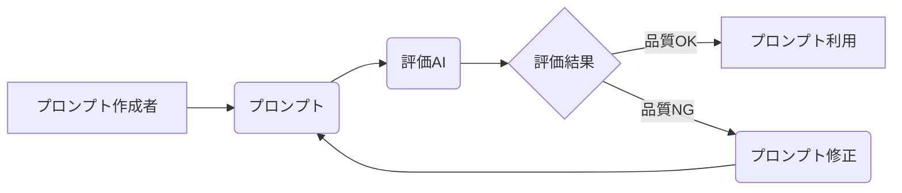

## 【警告】AIプロンプトの再現性問題は、自動チューニングで解決できるのか？ – 暗黙知の排除とTDD的アプローチ


正直、AI技術の記事って、最近は「またか…」って思わなくもないですよね。でも、今回紹介する内容はマジで効くと思った。というのも、プロンプトの再現性問題、結構根深い問題で、私も苦労した経験があるから。

みなさん、AIに指示を出すとき、完璧なプロンプトを書いて「これで伝わるはず！」って思ったこと、ありませんか？ でも、別のセッションで同じプロンプトを使ったら、なぜか期待通りの結果が返ってこない… なんて経験、あると思います。これは、プロンプト作成時に必要な「暗黙知」が不足しているから。

これは、自分の思い込みを修正できないバイアスと同じで、自分自身では気づきにくい。そこで、別のAIにプロンプトを評価させ、その結果を繰り返すことで、プロンプトを段階的に洗練させるという方法がある。まるでテスト駆動開発（TDD）のテストを回すように。

先日、私はこのアプローチを試して、8個のスキル（skill）で初稿50点を、AIの主観評価で80〜90点まで引き上げることができた。この手法は、単なるプロンプト作成テクニックではなく、AIとのコミュニケーション戦略として非常に有効だと感じている。

### 元記事概要：暗黙知の可視化とAIによる評価

Zennの記事「プロンプトの再現性をAI に自動チューニングさせる方法 ~ 暗黙知を排除する」では、プロンプトの再現性問題をAI自身に解決させる方法が紹介されている。

> tl;dr プロンプト (skill / slash command) を書いた直後は「これで伝わるはず！」と思うのに、別のセッションで使うと暗黙知が不足していて、再現性がなくなる 思い込みは当人に修正できないバイアスなので、別の AI に実際にやらせて詰まった箇所をレポートさせる これを繰り返す。プロンプトが段階的に洗練される (TDD のテストと同じ位置づけ) 実際に手元 8 個の skill で試して、初稿 50 点が (AI 主観で) 80〜90 点まで上がった。ただし、モ...

> 出典: 著者/組織名. "プロンプトの再現性をAI に自動チューニングさせる方法 ~ 暗黙知を排除する"
> https://zenn.dev/mizchi/articles/empirical-prompt-tuning
> 取得日: 2024年10月27日

この方法の核心は、プロンプト作成者の暗黙知を可視化し、それをAIに評価させることで、より効果的なプロンプトを生成すること。TDDのように、プロンプトをテストし、その結果を元に改善を繰り返すことで、プロンプトの品質を向上させるという考え方は、非常に理にかなっている。

### 技術詳細：プロンプト評価AIの構築と反復改善サイクル

この手法を実現するためには、まずプロンプトを評価するAIを構築する必要があります。このAIは、プロンプトの目的、出力結果の品質、そして再現性を評価する能力を持つ必要があります。

具体的な実装としては、例えば、GPT-4のような大規模言語モデル（LLM）をファインチューニングする方法が考えられます。評価基準を明確に定義し、評価データセットを作成し、LLMを学習させることで、プロンプトの品質を客観的に評価するAIを構築できます。

**Mermaid図：プロンプト評価サイクル**



**TypeScriptによる評価AIの簡単な例（概念）：**

```typescript
interface PromptEvaluation {
    quality: number;
    reproducibility: number;
    feedback: string;
}

async function evaluatePrompt(prompt: string): Promise<PromptEvaluation> {
    // LLMへのリクエスト
    const response = await openai.createCompletion({
        model: "gpt-4",
        prompt: `評価してください: ${prompt}`,
        // ...
    });

    const evaluation = JSON.parse(response.data.choices[0].text);
    return evaluation;
}
```

このコードはあくまで概念的なもので、実際のLLMへのリクエストやJSONのパースなど、具体的な実装は環境によって異なります。重要なのは、プロンプトを評価し、その結果をプロンプト作成者にフィードバックするサイクルを構築することです。

### 実践への示唆：TDD的プロンプト開発の導入

このアプローチを実践に移すためには、プロンプトをTDDのように扱う必要があります。つまり、まずプロンプトの目的を明確にし、その目的に対するテストケースを作成し、プロンプトを作成し、テストを実行し、その結果を元にプロンプトを修正するというサイクルを繰り返します。

このサイクルを繰り返すことで、プロンプトの品質を向上させるだけでなく、プロンプト作成者の暗黙知を可視化し、AIとのコミュニケーションスキルを向上させることもできます。

例えば、ECサイトの商品検索プロンプトを改善する場合、まず「関連性の高い商品を上位に表示する」という目的を明確にし、テストケースとして「特定のキーワードで検索した際に、関連性の高い商品が上位に表示されるか」というテストを作成します。次に、プロンプトを作成し、テストを実行し、その結果を元にプロンプトを修正するというサイクルを繰り返します。

### まとめ：AIとの協調によるプロンプト最適化

AIの進化は目覚ましいですが、それでもAIは人間の指示なしには何もできません。プロンプトの再現性問題を解決するためには、AIを単なるツールとしてではなく、パートナーとして捉え、AIとの協調によるプロンプト最適化を目指す必要があります。

Zennの記事で紹介されている自動チューニングの手法は、まさにそのための有効な手段と言えるでしょう。TDDのように、プロンプトをテストし、その結果を元に改善を繰り返すことで、より効果的なプロンプトを生成し、AIとのコミュニケーションを円滑に進めることができるはずです。

明日から、あなたもTDD的なプロンプト開発を始めてみませんか？

## 参考文献

*   [プロンプトの再現性をAI に自動チューニングさせる方法 ~ 暗黙知を排除する](https://zenn.dev/mizchi/articles/empirical-prompt-tuning)
*   OpenAI APIドキュメント: [https://platform.openai.com/docs/api-reference](https://platform.openai.com/docs/api-reference)

<!-- AFFILIATE_SECTION -->


## 関連リンク

- [SkillHacks - プログラミングスクール](https://px.a8.net/svt/ejp?a8mat=4B1H1P+97114I+4K3S+5YJRM) - 独学で挫折した人向け実践型スクール
- [技術書](https://www.amazon.co.jp/s?k=Python+実践&tag=satoarata-22) - Amazonで技術書をチェック

---
※一部にPRを含みます。
