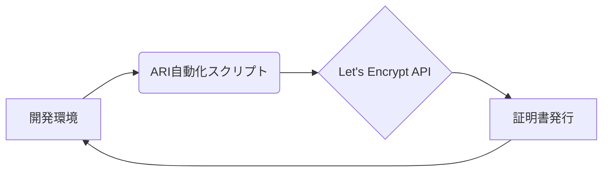

## 【完全自動】Let’s Encryptの短期証明書運用は、開発者の時間泥棒だ


正直、最近のWeb開発の流れを見てると、セキュリティ対策は必須だけど、そのための手間が半端ないですよね。特にSSL証明書の発行と更新。Let's Encryptは無料で利用できる素晴らしいサービスだけど、特に短期証明書を導入している環境では、その運用が想像以上に大変だったという話を聞くことが増えてきました。

先日、ZennでLet’s Encryptの短期証明書運用に関する記事を拝見し、まさに「あるある！」と共感しました。この記事では、その問題点と、より効率的な解決策について、筆者自身の経験と技術的な視点から深く掘り下げていきます。

### 元記事概要: 短期証明書は地雷原だ

> Let’s Encryptの短期証明書は、90日証明書の延長くらいの感覚で入るとかなり厳しいです。 サブドメインを含む複数の証明書を短い間隔で発行・更新する構成では、証明書発行まわりのレート制限に引っかかりやすくなります。短期証明書では更新回数が増えるので、その影響がかなり表面化しやすくなります。 https://letsencrypt.org/docs/rate-limits/ まずステージング環境で試した方がよい 開発やテストでは、本番ではなくステージング環境を使った方がよいです。本番と同じ種類の挙動をかなり緩い制限で試せるので、証明書の切り方や更新方法を確認する段階では先にこちら…

Zennの記事は、Let's Encryptの短期証明書運用におけるレート制限の問題を指摘しています。90日証明書と比較して、短期証明書は更新頻度が高くなるため、Let's Encryptのレート制限に引っかかる可能性が高まるというのです。これは、特にサブドメインを多数利用している環境や、頻繁に証明書を更新する必要がある環境では深刻な問題になりえます。

開発環境でのテストを本番環境で行うべきではないという点も重要です。ステージング環境で事前にテストすることで、本番環境でのトラブルを回避できます。

### 短期証明書運用が開発者の時間泥棒になる理由

Let's Encryptのレート制限は、単に証明書の発行を遅らせるだけではありません。

* **開発サイクルへの影響:** 証明書発行の遅延は、開発サイクルのボトルネックとなり、リリースが遅れる可能性があります。
* **運用コストの増加:** 証明書発行の失敗を何度も繰り返すことで、開発者の時間と労力が浪費されます。
* **信頼性の低下:** 証明書発行の失敗は、Webサイトの信頼性を低下させる可能性があります。

これらの問題を解決するためには、より効率的な運用方法を導入する必要があります。

### ARI（ACME Renewal Interface）の活用: 自動化の切り札

ARIは、Let's Encryptの新しいAPIであり、証明書の自動更新をより柔軟に行うためのインターフェースです。従来のACMEクライアントと比較して、ARIは以下の点で優れています。

* **レート制限の柔軟性:** 証明書発行のレート制限をより細かく制御できます。
* **リアルタイムなステータス:** 証明書発行のステータスをリアルタイムで確認できます。
* **カスタムな自動化:** 独自の自動化スクリプトを作成できます。

ARIを活用することで、証明書発行の自動化をより高度に行うことができ、開発者の負担を大幅に軽減できます。

### 実践的なARI自動化スクリプト例 (TypeScript)

以下は、TypeScriptで書かれたARIを使用した証明書自動更新スクリプトの簡単な例です。

```typescript
import axios from 'axios';

const apiEndpoint = 'https://acme-v01.api.letsencrypt.org/directory';
const accountKey = 'YOUR_ACCOUNT_KEY'; // 自身のAccount Keyに置き換える
const domain = 'example.com'; // 証明書を発行するドメインに置き換える

async function renewCertificate() {
  try {
    const response = await axios.post(`${apiEndpoint}/acme/reg/renew`, {
      key: accountKey,
      domain: domain,
    });

    console.log('Certificate renewal successful:', response.data);
  } catch (error) {
    console.error('Certificate renewal failed:', error.response.data);
  }
}

renewCertificate();
```

このスクリプトは、ARIエンドポイントにリクエストを送信し、証明書を更新します。`YOUR_ACCOUNT_KEY`と`example.com`を自身の値に置き換えてください。

**アーキテクチャ図:**



### 実践への示唆: まずはステージング環境で試す

ARIを活用した自動化スクリプトを導入する前に、必ずステージング環境でテストを行ってください。ステージング環境でテストすることで、本番環境でのトラブルを回避できます。

また、レート制限に関する情報を常に把握し、必要に応じて自動化スクリプトを調整することが重要です。Let's Encryptのドキュメントを定期的に確認し、最新の情報を入手するように心がけましょう。

### まとめ

Let's Encryptの短期証明書運用は、開発者の時間泥棒になりがちです。しかし、ARIを活用した自動化スクリプトを導入することで、この問題を解決し、開発効率を大幅に向上させることができます。

まずはステージング環境でテストを行い、本番環境での運用を開始してください。そして、常に最新の情報を入手し、自動化スクリプトを調整することで、安定したWebサイト運用を実現しましょう。

### 参考文献

* [Let's Encrypt Rate Limits](https://letsencrypt.org/docs/rate-limits/)
* [ACME Renewal Interface (ARI)](https://letsencrypt.org/page/acme-renewal-interface/)
* [ari-client](https://github.com/dwtchr/ari-client) （ARIクライアントの例）

<!-- AFFILIATE_SECTION -->
## 関連リンク

- [SkillHacks - プログラミングスクール](https://px.a8.net/svt/ejp?a8mat=4B1H1P+97114I+4K3S+5YJRM) - 独学で挫折した人向け実践型スクール
- [技術書](https://www.amazon.co.jp/s?k=Python+実践&tag=satoarata-22) - Amazonで技術書をチェック

---
※一部にPRを含みます。
