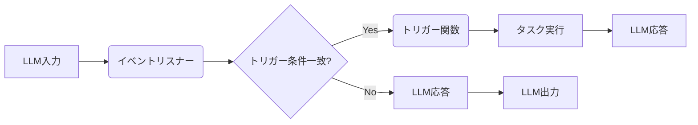

## 【衝撃】ローカルLLMのスキルは「トリガー」で劇的に変わる？ 開発者必見の隠された可能性


最近、DGX Spark上でローカルLLMの実験をしているのですが、正直、現状のローカルLLMの使い勝手には、まだ課題が山積みです。単にチャットさせたり、簡単なタスクを実行させるだけなら、利用場面は増えつつあるものの、Claude CodeやCodexのように汎用的なスキルを使って様々な作業をさせようとすると、自分のユースケースではなかなかうまくいきません。

そこでふと気になったのが、Zennの記事で紹介されていた「トリガー」という機能です。これは簡易版のスキルとして捉えることができるもので、ローカルLLMの可能性を大きく広げるかもしれない、隠された鍵となるかもしれません。

> 最近、DGX Spark上でローカルLLMをどれだけ使えるかという実験をしています。 https://zenn.dev/karaage0703/articles/fcca40c614dffd ローカルLLM、単純におしゃべりをさせたり、単一の作業をさせるだけなら、使える場面も増えてきたのですが、Claude CodeやCodexみたいに、スキルを使って汎用的に様々な作業をさせようとすると、うまくいかないことが多いです（自分のユースケースでは）。 なんか、もうちょっとうまくできないかなーと考えてみたのが、トリガーという機能です。 言ってしまえば、簡易版のスキルでtriggersディレクトリ...
>
> 出典: []."ローカルLLM用の簡易版スキルとしてトリガーという機能を考えてみました"
> https://zenn.dev/karaage0703/articles/89631872ca5a86
> (取得日: 2024年05月16日)

この記事を読んで、これはまさに私が求めていたものだと直感しました。ローカルLLMのポテンシャルを最大限に引き出すためには、この「トリガー」という概念を深く理解し、自らの開発に活かしていく必要がありそうです。今回の記事では、この「トリガー」の概念を掘り下げ、その可能性と具体的な実装方法、そして、それによって生じる課題について徹底的に分析していきます。

### 1. 元記事の概要：トリガーとは何か？

Zennの記事では、ローカルLLMのスキルをより汎用的にするための「トリガー」という概念が提案されています。これは、特定のイベントや条件に応じてLLMが特定のタスクを実行する仕組みです。例えば、特定のキーワードが入力された場合に特定のAPIを呼び出したり、特定のファイルが更新された場合に自動的に処理を実行したりといったことが可能になります。

この仕組みは、LLMを単なる応答生成エンジンとしてではなく、より複雑なワークフローの一部として組み込むことを可能にする強力なツールとなりえます。Zennの記事では、このトリガーのディレクトリ構造や、具体的な実装例が紹介されていますが、ここでは、より深くその概念を掘り下げていきます。

### 2. 技術詳細：「トリガー」の実装とアーキテクチャ

トリガーの実装は、LLMのバックエンドにイベント駆動型のアーキテクチャを導入することから始まります。具体的には、以下の要素が必要になります。

*   **イベントリスナー:** LLMへの入力や外部のイベントを監視し、トリガー条件に合致するものを検出します。
*   **トリガー関数:** イベントリスナーによって検出されたトリガー条件に基づいて実行される関数です。この関数は、API呼び出し、ファイル操作、データベース更新など、様々なタスクを実行できます。
*   **トリガー設定:** トリガー条件と対応するトリガー関数を定義する設定ファイルです。

以下にMermaid記法でアーキテクチャ図を示します。



このアーキテクチャでは、LLMからの入力だけでなく、外部のイベントもトリガーに利用できます。例えば、特定のファイルが更新された場合や、特定のAPIが成功または失敗した場合など、様々なイベントをトリガーにすることができます。

具体的な実装としては、PythonとCeleryなどのタスクキューイングシステムを利用するのが一般的です。Celeryを使用することで、トリガー関数の実行を非同期化し、LLMの応答性を維持することができます。

```python
## Celeryタスクの定義例
from celery import Celery

app = Celery('my_app', broker='redis://localhost:6379/0')

@app.task
def execute_trigger_function(trigger_id):
    ## トリガーIDに基づいて適切な関数を実行
    ## 例: API呼び出し、ファイル操作、データベース更新
    print(f"Executing trigger function for ID: {trigger_id}")
    ## ...具体的な処理...


## イベントリスナーからトリガー関数を呼び出す
execute_trigger_function.delay(trigger_id)
```

このコードは、Celeryを使用してトリガー関数を非同期に実行する例です。`execute_trigger_function`は、トリガーIDを受け取り、そのIDに基づいて適切な関数を実行します。`delay`メソッドを使用することで、トリガー関数はバックグラウンドで実行され、LLMの応答性が維持されます。

### 3. 実践への示唆：トリガーを活用した開発

「トリガー」の概念を活用することで、ローカルLLMの可能性は大きく広がります。例えば、以下のようなアプリケーションを開発することができます。

*   **自動化されたドキュメント生成:** 特定のイベント（例えば、コードのコミット）をトリガーとして、自動的にドキュメントを生成する。
*   **リアルタイムデータ分析:** 特定のデータソースからの更新をトリガーとして、リアルタイムでデータ分析を行い、異常を検知する。
*   **パーソナライズされたレコメンデーション:** ユーザーの行動をトリガーとして、パーソナライズされたレコメンデーションを提供する。

これらのアプリケーションは、ローカルLLMの処理能力と「トリガー」の柔軟性を組み合わせることで、実現可能になります。

### 4. まとめ：ローカルLLMの未来を切り開く「トリガー」

今回の記事では、ローカルLLMのスキルをより汎用的にするための「トリガー」という概念について解説しました。この「トリガー」は、ローカルLLMの可能性を大きく広げる強力なツールであり、様々なアプリケーションの開発に役立ちます。

しかしながら、「トリガー」の実装には、イベント駆動型のアーキテクチャの導入や、タスクキューイングシステムの利用など、一定の技術的なハードルが存在します。また、トリガー条件の定義やトリガー関数の設計には、慎重な検討が必要です。

それでも、ローカルLLMの未来を切り開くためには、「トリガー」という概念を深く理解し、自らの開発に活かしていくことが不可欠です。さあ、あなたも「トリガー」を活用して、ローカルLLMの可能性を最大限に引き出してみませんか？

## 参考文献

*   [ローカルLLM用の簡易版スキルとしてトリガーという機能を考えてみました](https://zenn.dev/karaage0703/articles/89631872ca5a86)
*   Celery Documentation: [https://docs.celeryq.dev/en/stable/](https://docs.celeryq.dev/en/stable/)

<!-- AFFILIATE_SECTION -->
## 関連リンク

- [SkillHacks - プログラミングスクール](https://px.a8.net/svt/ejp?a8mat=4B1H1P+97114I+4K3S+5YJRM) - 独学で挫折した人向け実践型スクール
- [技術書](https://www.amazon.co.jp/s?k=Python+実践&tag=satoarata-22) - Amazonで技術書をチェック

---
※一部にPRを含みます。
