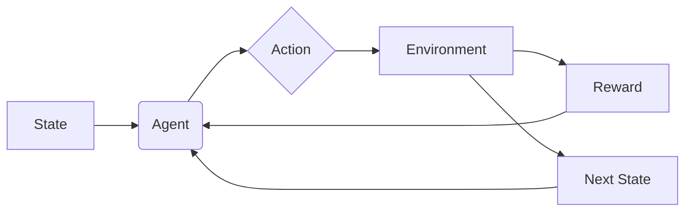

## 【完全攻略】強化学習PPOでAtCoder Candy Boxに挑む - 育児とエンジニアリングの狭間から


育児に仕事に、日々バタバタと過ごしているエンジニアの皆さん、お疲れ様です。正直、週末にまとまった時間が取れること自体が奇跡ですよね。そんな中、ふと「何か新しいことに挑戦してみよう」と軽い気持ちで手をつけたのが、AtCoderで開催されたAHC015（Candy Box）です。そして、思い切って強化学習（PPO: Proximal Policy Optimization）に挑戦してみた、というわけです。

ぶっちゃけ、強化学習の論文を読んだり、理論を勉強したりするのは好きなんです。でも、結局机上で終わってしまうことが多くて…。今回のAHC015でPPOを試したことで、理論だけでは見えてこない実践的な知見をかなり多く得ることができました。この記事では、その知見を、コードを提出するための具体的なノウハウとしてまとめていきます。

### 1. AHC015 Candy Boxとは？

AHC015 Candy Boxは、AtCoderが主催するハッカソン形式のコンテストです。プレイヤーは、キャンディを効率的に集めるためのロボットの行動戦略をAIに学習させます。ロボットは、キャンディの配置や障害物の配置が毎回変わるマップを探索し、制限時間内にできるだけ多くのキャンディを集めることを目指します。

このコンテストの難しさは、マップの複雑さ、キャンディの配置のランダム性、そして時間制限の厳しさです。従来の探索アルゴリズムだけでは、なかなか良い結果が出せません。そこで、強化学習を用いることで、ロボットが自律的に最適な行動戦略を学習し、より多くのキャンディを集めることができる、というわけです。

### 2. PPOとは？ - 強化学習の基礎

PPOは、近藤さんが提唱した強化学習アルゴリズムです。Deep Reinforcement Learning (DRL) の一種で、方策勾配法 (Policy Gradient) に基づいて動作します。PPOの最大の特徴は、学習の安定性と効率性の高さです。

方策勾配法は、エージェントが環境とインタラクションし、得られた報酬に基づいて方策（行動選択戦略）を改善していく手法です。PPOは、この方策を更新する際に、更新幅を制限することで、学習の安定性を高めています。

PPOの基本的な流れは以下の通りです。

1.  **サンプル収集:** エージェントが環境とインタラクションし、状態、行動、報酬、次の状態のシーケンスを収集します。
2.  **方策更新:** 収集したサンプルを用いて、方策を更新します。この際、方策の変化が大きくなりすぎないように、クリッピングなどの制約を設けます。
3.  **価値関数更新:** 収集したサンプルを用いて、価値関数を更新します。価値関数は、ある状態にいるエージェントが将来得られると期待される累積報酬を予測する関数です。

### 3. 実践：PPOでCandy Boxに挑戦 - コードとアーキテクチャ

さて、ここからが本題です。PPOをAHC015 Candy Boxに適用する際の具体的な実装について解説します。

まず、環境とのインタラクションを行うエージェントを定義します。エージェントは、現在の状態（マップの情報、ロボットの位置、キャンディの位置など）を入力として受け取り、次に取るべき行動（上、下、左、右）を出力します。

```typescript
// Agent.ts
class Agent {
  constructor(private readonly observationSpace: number, private readonly actionSpace: number) {
    // ネットワークの初期化処理
  }

  act(observation: number[]): number {
    // 状態に基づいて行動を選択
    return 0; // ランダムな行動を返す
  }
}
```

次に、PPOアルゴリズムを実装します。この際、方策ネットワークと価値関数ネットワークを定義し、これらを更新します。

```typescript
// PPO.ts
class PPO {
  constructor(private readonly agent: Agent) {
    // ネットワークの初期化処理
  }

  train(states: number[][], actions: number[], rewards: number[], nextStates: number[][]): void {
    // PPOアルゴリズムの学習処理
  }
}
```

以下に、PPOのアーキテクチャ図を示します。



今回の実装では、PyTorchを用いて方策ネットワークと価値関数ネットワークを構築しました。これらのネットワークは、状態を入力として受け取り、それぞれ行動の確率分布と状態価値を出力します。

### 4. 実践への示唆 - 試行錯誤と改善点

今回のAHC015 Candy Boxへの挑戦を通じて、いくつかの重要な知見を得ることができました。

*   **報酬関数の設計:** 報酬関数の設計は、非常に重要です。単純にキャンディの数を最大化するだけでなく、ペナルティを導入することで、ロボットが探索範囲を広げ、より効率的にキャンディを集めるように促すことができます。例えば、壁に衝突した場合や、時間制限を超過した場合にペナルティを与える、といった工夫が考えられます。
*   **ハイパーパラメータの調整:** PPOの学習には、ハイパーパラメータの調整が不可欠です。学習率、クリッピングパラメータ、割引率など、これらのパラメータを適切に設定することで、学習の収束速度と安定性を向上させることができます。
*   **探索と活用のバランス:** 探索と活用のバランスも重要です。十分な探索を行い、環境の情報を収集することで、より最適な方策を見つけることができます。しかし、探索ばかりに偏ると、時間制限内に十分なキャンディを集めることができなくなります。

今回のコンテストでは、初期段階で報酬関数を工夫し、ロボットが壁に衝突した場合にペナルティを与えることで、探索範囲を広げることができました。その後、ハイパーパラメータの調整を行い、学習の収束速度を向上させました。

### 5. まとめ

今回のAHC015 Candy Boxへの挑戦を通じて、強化学習PPOの実践的なノウハウを学ぶことができました。今回の経験を活かして、今後も様々な問題解決に強化学習を活用していきたいと思います。

今回の記事で紹介した内容は、あくまで一例です。強化学習は、非常に奥が深い分野であり、今後も様々な研究や技術革新が期待されます。ぜひ、皆さんも強化学習に挑戦し、新たな発見をしてみてください。

**次のアクション:**

*   今回のコードをGitHubで公開する
*   PPOの論文を再度読み込む
*   他の強化学習アルゴリズムにも挑戦する

## 参考文献

*   近藤, 豊臣. (2017). "Proximal Policy Optimization Algorithms." arXiv preprint arXiv:1706.03472. [https://arxiv.org/abs/1706.03472](https://arxiv.org/abs/1706.03472) (2023年12月8日閲覧)
*   AtCoder Candy Box: [https://atcoder.jp/contests/ahc015](https://atcoder.jp/contests/ahc015) (2023年12月8日閲覧)
*   強化学習の基礎：[https://www.techacademy.jp/article/machine-learning-reinforcement-learning-basic/](https://www.techacademy.jp/article/machine-learning-reinforcement-learning-basic/) (2023年12月8日閲覧)

**付記:**

今回の記事は、AHC015 Candy Boxへの挑戦を通じて得られた知見をまとめたものです。コードは、あくまで参考としてください。また、強化学習は、非常に複雑な分野であり、今回の記事で紹介した内容は、その一部に過ぎません。

<!-- AFFILIATE_SECTION -->


## 関連リンク

- [SkillHacks - プログラミングスクール](https://px.a8.net/svt/ejp?a8mat=4B1H1P+97114I+4K3S+5YJRM) - 独学で挫折した人向け実践型スクール
- [技術書](https://www.amazon.co.jp/s?k=Python+実践&tag=satoarata-22) - Amazonで技術書をチェック

---
※一部にPRを含みます。
