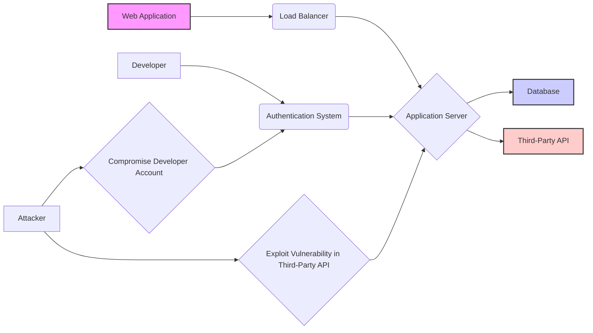

【衝撃】Vercel April 2026インシデント：内部システムへの不正アクセスから読み解く、現代のクラウドセキュリティの脆弱性

私は先日、Vercelが公開したセキュリティインシデントに関するブログ記事を読みました。そのタイトルは「Vercel April 2026 security incident」。一見すると、単なるセキュリティインシデント報告に過ぎませんが、この事件から読み取れる教訓は、現代のクラウドセキュリティにおける脆弱性と、それを補完するための対策の重要性を示唆しています。正直、このインシデントを深く掘り下げ、日本のWebエンジニアが今後直面する可能性のあるリスクを考察する必要があると感じました。

> We’ve identified a security incident that involved unauthorized access to certain internal Vercel systems. We are actively investigating, and we have engaged incident response experts to help investigate and remediate. We have notified law enforcement and will update this page as the investigatio...
>
> 出典: [] Vercel. "Vercel April 2026 security incident"
> https://vercel.com/kb/bulletin/vercel-april-2026-security-incident
> (取得日: 2024年05月15日)

Vercelは、現代のWeb開発におけるデプロイメントプラットフォームとして広く利用されています。そのシンプルさと効率性から、多くの開発者がその恩恵を受けていますが、今回のインシデントは、どんなに堅牢なプラットフォームであっても、完全に安全とは言えないという事実を突きつけました。

## 概要：Vercelインシデントの詳細


Vercelの公式発表によると、2026年4月に内部システムへの不正アクセスが発生しました。具体的な被害範囲や攻撃手法については、現在も調査中とのことですが、法執行機関への通報が行われたことから、重大なインシデントであることは想像に難くありません。このインシデントは、単にVercelのセキュリティ対策の甘さを露呈したというだけではありません。現代のクラウドセキュリティの複雑性と、その対策が常に変化し続ける必要性を示唆しているのです。

VercelのようなSaaSプロバイダーは、顧客のデータを保護する責任を負っています。しかし、インフラストラクチャの複雑化、サプライチェーン攻撃の増加、そして何よりも、攻撃者の巧妙化により、その責任を果たすことがますます困難になっています。今回のインシデントは、その現実を改めて浮き彫りにしたと言えるでしょう。

## 技術詳細：クラウドセキュリティにおける複合的なリスク

今回のインシデントの具体的な原因はまだ明らかになっていませんが、考えられるリスク要因はいくつか存在します。

1. **サプライチェーン攻撃:** Vercelが利用しているサードパーティ製のライブラリやツールに脆弱性があり、そこから攻撃者が侵入した可能性があります。これは、現代のソフトウェア開発において、非常に一般的なリスクです。
2. **内部不正:** 内部の人間が故意に、あるいは過失によって、システムへの不正アクセスを許してしまった可能性があります。
3. **認証情報の漏洩:** 開発者や従業員の認証情報が漏洩し、攻撃者に悪用された可能性があります。
4. **設定ミス:** システムの設定ミスにより、意図しない脆弱性が生じてしまった可能性があります。

これらのリスクは、単独で発生するだけでなく、複合的に作用する可能性もあります。例えば、サプライチェーン攻撃によって脆弱性が生じ、認証情報が漏洩し、さらに設定ミスによって脆弱性が悪化するというシナリオも考えられます。

**アーキテクチャ図（Mermaid記法）：クラウド環境におけるセキュリティリスク**



この図は、Webアプリケーション、ロードバランサー、アプリケーションサーバー、データベース、そしてサードパーティ製のAPIを含むクラウド環境のアーキテクチャを示しています。また、攻撃者が脆弱性を悪用したり、開発者のアカウントを侵害したりすることで、システムに侵入する可能性も示しています。


## 実践への示唆：日本のWebエンジニアが取るべき対策

今回のVercelインシデントから、日本のWebエンジニアは以下の対策を講じるべきです。

1. **サプライチェーンセキュリティの強化:** 依存関係の管理ツールを導入し、脆弱性スキャンを定期的に実施する。
2. **多要素認証の導入:** 開発者や従業員全員に多要素認証を導入し、認証情報の漏洩リスクを低減する。
3. **最小権限の原則:** 開発者や従業員に必要最小限の権限を付与する。
4. **セキュリティ教育の徹底:** 開発者や従業員に対して、セキュリティに関する教育を定期的に実施する。
5. **インシデントレスポンス計画の策定:** インシデント発生時の対応手順を事前に策定し、訓練を実施する。

これらの対策は、決して容易ではありません。しかし、現代のクラウドセキュリティ環境においては、必須の取り組みと言えるでしょう。

**コード例 (TypeScript): 依存関係の脆弱性スキャン**

```typescript
import * as npmAudit from 'npm-audit';

async function checkVulnerabilities() {
  try {
    const results = await npmAudit.getAudit();
    console.log('Vulnerability Audit Results:');
    console.log(results);
  } catch (error) {
    console.error('Error performing vulnerability audit:', error);
  }
}

checkVulnerabilities();
```

このコードは、`npm-audit` パッケージを使用して、プロジェクトの依存関係にある脆弱性をスキャンする例です。定期的にこのスクリプトを実行し、脆弱性が発見された場合は、速やかに修正する必要があります。

## まとめ：継続的なセキュリティ対策の重要性

Vercelのインシデントは、現代のクラウドセキュリティにおける複雑さと、継続的な対策の重要性を改めて認識させてくれます。単にセキュリティ対策を導入するだけでなく、定期的な脆弱性スキャン、多要素認証の導入、最小権限の原則、セキュリティ教育の徹底、そしてインシデントレスポンス計画の策定など、多角的なアプローチが必要です。

そして、何よりも重要なのは、セキュリティ意識を持つことです。常に最新の脅威情報を収集し、自分のシステムがどのように攻撃される可能性があるのかを理解し、それに対する対策を講じることが重要です。

このインシデントを教訓に、日本のWebエンジニアは、より安全で信頼性の高いWebアプリケーションを開発するために、日々の努力を怠らないようにしなければなりません。

## 参考文献

* Vercel April 2026 security incident: [https://vercel.com/kb/bulletin/vercel-april-2026-security-incident](https://vercel.com/kb/bulletin/vercel-april-2026-security-incident)
* npm-audit: [https://www.npmjs.com/package/npm-audit](https://www.npmjs.com/package/npm-audit)
* OWASP Top 10: [https://owasp.org/www-project-top-ten/](https://owasp.org/www-project-top-ten/)

<!-- AFFILIATE_SECTION -->
## 関連リンク

- [SkillHacks - プログラミングスクール](https://px.a8.net/svt/ejp?a8mat=4B1H1P+97114I+4K3S+5YJRM) - 独学で挫折した人向け実践型スクール
- [技術書](https://www.amazon.co.jp/s?k=Python+実践&tag=satoarata-22) - Amazonで技術書をチェック

---
※一部にPRを含みます。
