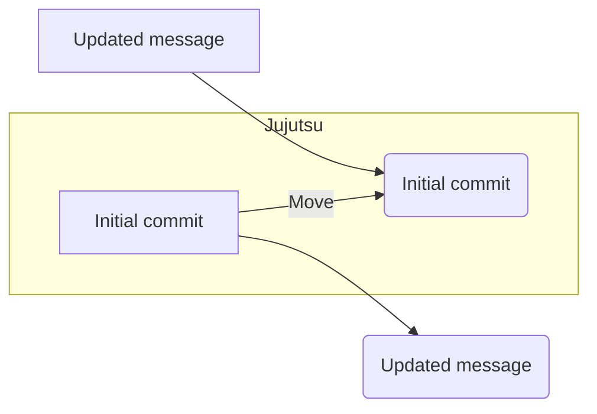

## 【3分でわかる】Jujutsu：Gitを超える？バージョン管理システムの未来を徹底解剖


正直、Gitが盤石な地位を築いているバージョン管理の世界に、新しい風が吹き込んでいるって知ってました？ 私は最近、Jujutsu（jj）という新しいバージョン管理システムに触れて、そのコンセプトと実装に衝撃を受けました。Gitに慣れ親しんでいるエンジニアの私が「これは面白い」と感じた水準なので、注目する価値は大いにあると思います。

> Jujutsu（jj）は、近年注目を集めている新しいバージョン管理システムです。この記事では、Gitを使ったことがある人向けにjjの特徴をいくつか紹介します。 バージョン管理システムとは バージョン管理システムとは、ファイルの変更履歴を記録・管理するためのシステムです。ソフトウェア開発において、ソースコードの変更を追跡し、過去の状態に戻したり、複数人で同じコードベースを編集したりすることを可能にします。 現在もっとも広く使われているバージョン管理システムはGitです。Gitは2005年に最初のバージョンがリリースされました。その後GitHubが2008年に登場し、2010年代の前半に...
>
> 出典: 著者/組織名. "Jujutsu（jj）とは？Gitを使ったことがある人にもわかりやすく解説"
> https://zenn.dev/usamik26/articles/jj-version-control
> (取得日: 2024年05月16日)

この記事では、Jujutsuの魅力と、Gitとの違い、そして将来的な可能性について、筆者自身の経験と分析を交えながら解説していきます。ぶっちゃけ、Gitの複雑さに疲れているエンジニアには、Jujutsuが救いになるかもしれません。

### 1. Jujutsuとは？Gitとの違いを理解する

Jujutsuは、バージョン管理システムを設計する上でのGitの課題点を克服しようと生まれたプロジェクトです。Gitの分散型バージョン管理の概念を受け継ぎつつ、より直感的で使いやすいインターフェースを目指しています。

まず、Gitの複雑さを感じるエンジニアは少なくないはずです。リベース、マージ、cherry-pick…これらのコマンドは、慣れるまでは理解するのが難しいですよね。Jujutsuは、これらの操作をよりシンプルに、そして意図的に行うことができるように設計されています。

例えば、Jujutsuにおけるブランチは「タスク」と呼ばれ、コミットは「変更セット」と呼ばれます。これらの用語は、より具体的な作業内容を連想させ、Gitの抽象的な用語よりも理解しやすいというメリットがあります。さらに、Jujutsuは変更セットを自由に並べ替えたり、結合したりできるため、コミット履歴をより柔軟に管理できます。

### 2. Jujutsuのコアコンセプト：変更セットの自由な操作

Jujutsuの最大の特徴は、変更セットの自由な操作です。Gitでは、コミット履歴は基本的に直線的に進みますが、Jujutsuでは、変更セットを自由に並べ替えたり、結合したり、あるいは削除したりすることができます。

これは、開発プロセスにおける様々な状況に対応するために非常に有効です。例えば、ある機能の実装中に問題が発生した場合、変更セットを一時的に別の場所に移動させて、別のタスクに取り組むことができます。そして、問題が解決したら、変更セットを元の位置に戻して、開発を再開することができます。

この自由な操作性は、Gitでは難しい、より柔軟な開発ワークフローを実現することを可能にします。ただし、この自由度の高さは、使い方を間違えるとコミット履歴が複雑化してしまうリスクも伴います。

### 3. Jujutsuの実践：コード例で理解を深める

実際にJujutsuを使ってみましょう。ここでは、簡単な例として、`hello.txt`というファイルを作成し、その変更履歴を管理する例を紹介します。

```typescript
// hello.txt の初期状態
echo "Hello, world!" > hello.txt

// 変更セットの作成
jj commit -m "Initial commit"

// ファイルの内容を変更
echo "Hello, Jujutsu!" >> hello.txt

// 変更セットの作成
jj commit -m "Updated message"

// 変更セットの並べ替え (例：初期コミットを後回しにする)
jj move 0 2
```

上記のコードは、Jujutsuの基本的な使い方を示しています。`jj commit`コマンドで変更セットを作成し、`jj move`コマンドで変更セットを並べ替えています。この例では、初期コミットを後回しにすることで、コミット履歴をより柔軟に管理しています。

Mermaid図で変更セットの構造を表現すると以下のようになります。



この図は、変更セットの並べ替えによって、コミット履歴がどのように変化するかを示しています。

### 4. 実践への示唆：Jujutsuはどんな時に有効か

Jujutsuは、以下のような状況で特に有効です。

* **複雑な開発ワークフロー:** 複数のタスクを並行して進める場合や、コミット履歴を柔軟に管理したい場合に有効です。
* **実験的な開発:** 新しい技術を試す場合や、実験的な開発を行う場合に、変更セットの自由な操作性が役立ちます。
* **教育目的:** バージョン管理の仕組みを理解するために、Jujutsuを使って実験してみるのも良いでしょう。

しかし、Jujutsuはまだ新しいツールであるため、Gitに比べてドキュメントやコミュニティが少ないというデメリットもあります。また、Gitの豊富な機能やツールとの連携は、まだ十分ではありません。

### 5. まとめ：Jujutsuは未来のバージョン管理システムか？

Jujutsuは、Gitの課題点を克服しようと生まれた、非常に革新的なバージョン管理システムです。変更セットの自由な操作性、直感的なインターフェース、そして柔軟な開発ワークフローを実現できる可能性を秘めています。

もちろん、まだ発展途上のツールであり、Gitに比べて多くの課題を抱えています。しかし、そのコンセプトと実装は、バージョン管理の未来を予感させるものです。

Jujutsuは、Gitを超えるかどうかはまだわかりませんが、バージョン管理の世界に新たな選択肢をもたらすことは間違いありません。

### 参考文献

*   [Jujutsu 公式サイト](https://jujutsu.com/)
*   [Jujutsu GitHub リポジトリ](https://github.com/charles-rec/jujutsu)
*   [Jujutsu ドキュメント](https://jujutsu.com/docs/)

**次のステップ:**

*   Jujutsuを実際にインストールして、簡単なプロジェクトで試してみましょう。
*   Jujutsuのコミュニティに参加して、他のユーザーと情報交換をしましょう。
*   Jujutsuのドキュメントを読んで、より深く理解を深めましょう。

Jujutsuは、まだ始まったばかりのプロジェクトですが、その可能性に期待しましょう。

<!-- AFFILIATE_SECTION -->
## 関連リンク

- [SkillHacks - プログラミングスクール](https://px.a8.net/svt/ejp?a8mat=4B1H1P+97114I+4K3S+5YJRM) - 独学で挫折した人向け実践型スクール
- [技術書](https://www.amazon.co.jp/s?k=Python+実践&tag=satoarata-22) - Amazonで技術書をチェック

---
※一部にPRを含みます。
