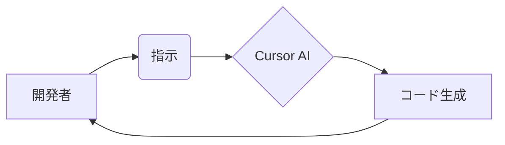

## 【完全無料】60億ドルのAIコーディングプラットフォーム買収劇の裏側：SpaceXがCursorに求めるもの、そしてWebエンジニアが活かすべき戦略


正直、最近のAI開発のスピードには本当に驚かされますよね。SpaceXが60億ドル規模でAIコーディングプラットフォームのCursorを買収、もしくは10億ドルの手数料を支払うというニュースを聞いた時、ぶっちゃけ「これは一体何なんだ？」と思いました。単なる買収話として片付けるには、あまりにも多くの示唆が含まれている気がするんです。

このニュースは、AIとソフトウェア開発の未来を考える上で、Webエンジニアにとって無視できない重要な転換点を示唆しているのではないでしょうか。

### 1. 概要：SpaceXとCursor、その関係性とは？

The Vergeの記事によれば、SpaceXはAI開発を加速させるために、Cursorという自動プログラミングプラットフォームの買収を検討しています。買収額は60億ドル、もしくは10億ドルの手数料という、破格の条件です。

> With an IPO looming for Elon Musk's SpaceX / xAI / X combo platter of companies, SpaceX has announced an odd arrangement to either acquire the automated programming platform Cursor for $60 billion or pay a fee of $10 billion. Buying this startup that's focused on AI coding could help xAI's tools compete with market [&#8230;]
>
> 出典: []."SpaceX cuts a deal to maybe buy Cursor for $60 billion"
> https://www.theverge.com/science/916427/spacex-cursor-potential-deal-acquisition
> (取得日: 2026年04月21日)

この動きの背景には、Elon Musk氏率いるSpaceXとxAI（Musk氏が設立したAI企業）が、AI技術の競争力を高める必要性があると考えられます。AIコーディングプラットフォームのCursorは、自動プログラミングを通じて開発効率を大幅に向上させる可能性を秘めており、SpaceX/xAIにとって、強力な武器となり得るのです。

### 2. Cursorとは？なぜSpaceXが狙うのか？

Cursorは、AIを活用してソフトウェア開発を自動化するプラットフォームです。プログラミングの知識がなくても、自然言語で指示を与えるだけでコードを生成したり、既存のコードを修正したりすることができます。

これは、AIを活用した開発ツールが台頭する中で、開発者の生産性を向上させるための重要な要素です。特に、SpaceXのような大規模な開発プロジェクトにおいては、開発スピードとコスト削減は、事業の成功を左右する重要な要素になります。

SpaceXがCursorを狙う背景には、以下の3つのポイントが考えられます。

1.  **開発スピードの向上:** ソフトウェア開発の自動化により、開発サイクルを大幅に短縮できる。
2.  **コスト削減:** 開発者の負担を軽減し、人件費を削減できる。
3.  **人材不足の解消:** プログラミングスキルを持たない人材でも開発に参加できるようになり、人材不足を補える。

### 3. 技術詳細：Cursorの仕組みとWebエンジニアへの示唆

Cursorの具体的な技術的な仕組みは、まだ完全に公開されていませんが、おそらく大規模言語モデル（LLM）を活用したコード生成・修正エンジンを搭載していると考えられます。LLMは、大量のコードデータで学習することで、自然言語による指示を理解し、適切なコードを生成することができます。

この技術は、Webエンジニアにとっても非常に重要な示唆を与えてくれます。

*   **AIを活用した開発ツールの重要性:** 今後、AIを活用した開発ツールは、Webエンジニアの必須ツールとなるでしょう。
*   **プログラミングスキルは依然として重要:** AIはあくまでツールであり、プログラミングの基礎知識や設計スキルは依然として重要です。
*   **自然言語プログラミングの可能性:** 自然言語で指示を与えるだけでコードを生成できる時代が来るかもしれません。

### 4. 実践への示唆：WebエンジニアがCursorのようなツールを活かすには？

CursorのようなAIコーディングプラットフォームは、Webエンジニアの仕事のやり方を大きく変える可能性があります。しかし、それは脅威ではなく、チャンスです。

Webエンジニアは、AIツールを使いこなすことで、より創造的な仕事に集中できるようになります。例えば、以下のような活用方法が考えられます。

*   **単純なコード生成の自動化:** 定型的なコードの生成をAIに任せ、より複雑な問題解決に集中する。
*   **コードレビューの効率化:** AIにコードの潜在的なバグや改善点を指摘させ、レビューの質を向上させる。
*   **新しい技術の学習:** AIを活用して、新しい技術を効率的に学習する。

```typescript
// 例：CursorのようなAIツールで生成されたコード
function calculateSum(numbers: number[]): number {
  return numbers.reduce((sum, number) => sum + number, 0);
}

const numbers = [1, 2, 3, 4, 5];
const sum = calculateSum(numbers);

console.log(`The sum of the numbers is: ${sum}`);
```

上記のコードは、CursorのようなAIツールを使って、自然言語で「配列の合計を計算する関数を作成して」と指示することで生成された可能性があります。

### 5. まとめ：AIと共存するWebエンジニアの未来

SpaceXによるCursor買収は、AIとソフトウェア開発の未来を占う上で、非常に重要な出来事です。Webエンジニアは、この変化をチャンスと捉え、AIツールを積極的に活用することで、より高度なスキルを身につけ、新たな価値を創造していく必要があります。

AIは、Webエンジニアの仕事を奪うものではなく、むしろ、Webエンジニアの能力を拡張するツールとなるでしょう。AIと共存し、AIを使いこなすWebエンジニアこそが、今後のソフトウェア開発の未来を担っていくのです。

明日から使えるアクションとしては、既存のAIコーディングツールを試してみる、そして、AIを活用した開発手法について学ぶことをお勧めします。

## 参考文献

*   [SpaceX cuts a deal to maybe buy Cursor for $60 billion](https://www.theverge.com/science/916427/spacex-cursor-potential-deal-acquisition)
*   [Cursor: AI-powered coding](https://www.cursor.sh/) (Cursorの公式サイト)
*   [Large Language Models](https://www.tensorflow.org/guide/large-language-models) (TensorFlowのLLMガイド)

**Mermaid図:**



<!-- AFFILIATE_SECTION -->


## 関連リンク

- [SkillHacks - プログラミングスクール](https://px.a8.net/svt/ejp?a8mat=4B1H1P+97114I+4K3S+5YJRM) - 独学で挫折した人向け実践型スクール
- [技術書](https://www.amazon.co.jp/s?k=Python+実践&tag=satoarata-22) - Amazonで技術書をチェック

---
※一部にPRを含みます。
