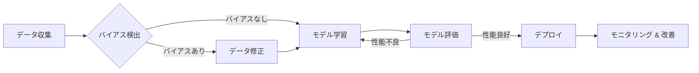

## 【完全保存版】AIレジスタンス：エンジニアが知っておくべき反AI運動の深層と、開発戦略への示唆

先日、Hacker Newsで「AI Resistance: some recent anti-AI stuff that’s worth discussing」という記事が話題になっていました。これは、AI技術に対する抵抗運動が世界中で高まっている現状をまとめたもので、開発者として、そして社会の一員として、無視できない内容でした。ぶっちゃけ、AI開発の熱狂だけが先行し、倫理的、社会的な議論が追いついていない状況は、このままでは大きな問題を引き起こすじゃないですか。この動きを理解し、適切に対応していくためには、エンジニア一人ひとりが意識を変えていく必要があると感じています。

> Article URL: https://stephvee.ca/blog/artificial%20intelligence/ai-resistance-is-growing/ Comments URL: https://news.ycombinator.com/item?id=47839951 Points: 290 # Comments: 283

この記事は、AIに対する様々な抵抗運動を紹介しています。例えば、AIによる雇用の喪失、AIによるバイアスと差別、AIの悪用によるプライバシー侵害など、具体的な問題点が指摘されています。これらの問題は、単なる杞憂ではなく、すでに現実として起きていることなのです。

### AIレジスタンスの背景：なぜ今、反AI運動が活発化しているのか？

AI技術の進歩は目覚ましいものがありますが、それと同時に、社会への影響に対する懸念も高まっています。特に、生成AIの登場以降、その影響は急速に広がり、様々な問題が顕在化しています。

* **雇用の喪失:** AIによる自動化が進み、多くの仕事が代替される可能性があります。特に、定型的な業務や単純作業に従事する人々は、職を失うリスクにさらされています。
* **バイアスと差別:** AIは、学習データに含まれるバイアスを反映し、差別的な結果を生み出す可能性があります。これは、特にマイノリティや弱者にとって深刻な問題です。
* **プライバシー侵害:** AIは、大量の個人データを収集・分析し、個人のプライバシーを侵害する可能性があります。これは、監視社会化のリスクを高めることにも繋がります。
* **誤情報拡散:** 生成AIは、非常にリアルな偽情報を作成し、拡散する可能性があります。これは、社会の信頼を損ない、民主主義を脅かす可能性があります。

これらの問題に対する懸念は、様々な形で社会運動として現れています。例えば、AI開発への抗議デモ、AI規制を求める請願活動、AI倫理に関する議論の活性化などがあります。

### Hacker News コミュニティの反応：多様な意見が交錯する議論

Hacker Newsのコメント欄では、AIレジスタンスに対する様々な意見が交わされています。一部の意見は、AI技術の進歩を阻害するものではないかという懸念を表明しています。しかし、多くのコメントは、AI開発における倫理的配慮の重要性を強調しています。

> "We need to have serious conversations about the societal impact of AI before it's too late."

このコメントは、まさに今の状況を端的に表していると言えるでしょう。AI技術の進歩は、社会に大きな恩恵をもたらす可能性を秘めていますが、同時に、深刻な問題を引き起こす可能性も孕んでいるのです。

### エンジニアが取るべき戦略：倫理的な開発と社会への貢献

エンジニアとして、私たちはAI技術の開発に携わる責任を負っています。AI技術が社会に与える影響を理解し、倫理的な開発を心がける必要があります。

* **倫理的なガイドラインの遵守:** AI開発における倫理的なガイドラインを遵守し、バイアスや差別を排除したAIシステムを開発する必要があります。
* **透明性の確保:** AIシステムの動作原理や学習データを公開し、透明性を確保することで、信頼性を高める必要があります。
* **説明責任の明確化:** AIシステムによる意思決定のプロセスを明確にし、説明責任を果たす必要があります。
* **社会への貢献:** AI技術を活用して、社会問題を解決し、人々の生活を豊かにするようなアプリケーションを開発する必要があります。

### アーキテクチャ図：倫理的AI開発フレームワーク

この図は、倫理的なAI開発フレームワークの一例を示しています。データ収集段階でバイアスを検出し、必要に応じて修正を行い、モデル学習を行います。モデル評価を行い、性能が良好であればデプロイし、その後は継続的なモニタリングと改善を行います。このプロセスを繰り返すことで、倫理的で信頼性の高いAIシステムを構築することができます。

### 実践への示唆：明日からできること

* **AI倫理に関する学習:** AI倫理に関する書籍や論文を読み、知識を深める。
* **倫理的な議論への参加:** AI倫理に関する議論に積極的に参加し、意見を交換する。
* **倫理的な開発の実践:** 開発プロジェクトにおいて、倫理的なガイドラインを遵守する。
* **社会への情報発信:** AI技術の倫理的な問題について、社会に情報発信する。

### まとめ：AIと共存する社会の実現に向けて

AIレジスタンスの動きは、私たちエンジニアにとって、AI技術の開発と利用を見直す良い機会です。倫理的な開発を心がけ、社会への貢献を目指すことで、AIと共存する社会を実現できると信じています。

このHacker Newsの記事は、単なる情報提供にとどまらず、私たちに問いを投げかけています。AI技術は、人類の未来を左右する可能性を秘めている。その力を正しく使い、より良い社会を築くために、私たちは何をすべきなのか？　この問いに対する答えを見つけるために、私たちエンジニアは、社会と対話し、共に歩んでいく必要があるのです。

## 参考文献

* [AI Resistance: some recent anti-AI stuff that’s worth discussing](https://stephvee.ca/blog/artificial%20intelligence/ai-resistance-is-growing/)
* [Hacker News - AI Resistance](https://news.ycombinator.com/item?id=47839951)
* AI倫理に関する書籍や論文 (検索エンジンで "AI ethics" と検索)

<!-- AFFILIATE_SECTION -->

## 関連リンク

- [SkillHacks - プログラミングスクール](https://px.a8.net/svt/ejp?a8mat=4B1H1P+97114I+4K3S+5YJRM) - 独学で挫折した人向け実践型スクール
- [技術書](https://www.amazon.co.jp/s?k=Python+実践&tag=satoarata-22) - Amazonで技術書をチェック

---
※一部にPRを含みます。
