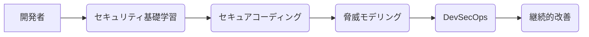

## 【緊急】AIセキュリティ教育のギャップ：現場が取り残される前に、開発者がすべきこと


私は先日、ITmedia AI+の記事「危機感9割、実践4割 AI時代に露呈したセキュリティ教育のギャップ」を読んで、背筋が凍るような感覚を覚えました。AI技術の進化は目覚ましいですが、その影でセキュリティ対策が追いついていないという現実が、日本のWebエンジニア界全体に大きな危機をもたらしているのではないかと。

「AI時代の到来でセキュリティ意識は確実に高まったが、その裏で“準備できている企業”は想像以上に少ないことが分かった。」これは単なる危機感の表明ではなく、今すぐ行動を起こすべき緊急事態を知らせる警鐘です。

> "AI時代の到来でセキュリティ意識は確実に高まったが、その裏で“準備できている企業”は想像以上に少ないことが分かった。投資は進む一方、現場の行動は変わらないというズレはなぜ生まれるのか。"
>
> 出典: []
> https://atmarkit.itmedia.co.jp/ait/articles/2604/21/news046.html
> (取得日: 2024年05月02日)

この記事を読み進めるうちに、私は従来のセキュリティ教育のあり方、そしてWebエンジニアがAI時代に求められるセキュリティ知識と実践能力のギャップについて深く考えるようになりました。今回の記事では、このギャップがなぜ生まれるのか、そして開発者が今できることを具体的に解説します。

### AI時代のセキュリティ：新たな脅威と複雑化するリスク

AIの進化は、セキュリティに新たな脅威をもたらしています。生成AIを活用した巧妙なフィッシング詐欺、AIモデルを標的とした攻撃、そして自動化された脆弱性スキャンなど、従来のセキュリティ対策では対応できない新たなリスクが生まれています。

例えば、OpenAIのChatGPTのような大規模言語モデル(LLM)は、自然な文章を生成する能力を持つため、巧妙なソーシャルエンジニアリング攻撃に悪用される可能性があります。攻撃者は、LLMを使ってターゲットの興味を引くようなメッセージを作成し、マルウェアを仕込んだリンクをクリックさせたり、機密情報を詐取したりするかもしれません。

さらに、AIモデル自体が脆弱性を持つことも懸念されています。敵対的生成(Adversarial Generation)と呼ばれる手法を使うことで、AIモデルの予測結果を意図的に誤らせることが可能です。自動運転車の誤作動や、顔認証システムの誤認識など、深刻な被害につながる可能性もあります。

### なぜギャップが生まれるのか？投資と現場の乖離

ITmedia AI+の記事によると、セキュリティ投資は増加の一途を辿っているにも関わらず、現場の行動がそれに追いついていないという現状があります。この乖離は、いくつかの要因によって引き起こされていると考えられます。

* **教育内容の遅れ:** 従来のセキュリティ教育は、ネットワークセキュリティやマルウェア対策といった基本的な知識に偏りがちです。AI時代の新たな脅威に対応できる知識やスキルが十分に提供されていない。
* **専門知識の不足:** AIセキュリティは、機械学習、深層学習、そしてセキュリティといった複数の分野の知識を組み合わせる必要があり、専門知識を持つ人材が不足している。
* **開発者の意識の低さ:** 開発者は、セキュリティを専門のチームに任せるという意識が根強く残っている。セキュリティを開発プロセスに組み込むことの重要性が十分に理解されていない。
* **時間的制約:** 開発者は、機能開発や納期に追われる日々を送っており、セキュリティ対策に十分な時間を割く余裕がない。

これらの要因が複合的に作用し、AIセキュリティ教育のギャップを生み出しているのです。

### 開発者が今できること：実践的なアプローチ

このギャップを埋めるためには、開発者自身が主体的にセキュリティ知識を習得し、実践的なスキルを身につける必要があります。以下に、具体的なアプローチをいくつか提案します。

1. **AIセキュリティの基礎を学ぶ:** 生成AI、敵対的生成、フェデレーション学習など、AIセキュリティに関する基礎知識を習得する。オンラインコースや書籍を活用し、体系的に学習を進めましょう。
2. **セキュアコーディングを徹底する:** 脆弱性のあるコードを書きにくくするためのコーディング規約を遵守し、静的解析ツールや動的解析ツールを活用する。
3. **脅威モデリングを導入する:** システム設計段階で潜在的な脅威を洗い出し、リスクを評価し、対策を講じる。
4. **ペネトレーションテストを定期的に実施する:** 専門家によるペネトレーションテストを実施し、システムの脆弱性を発見し、対策を講じる。
5. **セキュリティチームとの連携を強化する:** セキュリティチームと密に連携し、セキュリティに関する情報を共有し、共同で対策を講じる。
6. **DevSecOpsを導入する:** 開発、セキュリティ、運用を統合し、セキュリティを開発プロセスに組み込む。

### 実践例：敵対的生成への対策

敵対的生成は、AIモデルの予測結果を意図的に誤らせる攻撃手法です。例えば、画像認識モデルの場合、わずかなノイズを加えることで、モデルが画像を誤認識する可能性があります。

この攻撃を防ぐためには、敵対的学習と呼ばれる手法を用いることができます。敵対的学習では、敵対的なサンプルを生成し、それらを用いてモデルを訓練することで、モデルのロバスト性を高めます。

```python
import tensorflow as tf
import numpy as np

## モデルの定義 (例: MNIST)
model = tf.keras.models.Sequential([
    tf.keras.layers.Flatten(input_shape=(28, 28)),
    tf.keras.layers.Dense(128, activation='relu'),
    tf.keras.layers.Dense(10, activation='softmax')
])


## モデルのコンパイル
model.compile(optimizer='adam',
              loss='sparse_categorical_crossentropy',
              metrics=['accuracy'])

## 敵対的サンプルを生成する関数
def generate_adversarial_example(image, model, epsilon=0.01):
    image = image.numpy()
    gradient = tf.GradientTape()(model(image), training=False)
    sign = tf.sign(gradient)
    perturbed_image = image + epsilon * sign
    perturbed_image = np.clip(perturbed_image, 0, 1)
    return perturbed_image

## 敵対的学習を行う
for epoch in range(10):
    for i in range(100):
        image = np.random.rand(1, 28, 28)
        label = np.random.randint(0, 10)
        adversarial_example = generate_adversarial_example(image, model)
        model.fit(adversarial_example, np.array([label]), epochs=1, verbose=0)

print("敵対的学習終了")
```

このコードは、MNISTデータセットを用いて、敵対的学習を行う簡単な例です。敵対的サンプルを生成し、それらを用いてモデルを訓練することで、モデルのロバスト性を高めることができます。

### まとめ：未来を見据えたセキュリティ対策

AI技術の進化は、セキュリティ対策に新たな課題を突きつけています。従来のセキュリティ教育のあり方を見直し、開発者自身が主体的にセキュリティ知識を習得し、実践的なスキルを身につけることが不可欠です。

今回の記事で紹介したアプローチは、あくまで一例です。それぞれの環境や状況に合わせて、最適な対策を講じる必要があります。しかし、最も重要なことは、常に最新の脅威に目を向け、未来を見据えたセキュリティ対策を継続的に実施することです。

AIセキュリティの専門家不足を補うためには、開発者自身がセキュリティ意識を高め、実践的なスキルを身につけることが重要です。それは、個人のキャリアアップだけでなく、日本のセキュリティレベル全体を向上させることにもつながります。

## 参考文献

* ITmedia AI+「危機感9割、実践4割 AI時代に露呈したセキュリティ教育のギャップ」: [https://www.itmedia.co.jp/ai/articles/2404/19/news062.html](https://www.itmedia.co.jp/ai/articles/2404/19/news062.html)
* TensorFlow 公式ドキュメント: [https://www.tensorflow.org/](https://www.tensorflow.org/)
* 敵対的生成に関する論文: 検索エンジンで "Adversarial Generation" を検索してください。



<!-- AFFILIATE_SECTION -->
## 関連リンク

- [Claude Pro (公式)](https://claude.ai) - 高性能AIアシスタント
- [SkillHacks - AI・プログラミング学習](https://px.a8.net/svt/ejp?a8mat=4B1H1P+97114I+4K3S+5YJRM) - AIを使いこなすエンジニアへ
- [AI関連書籍](https://www.amazon.co.jp/s?k=ChatGPT+Claude+活用&tag=satoarata-22) - 最新AI本

---
※一部にPRを含みます。
