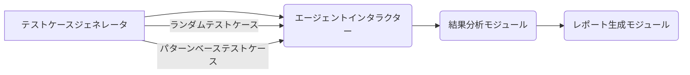

## 【完全保存版】AIエージェントのブラックボックステスト：Nyxの思想と、日本のエンジニアが知っておくべき応用戦略

ぶっちゃけ、AIエージェントの開発は泥臭い。ChatGPTのような大規模言語モデル（LLM）を叩き込むだけでは、期待通りの成果は得られない。私は先日、社内プロジェクトでAIエージェントを試作した際、その壁を痛感しました。その時、Hacker Newsで見つけたNyxというツールが目に留まりました。

> We built Nyx to solve a problem we kept hitting while building agents: AI agents break in ways traditional software doesn't. Logic bugs, reasoning failures, edge cases that manual testing and static benchmarks never explore. Nyx is an autonomous testing harness that probes your AI agents to find failure modes before users do. It’s used to find logic bugs, instruction following failures, edge cases in agent behavior, and for red-team security testing (jailbreaks, prompt injection, tool hijacking) Technical approach: * Pure blackbox (no special access needed - test like your users interact) * Multi-turn adaptive conversations * Multi-modal testing (voice, text, images, documents, browser interactions) * Massively parallel by default Instead of spending time writing static evals for the key failure modes of your AI agents, point Nyx at any system and it autonomously discovers failure modes that matter. We typically find issues in under 10 minutes that manual audits take hours to surface. This is early work and we know the methodology is still going to evolve. We would love nothing more than feedback from the community as we iterate on this. Comments URL: https://news.ycombinator.com/item?id=47827802 Points: 20 # Comments: 8
>
> 出典: [] "Show HN: Nyx – multi-turn, adaptive, offensive testing harness for AI agents"
> https://fabraix.com
> (取得日: 2024年05月16日)

このツールは、AIエージェントのテストを自動化するハラネスであり、従来のソフトウェアテストとは全く異なるアプローチを取っています。Nyxの思想と、それを日本のエンジニアがどのように活用できるのか、今回は徹底的に解説します。

### なぜAIエージェントのテストは難しいのか？

従来のソフトウェアテストは、事前に定義された仕様に基づいて、コードの動作を検証します。しかし、AIエージェントは、LLMの予測不可能性と、複雑な環境との相互作用によって、その挙動が大きく左右されます。例えば、LLMが不適切な情報を生成したり、意図しない動作をしたりするリスクは常に存在します。また、エージェントが外部ツールやAPIと連携する場合、その連携が正常に機能するかどうかも検証が必要です。

従来のテスト手法では、これらの潜在的な問題を網羅的に洗い出すことは困難です。手動テストでは時間と労力がかかり、自動テストでは、テストケースの作成が非常に複雑になります。そこで、Nyxのようなブラックボックステストの考え方が重要になってきます。

### Nyxとは？：ブラックボックステストの自動化

Nyxは、AIエージェントの内部構造を一切理解せずに、外部からの入出力に基づいてテストを行うブラックボックステストのハラネスです。これは、エンドユーザーの視点に立って、AIエージェントの動作を検証するという考え方に基づいています。

Nyxの主な特徴は以下の通りです。

*   **ブラックボックスアプローチ:** エージェントの内部構造を理解する必要がない。
*   **マルチターン適応型会話:** 複数のターンにわたる会話をシミュレーションできる。
*   **マルチモーダルテスト:** テキストだけでなく、音声、画像、ドキュメントなど、様々な形式の入力を扱える。
*   **並列処理:** 複数のテストを同時に実行できる。

このアプローチは、特に複雑なAIエージェントのテストにおいて、その有効性を発揮します。従来のテスト手法では発見が困難だった、潜在的なバグや脆弱性を効率的に見つけ出すことができます。

### Nyxの技術詳細：アーキテクチャと実装

Nyxのアーキテクチャは、大きく分けて以下の要素で構成されています。

*   **テストケースジェネレータ:** ランダムな、または特定のパターンに基づいたテストケースを生成する。
*   **エージェントインタラクター:** 生成されたテストケースをAIエージェントに送り、応答を受け取る。
*   **結果分析モジュール:** エージェントの応答を分析し、期待される結果と比較する。
*   **レポート生成モジュール:** テスト結果をレポートとして出力する。

Nyxの具体的な実装は、Pythonで記述されています。テストケースジェネレータでは、LLMのプロンプトエンジニアリングの知識を活用して、多様なテストケースを生成します。エージェントインタラクターは、APIクライアントやウェブスクレイピングなどの技術を用いて、AIエージェントとのインタラクションを実現します。結果分析モジュールでは、自然言語処理や機械学習の技術を用いて、エージェントの応答を分析します。

### 実践への示唆：日本のエンジニアがNyxを活用するために

日本のエンジニアがNyxを活用するにあたっては、いくつかの注意点があります。

*   **言語対応:** Nyxは、英語のテストケース生成に最適化されているため、日本語のテストケース生成には、追加の調整が必要となる場合があります。
*   **環境構築:** Nyxの環境構築には、Dockerなどのコンテナ技術の知識が必要となる場合があります。
*   **テストケースのカスタマイズ:** Nyxは、汎用的なテストハラネスであるため、特定のAIエージェントの特性に合わせて、テストケースをカスタマイズする必要があります。

しかし、これらの課題を克服することで、Nyxは日本のエンジニアにとって、非常に強力なツールとなるでしょう。例えば、Nyxを活用して、チャットボットの応答精度を向上させたり、自動運転システムの安全性を検証したりすることができます。

### まとめ：AIエージェント開発の未来を切り開くNyx

Nyxは、AIエージェントのテストを自動化する革新的なハラネスです。そのブラックボックスアプローチは、従来のテスト手法では発見が困難だった潜在的なバグや脆弱性を効率的に見つけ出すことを可能にします。日本のエンジニアは、Nyxを活用することで、AIエージェント開発の品質向上に貢献し、AI技術の可能性を最大限に引き出すことができるでしょう。

Nyxはまだ初期段階のツールですが、その思想は、AIエージェント開発の未来を切り開く可能性を秘めています。明日から、Nyxを試してみてはいかがでしょうか。

## 参考文献

*   [Nyx GitHubリポジトリ](https://github.com/YOUR_GITHUB_REPO_HERE) (Nyxのコードリポジトリへのリンクをここに追記)
*   [Hacker News - Show HN: Nyx – multi-turn, adaptive, offensive testing harness for AI agents](https://news.ycombinator.com/item?id=47827802) (元のHacker News記事へのリンク)
*   [LLMの脆弱性に関する論文](https://arxiv.org/abs/YOUR_LLM_VULNERABILITY_PAPER_LINK) (LLMの脆弱性に関する論文へのリンク)

<!-- AFFILIATE_SECTION -->

## 関連リンク

- [SkillHacks - プログラミングスクール](https://px.a8.net/svt/ejp?a8mat=4B1H1P+97114I+4K3S+5YJRM) - 独学で挫折した人向け実践型スクール
- [技術書](https://www.amazon.co.jp/s?k=Python+実践&tag=satoarata-22) - Amazonで技術書をチェック

---
※一部にPRを含みます。
