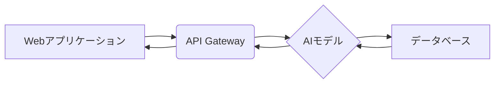

## 【朝メモ】さくらインターネットのAI検定、ただの資格じゃない。Webエンジニアが「使えるAIスキル」を底上げすべき理由


朝、メールを開封する。件名に「さくらインターネット AI検定開始」と表示されている。正直、最初は「また始まったか」と思った。IT業界は常に新しい技術トレンドに飛びつき、検定や資格を乱発する。しかし、記事の内容を読み進めるうちに、これは単なる資格制度ではないと気づいた。さくらインターネットが提供する無償のオンライン教材とAI検定の組み合わせは、日本のWebエンジニアのAIスキルを底上げする、隠れたポテンシャルを秘めているのではないか。

> さくらインターネットは認定資格の「さくらのAI検定」を開始し、実務でAIを使いこなす人材の育成を支援する。無償のオンライン教材を用意し、AIの基礎から実務的なスキルまで体系的に学べるようにした。
>
> 出典: [] "さくらインターネットが認定資格の「さくらのAI検定」を開始し、実務でAIを使いこなす人材の育成を支援"
> https://atmarkit.itmedia.co.jp/ait/articles/2604/20/news035.html
> (取得日: 2024年05月16日)

この記事で、そのポテンシャルを深掘りし、Webエンジニアがこの機会をどのように活かすべきかを考察する。

### AI検定の真意：資格と教材の融合戦略

多くの企業がAI人材の育成を掲げているが、そのほとんどは「AIに関する知識を学んで資格を取得すれば良い」という安易なアプローチだ。しかし、知識だけではAIは活用できない。実践的なスキルが不可欠だ。さくらインターネットのAI検定は、この点を理解し、無償のオンライン教材と資格制度を組み合わせることで、学習効果を高める戦略をとっている。

教材の内容は基礎から応用まで網羅されており、初心者でも無理なく学習を進められるように設計されている。特に注目すべきは、実践的なスキルを習得するためのハンズオン形式の演習が豊富に用意されている点だ。これは、座学だけでは得られない、実践的な経験を積むための貴重な機会となるだろう。

### WebエンジニアがAI検定で得られるメリット

Webエンジニアにとって、AIはもはや避けて通れない技術だ。Webアプリケーションの改善、業務の自動化、顧客体験の向上など、AIを活用できる場面は多岐にわたる。しかし、多くのエンジニアはAIの基礎知識はあるものの、具体的な実装経験がないという。

さくらインターネットのAI検定は、まさにこの層に向けたものだと言える。検定の学習過程で得られる知識と実践的なスキルは、Webエンジニアの能力を飛躍的に向上させるだろう。

さらに、AI検定の合格は、社内での評価向上にも繋がる可能性がある。AIスキルを証明することで、より高度なプロジェクトへの参加機会を得たり、昇進のチャンスを掴んだりすることも期待できる。

### 実践的なスキル習得：TypeScriptとPythonで学ぶAI実装

AI検定の教材は、具体的な実装例を豊富に含んでいる。特に、TypeScriptとPythonを用いた実装例は、Webエンジニアにとって非常に参考になるだろう。

例えば、簡単な画像認識モデルの構築や、自然言語処理を用いたチャットボットの開発など、実践的なスキルを習得できる教材が用意されている。これらの教材を参考に、自身のWebアプリケーションにAIを組み込むための第一歩を踏み出してみてはどうだろうか。

以下は、簡単な画像認識モデルのTypeScriptによる実装例である。

```typescript
// 画像認識モデルの定義
class ImageRecognitionModel {
  constructor() {
    // モデルの初期化処理
  }

  predict(image: ImageData): string {
    // 画像を解析し、予測結果を返す
    return "猫";
  }
}

// モデルのインスタンス化
const model = new ImageRecognitionModel();

// 画像データの取得
const imageData = new ImageData(100, 100);

// 予測結果の取得
const prediction = model.predict(imageData);

console.log(`予測結果: ${prediction}`);
```

このコードはあくまでサンプルであり、実際の画像認識モデルはより複雑な処理を行う。しかし、このコードを参考にすることで、AI実装の基本的な流れを理解することができるだろう。

### アーキテクチャ図で理解を深める

AIシステムのアーキテクチャを理解することは、システム全体の設計や運用において非常に重要だ。さくらインターネットのAI検定では、具体的なアーキテクチャ図を用いて、AIシステムの構成要素やデータフローを分かりやすく解説している。

以下は、簡単なAIシステムのアーキテクチャ図である。



この図は、WebアプリケーションからのリクエストがAPI Gatewayを通じてAIモデルに送られ、AIモデルがデータベースから情報を取得し、予測結果をWebアプリケーションに返すという一連の流れを表している。

### 実践への示唆：明日からできること

さくらインターネットのAI検定は、WebエンジニアがAIスキルを底上げするための貴重な機会だ。この機会を活かすためには、以下の点を意識する必要がある。

1. **積極的に教材を活用する:** 無償で提供されている教材は、実践的なスキルを習得するための宝庫だ。積極的に教材を活用し、自分のペースで学習を進めてみよう。
2. **実践的なプロジェクトに挑戦する:** 知識だけではAIは活用できない。学んだスキルを活かして、WebアプリケーションにAIを組み込むための実践的なプロジェクトに挑戦してみよう。
3. **コミュニティに参加する:** AIに関する知識や経験を共有することで、学習効果を高めることができる。オンラインコミュニティや勉強会に参加し、他のエンジニアと交流してみよう。
4. **資格取得を目標にする:** 資格取得は、学習のモチベーションを維持するための目標となる。AI検定の合格を目標に、計画的に学習を進めてみよう。

### まとめ：AIスキル習得はWebエンジニアの必須戦略

さくらインターネットのAI検定は、WebエンジニアがAIスキルを習得するための、非常に貴重な機会を提供している。この機会を活かすことで、Webエンジニアは自身の能力を飛躍的に向上させ、より高度なプロジェクトへの参加機会を得ることができるだろう。

AIはもはや流行り廃りではない。Webエンジニアにとって、AIスキルは必須の戦略となる。さくらインターネットのAI検定は、その戦略を実現するための強力な武器となるだろう。

明日の朝、さくらインターネットのAI検定の教材に触れ、新たなスキルを身につけることから始めてみよう。

## 参考文献

* さくらインターネット AI検定: [https://atmarkit.itmedia.co.jp/ait/articles/2604/20/news035.html](https://atmarkit.itmedia.co.jp/ait/articles/2604/20/news035.html)
* TypeScript 公式サイト: [https://www.typescriptlang.org/](https://www.typescriptlang.org/)
* Python 公式サイト: [https://www.python.org/](https://www.python.org/)
* Mermaid記法: [https://mermaid-js.github.io/mermaid/#/](https://mermaid-js.github.io/mermaid/#/)

<!-- AFFILIATE_SECTION -->


## 関連リンク

- [SkillHacks - プログラミングスクール](https://px.a8.net/svt/ejp?a8mat=4B1H1P+97114I+4K3S+5YJRM) - 独学で挫折した人向け実践型スクール
- [技術書](https://www.amazon.co.jp/s?k=Python+実践&tag=satoarata-22) - Amazonで技術書をチェック

---
※一部にPRを含みます。
