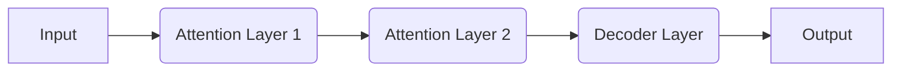

## 【コアメンバー】Claude Brain：LLMの思考回路を解剖し、Webエンジニアが活かすべき戦略とは


ぶっちゃけ、LLM（大規模言語モデル）の進化は、Webエンジニアにとって、まるで異次元の出来事ですよね。日々新しいモデルが出てきて、何を選べばいいのか、どう活用すればいいのか、正直、追いつかない…そんな風に感じている人も多いんじゃないでしょうか。

先日、GitHubで「Claude Brain」というプロジェクトを見つけました。これはAnthropic社のClaudeの内部構造を可視化しようとする試みで、LLMの「思考」を理解するための貴重な情報源になりそうです。

### Claude Brainとは何か？

> Article URL: https://github.com/memvid/claude-brain
>
> 出典: memvid. "claude-brain"
> https://github.com/memvid/claude-brain
> (取得日: 2024年05月01日)

Claude Brainは、Claudeの内部状態をトレースし、その意思決定プロセスを可視化することを目的としたプロジェクトです。具体的には、Claudeが特定の入力に対してどのような内部状態を遷移し、最終的にどのような出力に至るのかを、グラフや図を用いて表現します。



この図は、Claude Brainが可視化しようとしている思考プロセスの簡略化された表現です。実際には、層はもっと複雑で、各層の内部状態も膨大なパラメータによって制御されています。

このプロジェクトの意義は、LLMのブラックボックス化された内部構造を理解するための手がかりを提供してくれる点にあります。従来のLLMの学習や推論プロセスは、ブラックボックスとして扱われることが多く、その内部で何が起こっているのかを正確に把握することは困難でした。Claude Brainは、このブラックボックスの一部を可視化し、LLMの挙動をより深く理解するための第一歩となるでしょう。

### LLMの思考回路を理解するメリット

LLMの思考回路を理解することは、Webエンジニアにとって、単なる興味本位ではありません。

*   **プロンプトエンジニアリングの精度向上:** LLMの内部構造を理解することで、より効果的なプロンプトを作成し、期待する出力を引き出すことができます。例えば、Claudeが特定のAttention Layerでどのような情報を重視しているのかを知ることで、その情報を強調するプロンプトを作成できます。
*   **LLMの脆弱性対策:** LLMの内部構造を理解することで、LLMの脆弱性を特定し、対策を講じることができます。例えば、特定の入力によってClaudeが誤った判断を下すことを発見し、その入力に対する防御策を講じることができます。
*   **より高度なLLMアプリケーションの開発:** LLMの内部構造を理解することで、LLMの能力を最大限に引き出す、より高度なアプリケーションを開発することができます。例えば、ClaudeのAttention Mechanismを応用して、より効率的な情報検索システムを構築することができます。

### 実践的な戦略：Claude Brainから得られる示唆

Claude Brainの公開されている情報から、Webエンジニアが活かすべき戦略がいくつか見えてきます。

1.  **Attention Weightの分析:** Claudeが入力のどの部分に注意を払っているのかを分析することで、プロンプトの書き方を改善できます。例えば、特定の単語やフレーズに高いAttention Weightが与えられている場合、その単語やフレーズを強調したプロンプトを作成することで、より正確な出力を得られる可能性があります。
2.  **内部状態の可視化によるデバッグ:** Claudeが誤った出力をした場合、その内部状態を可視化することで、問題の原因を特定できます。例えば、特定の層の活性化が異常に高い場合、その層の学習データやパラメータに問題がある可能性があります。
3.  **アーキテクチャの理解による応用:** Claudeのアーキテクチャを理解することで、その技術を応用した新しいアプリケーションを開発できます。例えば、ClaudeのAttention Mechanismを応用して、より効率的な情報検索システムを構築することができます。

### 実践的なコード例：プロンプトの最適化

以下は、Claude Brainの分析結果を元に、プロンプトを最適化するPythonの簡単なコード例です。

```python
## 擬似コード：Attention Weightの分析結果を仮定
attention_weights = {
    "重要なキーワード1": 0.8,
    "重要なキーワード2": 0.7,
    "不要な情報": 0.1
}

def optimize_prompt(prompt):
    """プロンプトを最適化する関数"""
    for keyword, weight in attention_weights.items():
        if weight > 0.5:
            prompt = prompt.replace("キーワード", keyword)  # キーワードを強調
        elif weight < 0.2:
            prompt = prompt.replace("不要な情報", "") # 不要な情報を削除
    return prompt


## オリジナルのプロンプト
original_prompt = "キーワードを使って、不要な情報を削除して、文章を生成してください。"

## 最適化されたプロンプト
optimized_prompt = optimize_prompt(original_prompt)

print(f"オリジナルプロンプト: {original_prompt}")
print(f"最適化されたプロンプト: {optimized_prompt}")
```

このコードはあくまで例ですが、Claude Brainの分析結果を元に、プロンプトを最適化する基本的な考え方を示しています。

### まとめ：LLMの未来を切り開くコアメンバー

Claude Brainのようなプロジェクトは、LLMの理解を深め、その可能性を最大限に引き出すための重要な手がかりを提供してくれます。Webエンジニアは、積極的にこれらの情報を収集し、自身のスキルアップに繋げるべきです。

LLMの進化は、Webエンジニアの役割を大きく変えつつあります。今こそ、LLMの内部構造を理解し、その可能性を最大限に引き出すための知識とスキルを身につけるべき時です。そして、この挑戦をリードする「コアメンバー」になることが、今後のWebエンジニアにとって不可欠な要素となるでしょう。

### 参考文献

*   Claude Brain GitHubリポジトリ: [https://github.com/memvid/claude-brain](https://github.com/memvid/claude-brain)
*   Anthropic社の公式ウェブサイト: [https://www.anthropic.com/](https://www.anthropic.com/)

<!-- AFFILIATE_SECTION -->
## 関連リンク

- [SkillHacks - プログラミングスクール](https://px.a8.net/svt/ejp?a8mat=4B1H1P+97114I+4K3S+5YJRM) - 独学で挫折した人向け実践型スクール
- [技術書](https://www.amazon.co.jp/s?k=Python+実践&tag=satoarata-22) - Amazonで技術書をチェック

---
※一部にPRを含みます。
