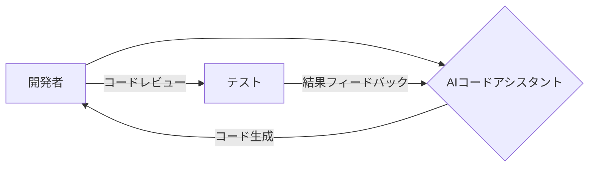

【深夜便】Claude Codeの終焉が日本のWebエンジニアにもたらす衝撃と、次の手を読むための戦略

最近、AnthropicのClaude CodeがPro tierから除外されたというニュースが、開発者コミュニティに波紋を広げています。これは単なる機能の削除ではなく、AI開発の方向性と、それらがWebエンジニアの働き方に与える影響を考える上で重要な転換点です。私も、このニュースを読んで、今後の技術トレンドと自身のスキルセットについて、改めて見つめ直す必要性を感じました。

> Article URL: https://bsky.app/profile/edzitron.com/post/3mjzxwfx3qs2a Comments URL: https://news.ycombinator.com/item?id=47855565 Points: 96 # Comments: 48

今回のClaude Codeの終了は、Anthropicがコード生成に特化したモデルの提供方法を変えるという意思表示と解釈できます。Hacker Newsのコメント欄では、「無料版のClaudeで十分だった」「Anthropicの戦略転換は予想通り」といった意見が見られます。しかし、Claude Codeを利用していた多くのエンジニアにとっては、突然の変更であり、代替手段を探さざるを得ない状況です。

**なぜClaude Codeの終了は重要なのか？**

Claude Codeは、その優れたコード生成能力と自然言語処理能力によって、Webエンジニアの生産性を大幅に向上させてきました。特に、複雑なアルゴリズムの実装や、新しいフレームワークの学習において、その効果は顕著でした。しかし、その利用の容易さゆえに、開発者のスキル低下や、AIへの過度な依存といった懸念も生じていました。今回の終了は、これらの問題を認識し、より持続可能なAI開発のあり方を模索するための措置と捉えるべきでしょう。

### Claude Codeの終焉がWebエンジニアにもたらす影響

今回の変更は、Webエンジニアにもたらす影響は多岐にわたります。

*   **生産性低下:** コード生成の効率が低下し、開発スピードが遅くなる可能性があります。
*   **学習コスト増加:** 代替となるツールや技術を習得する必要が生じます。
*   **AI依存からの脱却:** AIに頼りすぎた開発スタイルを見直し、より基礎的なスキルを向上させる必要性が高まります。
*   **新たな技術トレンドへの対応:** AI開発の方向性が変化し、Webエンジニアは常に最新の技術トレンドに対応していく必要性が求められます。

ぶっちゃけ、Claude Codeのような便利なツールに頼りきっていたエンジニアにとっては、痛手であることは間違いありません。しかし、これは同時に、自身のスキルを棚卸しし、より本質的な技術力を高める良い機会でもあります。

### 次のAIコードアシスタント：代替手段の検討と現実的な戦略

代替となるAIコードアシスタントはいくつか存在します。GitHub Copilot、Tabnine、Amazon CodeWhispererなどが挙げられますが、それぞれに特徴があり、Claude Codeとは異なる強みと弱みを持っています。例えば、GitHub Copilotは、GitHubのリポジトリから学習したコードベースを基に、より高度なコード補完機能を提供します。一方、Tabnineは、プライバシーを重視したローカル環境でのコード補完を特徴としています。

重要なのは、これらのツールを単なるコード生成ツールとしてではなく、あくまで開発を支援するパートナーとして活用することです。AIが生成したコードを鵜呑みにするのではなく、その意図を理解し、必要に応じて修正を加えることが重要です。

```typescript
// 例：GitHub Copilotのコード補完を利用した簡単なAPIエンドポイントの作成
const express = require('express');
const app = express();
const port = 3000;

app.get('/api/hello', (req, res) => {
  res.send('Hello World!');
});

app.listen(port, () => {
  console.log(`Example app listening at http://localhost:${port}`);
});
```

この例では、GitHub Copilotのコード補完機能を利用して、簡単なAPIエンドポイントを作成しました。Copilotは、`app.get`の引数として、`/api/hello`というパスと、コールバック関数を提案してくれました。この提案をそのまま受け入れ、必要な処理を追加することで、簡単にAPIエンドポイントを作成することができました。

### アーキテクチャ図：AIアシスタントと開発者の協調



この図は、AIコードアシスタントと開発者の協調関係を視覚的に表現しています。開発者はAIアシスタントにコード生成を依頼し、AIアシスタントは開発者の指示に基づいてコードを生成します。開発者は生成されたコードをレビューし、必要に応じて修正を加えます。そして、テストの結果をフィードバックすることで、AIアシスタントの精度を向上させることができます。

### 実践への示唆：スキルアップと戦略的選択

今回のClaude Codeの終了は、Webエンジニアにとって、スキルアップの必要性を再認識させる良い機会です。

*   **基礎技術の強化:** コード生成AIに頼りすぎた開発スタイルを見直し、アルゴリズム、データ構造、プログラミング言語の基礎を強化しましょう。
*   **AIリテラシーの向上:** AIの仕組みや限界を理解し、AIを適切に活用できるようになりましょう。
*   **代替ツールの積極的な検証:** 様々なAIコードアシスタントを試してみて、自身の開発スタイルに最適なツールを見つけましょう。
*   **変化への対応力強化:** 今後も技術トレンドは常に変化するため、新しい技術を積極的に学び、変化に対応できる柔軟性を身につけましょう。

### まとめ

Claude Codeの終了は、Webエンジニアにとって一時的な困難をもたらす可能性があります。しかし、これは同時に、自身のスキルを向上させ、より本質的な技術力を高める良い機会でもあります。今回の出来事を教訓に、AIとの共存関係を築き、より創造的で生産的な開発環境を構築していきましょう。

そして、この変化の波に乗り、新たなスキルを習得し、より高度なWebエンジニアとして成長していくことが、今後のWeb開発の現場で生き残るための戦略的な選択となるでしょう。

## 参考文献


*   Anthropic Blog: [https://www.anthropic.com/blog/](https://www.anthropic.com/blog/)
*   GitHub Copilot: [https://github.com/features/copilot](https://github.com/features/copilot)
*   Tabnine: [https://www.tabnine.com/](https://www.tabnine.com/)
*   Amazon CodeWhisperer: [https://aws.amazon.com/codewhisperer/](https://aws.amazon.com/codewhisperer/)
*   Hacker News discussion: [https://news.ycombinator.com/item?id=47855565](https://news.ycombinator.com/item?id=47855565)

<!-- AFFILIATE_SECTION -->
## 関連リンク

- [SkillHacks - プログラミングスクール](https://px.a8.net/svt/ejp?a8mat=4B1H1P+97114I+4K3S+5YJRM) - 独学で挫折した人向け実践型スクール
- [技術書](https://www.amazon.co.jp/s?k=Python+実践&tag=satoarata-22) - Amazonで技術書をチェック

---
※一部にPRを含みます。
