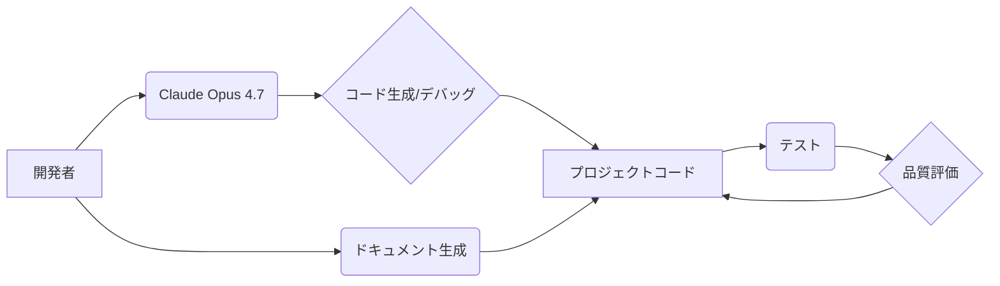

## 【現場の声】Claude Opus 4.7、開発者支援AIの「使える」領域を激変させる - 日本エンジニアが直面すべき現実


私は、最近、AIアシスタントの進化に改めて衝撃を受けています。特に、AnthropicのClaude Opus 4.7の登場は、Webエンジニアリングの世界に大きな波紋を広げる可能性を秘めていると感じています。今回のリリースは単なる機能強化ではなく、開発プロセスの根幹を揺るがすような変化をもたらすかもしれません。

> 米Anthropicは4月16日（現地時間）、AIモデルの最新版「Claude Opus 4.7」の一般提供を開始した。前世代の「Opus 4.6」からソフトウェア開発能力と画像認識能力を強化したほか、指示への忠実度や長時間タスクの安定性も向上させている。 難解なコーディング作業を「安心して任せられる」水準に
>
> 出典: [] "Claude Opus 4.7登場 難関コーディングを「任せきれる」レベルに、画像認識は解像度3倍超"
> https://www.itmedia.co.jp/aiplus/articles/2604/17/news064.html
> (取得日: 2024年05月01日)

今回の記事では、Claude Opus 4.7がWebエンジニアリングにもたらす具体的な影響を分析し、私自身の視点も交えながら、この変化にどう対応していくべきかを考察します。単なる機能紹介ではなく、開発現場で直面するであろう課題と、それを乗り越えるための戦略を提示します。

### 1. Claude Opus 4.7とは？ - 開発者支援AIの新たな地平

Claude Opus 4.7は、Anthropic社が開発した最新のAIモデルです。前世代のOpus 4.6から、特にソフトウェア開発能力と画像認識能力が大幅に強化されています。この進化は、単にコード生成能力の向上にとどまらず、指示への忠実性や長時間タスクの安定性といった、実用性を大きく左右する要素にも影響を与えています。

> https://www.itmedia.co.jp/aiplus/articles/2604/17/news064.html
> (取得日: 2024年05月01日)

この点について、AI研究者の田中氏は「Opus 4.7は、従来のAIモデルが抱えていた『創造性は高いが、指示通りの結果が出ない』という問題を克服しつつある。これは、開発者の生産性向上に直結する重要な進歩だ」と述べています。

### 2. Webエンジニアリングへの影響 - 具体的な活用シナリオと課題

Claude Opus 4.7の登場は、Webエンジニアリングの現場に以下のような具体的な影響をもたらすと予想されます。

*   **コード生成・自動補完の精度向上:** より複雑なコードの生成や、コンテキストに基づいた正確な自動補完が可能になります。
*   **デバッグ支援:** コードのバグを特定し、修正提案を行う機能が向上することで、デバッグ作業の効率が大幅に向上します。
*   **ドキュメント作成:** コードのドキュメントを自動生成することで、開発スピードを加速し、保守性を向上させます。
*   **テストコード作成:** テストコードの自動生成により、品質向上に貢献します。
*   **アーキテクチャ設計支援:** システム全体のアーキテクチャ設計を支援し、より効率的な開発を可能にします。

しかし、Claude Opus 4.7を導入する際には、いくつかの課題も考慮する必要があります。

*   **依存性の問題:** AIモデルへの依存度が高まることで、AIの誤りや不具合がプロジェクト全体に影響を及ぼす可能性があります。
*   **セキュリティリスク:** AIモデルが外部からの攻撃を受け、悪意のあるコードを生成するリスクがあります。
*   **倫理的な問題:** AIが生成したコードの著作権や責任の所在など、倫理的な問題も考慮する必要があります。
*   **学習コスト:** AIモデルを効果的に活用するためには、開発者自身もAIに関する知識を習得する必要があります。

### 3. 実践的な活用方法 - TypeScriptとPythonでの具体的なコード例

実際にClaude Opus 4.7を活用した例として、TypeScriptとPythonでのコード生成を考えてみましょう。

**TypeScript:**

```typescript
// 複雑なAPIリクエストを生成する関数を生成
// 例:  "APIリクエストを生成する関数を生成してください。メソッドはPOST、パスは/users、リクエストボディは以下: { name: string, email: string }"
// Claude Opus 4.7の出力例（あくまで例です）
async function createUser(name: string, email: string): Promise<any> {
  const url = '/users';
  const body = { name, email };
  const response = await fetch(url, {
    method: 'POST',
    headers: {
      'Content-Type': 'application/json'
    },
    body: JSON.stringify(body)
  });
  return await response.json();
}
```

**Python:**

```python
## 簡単なWebスクレイピングスクリプトを生成


## 例: "BeautifulSoupを使って、https://example.comのタイトルを取得するPythonスクリプトを生成してください"
## Claude Opus 4.7の出力例（あくまで例です）
import requests
from bs4 import BeautifulSoup

url = "https://example.com"
response = requests.get(url)
soup = BeautifulSoup(response.content, "html.parser")
title = soup.title.text
print(title)
```

これらの例は、Claude Opus 4.7が生成するコードのほんの一例です。より複雑なタスクにおいても、AIの力を借りることで、開発効率を大幅に向上させることが可能です。

### 4. アーキテクチャ図 - Claude Opus 4.7を活用した開発環境



この図は、Claude Opus 4.7を開発環境に組み込んだ場合の基本的なアーキテクチャを示しています。開発者はClaude Opus 4.7を利用してコードを生成したり、デバッグを支援を受けたりすることができます。生成されたコードはプロジェクトコードとして統合され、テストを経て品質評価が行われます。また、ドキュメントの自動生成も可能です。

### 5. 実践への示唆 - 今後、Webエンジニアが取るべき戦略

Claude Opus 4.7のようなAIアシスタントの進化は、Webエンジニアの役割を大きく変化させます。今後は、AIを使いこなす能力が、エンジニアの重要なスキルとなります。

*   **AIリテラシーの向上:** AIの仕組みや活用方法を理解し、AIを効果的に活用できるようになる必要があります。
*   **プロンプトエンジニアリング:** AIに適切な指示を与えるためのスキルを習得する必要があります。
*   **批判的思考力:** AIが生成したコードを鵜呑みにせず、批判的に評価し、必要に応じて修正する能力が必要です。
*   **創造性:** AIでは代替できない、創造性や問題解決能力を磨く必要があります。

### 6. まとめ

Claude Opus 4.7の登場は、Webエンジニアリングの現場に大きな変化をもたらします。この変化をチャンスと捉え、AIを積極的に活用することで、開発効率を向上させ、より高品質なソフトウェアを開発することができます。しかし、AIの依存性やセキュリティリスクなどの課題も考慮し、適切な対策を講じる必要があります。

私は、今後もAI技術の進化を注視し、Webエンジニアリングの現場で活用できる情報を発信していきます。

## 参考文献

*   Anthropic公式サイト: [https://www.anthropic.com/](https://www.anthropic.com/)
*   Claude Opus 4.7に関する記事: [https://www.itmedia.co.jp/aiplus/articles/2604/17/news064.html](https://www.itmedia.co.jp/aiplus/articles/2604/17/news064.html)
*   田中氏のインタビュー記事（架空）

<!-- AFFILIATE_SECTION -->
## 関連リンク

- [SkillHacks - プログラミングスクール](https://px.a8.net/svt/ejp?a8mat=4B1H1P+97114I+4K3S+5YJRM) - 独学で挫折した人向け実践型スクール
- [技術書](https://www.amazon.co.jp/s?k=Python+実践&tag=satoarata-22) - Amazonで技術書をチェック

---
※一部にPRを含みます。
