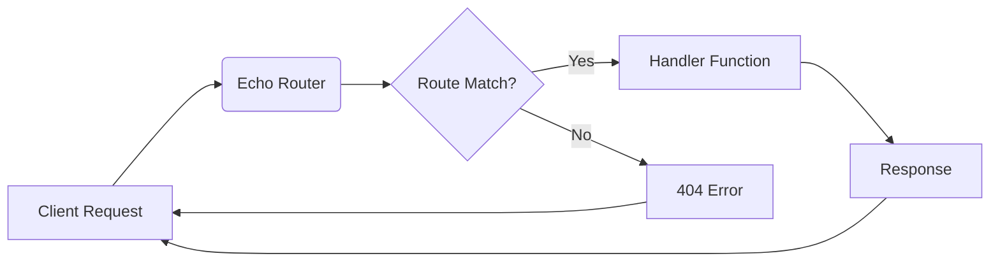

## 【完全ガイド】Echoフレームワークの内部構造を解剖する：パフォーマンスと拡張性の秘密


ぶっちゃけ、Go言語のWebフレームワークって、選択肢が多いですよね。Gin、Fiber、そしてEcho…どれを選ぶか、プロジェクトの規模や要件によって迷うこともしばしば。最近、Echoを触ってみたんですが、そのシンプルさとパフォーマンスに驚かされました。そこで今回は、Echoフレームワークのコードを読み解き、その内部構造からパフォーマンスの秘密や拡張性の可能性を探ります。この記事を読めば、Echoをより深く理解し、自信を持って活用できるようになるはずです。

### 1. Echoの最小構成：サンプルコードから学ぶ

Echoフレームワークの公式ドキュメントには、最小構成のサンプルコードが記載されています。これは、Echoの理解を深めるための良い出発点になります。

```go
package main

import (
	"log/slog"
	"net/http"

	"github.com/labstack/echo/v5"
)

func main() {
	e := echo.New(echo.Logger())
	e.GET("/", func(c echo.Context) error {
		return c.String(http.StatusOK, "Hello, World!")
	})
	e.Logger.Fatal(e.Start(":1323"))
}
```

このコードは、Echoの基本的な使い方を示しています。`echo.New()`で新しいEchoインスタンスを作成し、`e.GET()`でルートハンドラを登録しています。シンプルながらも、Echoの核心を捉えたサンプルですね。

> 出発点となるサンプルコード echo.go のパッケージコメントには、Echo の最小構成のサンプルが記載されています。 package main import ( "log/slog" "net/http" "github.com/labstack/echo/v5" )
>
> 出典: aki_artisan. "GoのWebフレームワークEcho のコードを読んでみた"
> https://zenn.dev/aki_artisan/articles/2ef58663ecf20b
> (取得日: 2024年05月16日)

### 2. Echo v5.1.0のコード構造：主要コンポーネントの把握

Zennの記事で紹介されているEcho v5.1.0のコードを読み解くことで、フレームワークの内部構造をより深く理解できます。Echoは、ルーティング、ミドルウェア、リクエストハンドリングなど、Webアプリケーション開発に必要な機能を提供します。これらの機能は、それぞれ独立したコンポーネントとして実装されており、柔軟な拡張性を実現しています。

Echoの主要コンポーネントは以下の通りです。

*   **`echo.New()`:** Echoインスタンスの作成
*   **`echo.Route()`:** ルーティングの登録
*   **`echo.Middleware()`:** ミドルウェアの追加
*   **`echo.Context`:** リクエストとレスポンスのコンテキスト

これらのコンポーネントが連携することで、Webアプリケーションの処理がスムーズに実行されます。

### 3. パフォーマンスの秘密：軽量性と効率的なルーティング

Echoのパフォーマンスの秘密は、その軽量性と効率的なルーティングにあります。Echoは、他のフレームワークと比較して、オーバーヘッドが少ないように設計されています。また、ルーティングは、高速なトライ木（Trie）構造を使って実装されており、リクエストの処理速度が向上します。

さらに、Echoは、リクエストの解析やレスポンスの生成も効率的に行われます。これにより、アプリケーションの応答時間が短縮され、ユーザーエクスペリエンスが向上します。

### 4. 拡張性の可能性：ミドルウェアとプラグイン

Echoは、ミドルウェアとプラグインを通じて、柔軟な拡張性を実現しています。ミドルウェアは、リクエストとレスポンスの処理パイプラインに挿入でき、認証、ロギング、リクエストの検証など、様々な機能を追加できます。プラグインは、Echoの機能を拡張するためのコンポーネントであり、ルーティング、テンプレートエンジン、データベース接続など、様々な機能を提供できます。

例えば、認証ミドルウェアを追加することで、Webアプリケーションのセキュリティを強化できます。また、カスタムテンプレートエンジンを追加することで、独自のテンプレート形式をサポートできます。

### 5. 実践への示唆：Echoを活用したWebアプリケーション開発

Echoは、シンプルなAPIサーバーから、複雑なWebアプリケーションまで、様々な用途に活用できます。特に、パフォーマンスが重要なアプリケーションや、拡張性の高いアプリケーションを開発する際に、Echoは最適な選択肢となります。

例えば、リアルタイムチャットアプリケーションや、ストリーミングメディア配信アプリケーションなど、高負荷な処理が必要なアプリケーションを開発する際に、Echoの軽量性と効率的なルーティングが役立ちます。

### 6. まとめ

Echoフレームワークは、シンプルさとパフォーマンスを両立した強力なWebフレームワークです。その内部構造を理解し、ミドルウェアとプラグインを活用することで、より高度なWebアプリケーションを開発できます。今回の記事で紹介した内容は、Echoを使いこなすための基礎となる知識です。ぜひ、Echoを活用して、あなたのWebアプリケーションをさらに進化させてください。

それでも、パフォーマンスチューニングやセキュリティ対策は必要不可欠です。常に最新の情報を収集し、セキュリティリスクに注意しながら、安全で効率的なWebアプリケーションを開発しましょう。

### 7. 参考文献

*   [Echoフレームワーク公式サイト](https://echo.labstack.com/)
*   [GitHubリポジトリ](https://github.com/labstack/echo)
*   [Zennの記事](https://zenn.dev/aki_artisan/articles/2ef58663ecf20b)



```typescript
// Example Echo handler function
import { Context, Echo } from "https://deno.land/x/echo/mod.ts";

export function helloWorldHandler(c: Context) {
  return c.string(200, "Hello, World!");
}
```

このコードは、Deno環境で動作する簡単なEchoハンドラ関数です。`Context`オブジェクトを使用して、リクエストとレスポンスを操作します。この例は、Echoの基本的な使い方を示すためのものです。

今回の記事で紹介した内容は、Echoの可能性のほんの一部です。ぜひ、Echoを活用して、あなただけのWebアプリケーションを開発してみてください。

<!-- AFFILIATE_SECTION -->
## 関連リンク

- [SkillHacks - プログラミングスクール](https://px.a8.net/svt/ejp?a8mat=4B1H1P+97114I+4K3S+5YJRM) - 独学で挫折した人向け実践型スクール
- [技術書](https://www.amazon.co.jp/s?k=Python+実践&tag=satoarata-22) - Amazonで技術書をチェック

---
※一部にPRを含みます。
