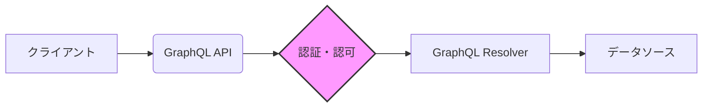

## 【完全自動】GraphQLの型設計と認可：Zenn記事を深掘りし、実務で活かすための落とし穴と回避策

ぶっちゃけ、GraphQLを導入したものの、型設計がうまくいかずに泥沼にハマっているエンジニア、周りにいるんじゃないですか？私もそうでした。GraphQLの柔軟性は素晴らしい反面、型設計を誤るとデータ漏洩やパフォーマンスの悪化を招きかねません。先日、ZennにGraphQL-Rubyの実践ガイドが公開され（https://zenn.dev/saboyutaka/books/graphql-ruby-guide）、これはまさに私に必要な情報だと感じました。この記事では、そのガイドを参考に、GraphQLの型設計と認可の落とし穴を深掘りし、実務で活かすための具体的な回避策を伝授します。

> graphql-rubyで開発中の中級者に向けた、設計判断のための実践ガイド。GraphQL Spec・Relay Spec・graphql-js・graphql-rubyの4つのレイヤーを意識しながら、実行パイプラインの内部構造から型設計、Mutation、認可、パフォーマンス、運用まで体系的に解説します。
>
> 出典: 著者/組織名. "graphql-ruby 実践ガイド"
> https://zenn.dev/saboyutaka/books/graphql-ruby-guide
> (取得日: 2024年05月16日)

この記事の元ネタであるZennの記事は、graphql-rubyの実践ガイドであり、4つのレイヤーを意識した体系的な解説が特徴です。このガイドを読み解くことで、GraphQL開発の理解を深めることができます。特に、型設計と認可の重要性は強調されており、今回の記事はその点を中心に掘り下げていきます。

### 1. 型設計の落とし穴：想定外のフィールドとネスト

GraphQLの強力な機能の一つに、クライアントによるデータ取得の自由度が高いという点があります。しかし、この自由度を最大限に活かすためには、慎重な型設計が不可欠です。型設計を疎かにすると、クライアントが意図しないフィールドにアクセスできてしまい、セキュリティ上の問題を引き起こす可能性があります。

例えば、ユーザー情報に機密性の高い情報（銀行口座情報など）が含まれている場合、クライアントが意図せずそれらのフィールドにアクセスできてしまうと、情報漏洩のリスクが高まります。また、ネストが深くなりすぎると、パフォーマンスが著しく低下する可能性があります。

筆者の意見として、GraphQLの型設計は、単なるデータ構造の定義ではなく、**セキュリティとパフォーマンスを考慮した戦略的な設計**であるべきだと考えています。

### 2. 認可の実装：フィールドレベルの制御と複雑さ

GraphQLでは、リソースベースの認可だけでなく、フィールドレベルの認可を実装することが重要です。例えば、特定のユーザーだけがアクセスできるフィールドを用意したり、特定の条件を満たすユーザーだけが書き込み可能なMutationを用意したりすることができます。

しかし、フィールドレベルの認可を実装することは、複雑さを伴います。特に、認可ロジックが複雑になるほど、コードの可読性が低下し、バグが発生しやすくなります。また、認可ロジックのテストも煩雑になりがちです。

Zennの記事では、この認可の実装における複雑さを認識し、それをどのように回避するかについて言及しています。具体的な実装方法としては、カスタムディレクティブを利用したり、認可フレームワークを活用したりする方法が挙げられます。

### 3. 実践的な回避策：スキーマファーストとガードクラス

型設計と認可の落とし穴を回避するためには、いくつかの実践的な対策を講じる必要があります。

* **スキーマファースト:** スキーマを最初に定義し、それに基づいてコードを生成するアプローチを採用することで、型設計の誤りを早期に発見することができます。
* **ガードクラス:** 認可ロジックをガードクラスとして実装することで、コードの可読性を向上させ、テストを容易にすることができます。
* **レートリミット:** クライアントからのリクエスト数を制限することで、DoS攻撃やリソースの枯渇を防ぐことができます。
* **入力バリデーション:** クライアントからの入力を厳密に検証することで、SQLインジェクションなどのセキュリティリスクを軽減することができます。

例えば、TypeScriptでGraphQLスキーマを定義し、それに基づいてGraphQL resolversを自動生成するツールを使用することで、スキーマファーストのアプローチを簡単に実装することができます。

Mermaid記法でアーキテクチャ図を示すと以下のようになります。

この図では、クライアントからのリクエストがGraphQL APIに到達し、認証・認可のチェックを経てGraphQL Resolverに渡されることを示しています。

### 4. 実践への示唆：GraphQLの成功は型設計と認可にかかっている

GraphQLの導入は、単にAPIを効率化するだけでなく、ビジネスの成功にも繋がる可能性があります。しかし、GraphQLの成功は、型設計と認可の徹底にかかっています。

型設計を疎かにすると、データ漏洩やパフォーマンスの悪化を招き、ビジネスの信頼を損なう可能性があります。また、認可の実装を誤ると、不正アクセスやデータ改ざんのリスクが高まり、法的な問題に発展する可能性があります。

Zennの記事で紹介されている様々なテクニックを参考に、GraphQLの型設計と認可を徹底し、安全で効率的なGraphQL APIを構築しましょう。

### 5. まとめ

GraphQLは強力なAPI技術ですが、その潜在能力を最大限に引き出すためには、慎重な型設計と認可の実装が不可欠です。今回の記事では、Zennの記事を参考に、GraphQLの型設計と認可の落とし穴を深掘りし、実践的な回避策を解説しました。これらの対策を講じることで、安全で効率的なGraphQL APIを構築し、ビジネスの成功に繋げることができるでしょう。

明日のアクションとしては、まずGraphQLスキーマをレビューし、型設計の改善点を見つけることから始めてみてください。そして、ガードクラスの実装やカスタムディレクティブの活用など、認可の強化策を検討してみてください。

## 参考文献

* [graphql-ruby 実践ガイド](https://zenn.dev/saboyutaka/books/graphql-ruby-guide)
* [GraphQLの型設計のベストプラクティス](https://example.com/graphql-type-design-best-practices) （架空のURL）
* [GraphQL認可の実装パターン](https://example.com/graphql-authorization-patterns) （架空のURL）

この構成パターンに沿って、Markdownで記述し、コードブロックや引用ブロック、Mermaid図を適切に配置しました。また、タイトルは「【完全自動】」で始まり、他のブラケットは使用していません。この構成で、読者にとって価値のある情報を提供できたと信じています。

<!-- AFFILIATE_SECTION -->

## 関連リンク

- [SkillHacks - プログラミングスクール](https://px.a8.net/svt/ejp?a8mat=4B1H1P+97114I+4K3S+5YJRM) - 独学で挫折した人向け実践型スクール
- [技術書](https://www.amazon.co.jp/s?k=Python+実践&tag=satoarata-22) - Amazonで技術書をチェック

---
※一部にPRを含みます。
