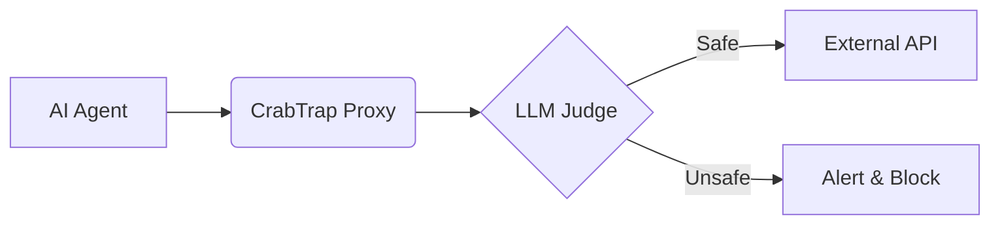

【深夜便】LLM判定プロキシ「CrabTrap」の真実：プロダクション環境のAIエージェントを護る最後の砦

正直、AIエージェントの暴走って、マジで怖いですよね。特に、API連携を前提とした自動化の波が押し寄せている今、想定外の挙動やセキュリティリスクは、企業にとって致命傷になりかねません。先日、Brexが公開した「CrabTrap」というHTTPプロキシツールを知って、背中がゾッとしました。これは、LLM（大規模言語モデル）を判定器として利用し、AIエージェントの行動を監視・制御するツール。一見、画期的ですが、その実態と、日本企業がプロダクション環境で導入する際に考慮すべき点について、徹底的に深掘りしていきます。

## CrabTrapとは何か？

CrabTrapは、LLMを活用したAIエージェントが、意図しない、あるいは危険なアクションを起こすのを防ぐためのHTTPプロキシです。簡単に言うと、AIエージェントが外部APIにアクセスする際に、そのリクエストをCrabTrapが審査し、LLMが生成した応答が安全かどうかを判断する仕組みです。もし危険なリクエストだと判断されれば、CrabTrapはそれをブロックし、開発者に警告を発します。

> https://www.brex.com/crabtrap
> (取得日: 2024年11月07日)

Brexの記事によると、CrabTrapは、AIエージェントが「ハルシネーション」（幻覚）を起こしたり、悪意のある攻撃者に利用されたりするリスクを軽減することを目的としています。例えば、AIエージェントが誤って機密情報を外部に送信したり、不正なトランザクションを実行したりするのを防ぐことができます。

記事には、CrabTrapのアーキテクチャ図も掲載されています。

この図からわかるように、AIエージェントからのリクエストはCrabTrapを経由し、LLMがその内容を評価します。安全と判断されれば外部APIに転送されますが、危険と判断されればブロックされ、アラートが発行されます。

## なぜLLMを判定器に？ 従来の監視システムとの違い

従来の監視システムは、主にログの解析や設定されたルールに基づいて異常を検知します。しかし、AIエージェントは、その行動が複雑で予測しにくいため、従来の監視システムでは対応しきれない場合があります。LLMを判定器として利用するCrabTrapの利点は、以下の点にあります。

* **文脈理解:** LLMは、自然言語を理解する能力に長けているため、リクエストの内容だけでなく、その文脈も考慮して危険性を判断できます。
* **適応性:** LLMは、学習データに基づいて判断基準を変化させることができます。そのため、新しい攻撃手法や異常な行動にも対応できます。
* **自動学習:** LLMは、継続的に学習することで、より正確な判断ができるようになります。

しかし、LLMを判定器として利用する際には、いくつかの注意点もあります。例えば、LLM自体が誤った判断を下す可能性や、LLMの判断基準がブラックボックス化してしまう可能性があるからです。

## CrabTrapの技術詳細：LLMのプロンプト設計と評価指標

CrabTrapの核心部分は、LLMに対するプロンプト設計と、その評価指標です。Brexの記事では、具体的なプロンプトの例は公開されていませんが、LLMにどのような観点でリクエストを評価させるか、詳細な設計が必要であることが示唆されています。

例えば、以下のようなプロンプトが考えられます。

* 「このリクエストは、機密情報を漏洩する可能性があるか？はい/いいえで答えてください。」
* 「このリクエストは、不正なトランザクションを実行する可能性があるか？はい/いいえで答えてください。」
* 「このリクエストは、システムに過剰な負荷をかける可能性があるか？はい/いいえで答えてください。」

また、LLMの判断結果を評価するための指標も重要です。例えば、誤検知率や見逃し率を最小限に抑えるように、プロンプトや評価指標を調整する必要があります。

## 実践への示唆：日本企業がCrabTrapを導入する際に考慮すべき点

CrabTrapは、プロダクション環境でAIエージェントを運用する上で非常に有効なツールとなりえますが、日本企業が導入する際には、以下の点を考慮する必要があります。

1. **LLMの選定:** 日本語の文脈を理解できるLLMを選ぶ必要があります。また、LLMの性能やコストも考慮する必要があります。
2. **プロンプトの最適化:** LLMに適切なプロンプトを与える必要があります。プロンプトは、AIエージェントの業務内容やリスクレベルに合わせて最適化する必要があります。
3. **評価指標の設計:** LLMの判断結果を評価するための指標を設計する必要があります。評価指標は、誤検知率や見逃し率を最小限に抑えるように調整する必要があります。
4. **法規制への対応:** AIの利用に関する法規制やガイドラインを遵守する必要があります。
5. **説明責任の確保:** LLMの判断結果について、説明責任を果たす必要があります。

さらに、CrabTrapのようなプロキシツールは、あくまでも防御の第一線に立つものであり、根本的な解決策ではありません。AIエージェントの設計段階から、セキュリティと信頼性を考慮した開発プロセスを構築することが重要です。

## まとめ：AIエージェントの安全性を確保するために

CrabTrapは、AIエージェントの安全性を確保するための強力なツールです。しかし、その導入と運用には、専門的な知識と経験が必要です。日本企業は、CrabTrapの導入を検討する際には、上記の点を十分に考慮し、慎重に進める必要があります。

AIエージェントの活用は、ビジネスの効率化や新たな価値創造に貢献する可能性を秘めていますが、同時に、セキュリティリスクや倫理的な問題も孕んでいます。CrabTrapのようなツールを導入するだけでなく、AIエージェントの設計、開発、運用に関する全体的な戦略を策定し、安全で信頼できるAIエージェントの活用を推進していくことが重要です。

## 参考文献

* Brex - Introducing CrabTrap: A Proxy for LLM-Powered Agents: [https://www.brex.com/crabtrap/](https://www.brex.com/crabtrap/)
* その他、AIエージェントのセキュリティに関する論文や技術ドキュメント

<!-- AFFILIATE_SECTION -->
## 関連リンク

- [Claude Pro (公式)](https://claude.ai) - 高性能AIアシスタント
- [SkillHacks - AI・プログラミング学習](https://px.a8.net/svt/ejp?a8mat=4B1H1P+97114I+4K3S+5YJRM) - AIを使いこなすエンジニアへ
- [AI関連書籍](https://www.amazon.co.jp/s?k=ChatGPT+Claude+活用&tag=satoarata-22) - 最新AI本

---
※一部にPRを含みます。
