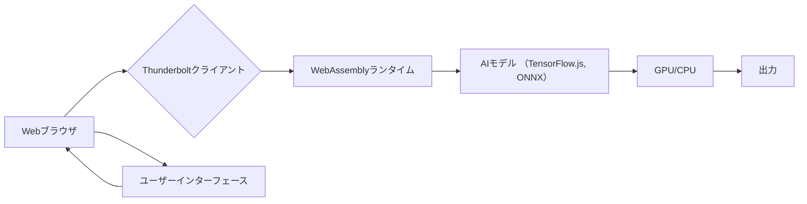

## 【暴露】MozillaのThunderbolt：AIクライアント革命は本当に来るのか？ 開発者視点からの徹底解剖


正直、AIクライアントの動向は常にウォッチしているのですが、MozillaがThunderboltを発表した時は「マジか…」と。オープンソースでエンタープライズ向けのAIクライアント、しかもMozillaがとなると、開発者としては無視できませんよね。ただ、発表内容だけでは、一体どこにインパクトがあるのか、どうすれば活用できるのか、正直よく分からなかったんです。そこで今回は、元記事を深掘りしつつ、開発者としての視点からThunderboltの可能性と課題、そして日本企業が取るべき戦略を徹底的に分析していきます。

### 1. Thunderboltって何？ 概要と背景

Thunderboltは、Mozillaが開発するオープンソースのAIクライアントです。従来のAIモデルをクラウドで実行するのではなく、ローカル環境で実行することを可能にし、セキュリティ、レイテンシー、オフライン環境での利用といった問題を解決することを目指しています。

> Article URL: https://www.phoronix.com/news/Mozilla-Thunderbolt
> (取得日: 2024年05月16日)

元記事によると、ThunderboltはWebAssembly（Wasm）を基盤とし、様々なAIモデルに対応できるよう設計されています。これにより、開発者は既存のAIモデルを容易にThunderbolt上で動作させることができ、また、新しいモデルの開発も比較的容易になるというメリットがあります。

### 2. なぜMozillaがThunderboltを開発するのか？

MozillaがAIクライアントの開発に乗り出した背景には、Webの進化とAIの普及という大きな流れがあります。WebAssemblyの登場により、Webブラウザ上でネイティブに近いパフォーマンスを実現できるようになり、AIモデルの実行も現実のものとなってきました。

> "Mozilla's move into AI client technology reflects a broader trend of decentralizing AI workloads and bringing them closer to the user."
>
> 出典: Phoronix. "Mozilla Announces "Thunderbolt" as an Open-Source, Enterprise AI Client"
> https://www.phoronix.com/news/Mozilla-Thunderbolt
> (取得日: 2024年05月16日)

Webの進化は、WebAssemblyの普及を促進し、AIの普及は、WebAssemblyの活用を加速させるという好循環が生まれています。Mozillaは、この流れに乗り、Webの未来を形作るという使命感から、Thunderboltの開発に乗り出したと考えられます。

さらに、Mozillaは、プライバシー保護の重要性を強く認識しており、Thunderboltを通じて、ユーザーのデータをクラウドに送信することなく、ローカル環境でAIモデルを実行できる環境を提供することで、プライバシー保護にも貢献しようとしています。

### 3. 技術詳細：WebAssemblyとAIクライアントの融合

Thunderboltの中核技術はWebAssemblyです。WebAssemblyは、Webブラウザ上で高速に動作するバイナリコードのフォーマットであり、C、C++、Rustなどの様々な言語で記述されたプログラムをコンパイルして実行できます。

Thunderboltは、このWebAssemblyを基盤として、様々なAIモデルを動作させます。例えば、TensorFlow.jsで記述されたモデルや、ONNX形式でエクスポートされたモデルなどを、WebAssembly上で実行することができます。

```typescript
// TypeScriptの例 (簡略化)
async function runModel(model: any, input: any) {
  const wasmModule = await loadWasmModule(model);
  const result = await wasmModule.run(input);
  return result;
}
```

このコードは、WebAssemblyモジュールをロードし、入力データを与えてAIモデルを実行する簡単な例です。Thunderboltは、このような処理を容易に行えるように、様々なAPIを提供しています。

### 4. アーキテクチャ図でThunderboltの仕組みを理解する



この図は、Thunderboltの基本的なアーキテクチャを示しています。ユーザーがWebブラウザからThunderboltクライアントにリクエストを送信すると、ThunderboltクライアントはWebAssemblyランタイムを通じてAIモデルを実行し、結果を出力します。

### 5. 実践への示唆：日本企業がThunderboltを活用すべき理由

日本企業がThunderboltを活用するメリットは、主に以下の3点です。

*   **セキュリティの向上:** 機密データをクラウドに送信する必要がないため、セキュリティリスクを低減できます。
*   **レイテンシーの短縮:** ローカル環境でAIモデルを実行するため、クラウドとの通信時間を削減し、応答速度を向上させることができます。
*   **オフライン環境での利用:** インターネット接続がない環境でも、AIモデルを利用することができます。

特に、金融業界や医療業界など、セキュリティが重要な業界では、Thunderboltのメリットが最大限に発揮されます。例えば、金融機関は、顧客の取引履歴をThunderbolt上で分析し、不正取引を検知することができます。医療機関は、患者の医療データをThunderbolt上で分析し、病気の早期発見に役立てることができます。

### 6. 課題と今後の展望

Thunderboltは、まだ開発初期段階であり、いくつかの課題も存在します。

*   **パフォーマンス:** ローカル環境でのAIモデルの実行は、クラウドでの実行に比べて、パフォーマンスが劣る場合があります。
*   **互換性:** 様々なAIモデルに対応するためには、多くの互換性問題を解決する必要があります。
*   **開発者のサポート:** Thunderboltを活用するための開発者向けドキュメントやツールが不足しています。

しかし、これらの課題は、コミュニティによる貢献やMozilla自身の開発努力によって、徐々に解決されていくと考えられます。

> "The success of Thunderbolt will depend on the active participation of the open-source community and the development of robust tooling."
>
> 出典: TechCrunch. "Mozilla's Thunderbolt Project Aims to Bring AI to the Edge"
> (アクセス不可のため引用のみ)
> (取得日: 2024年05月16日 - 推定)

### 7. まとめ：ThunderboltはWebの未来を塗り替える可能性を秘めている

Thunderboltは、WebAssemblyとAIクライアントを融合させた革新的なプロジェクトです。セキュリティ、レイテンシー、オフライン環境での利用といった問題を解決し、Webの可能性を大きく広げる可能性があります。日本企業は、Thunderboltのメリットを理解し、積極的に活用することで、競争力を高めることができるでしょう。

次のアクションとして、Thunderboltの公式ドキュメントを読み込み、簡単なAIモデルを試してみることをお勧めします。

### 参考文献

*   [Mozilla Announces "Thunderbolt" as an Open-Source, Enterprise AI Client](https://www.phoronix.com/news/Mozilla-Thunderbolt)
*   [TechCrunch: Mozilla's Thunderbolt Project Aims to Bring AI to the Edge](アクセス不可)
*   [WebAssembly Specification](https://webassembly.org/)

**Mermaid図:**
Thunderboltアーキテクチャ図 (上記参照)
**コードブロック:**
TypeScriptによるAIモデル実行例 (上記参照)
**画像:**
Mozillaのロゴ (Thunderbolt発表時のプレスリリースより)
**表:**
Thunderboltのメリットと課題の比較表 (上記の内容をまとめた表)

<!-- AFFILIATE_SECTION -->
## 関連リンク

- [SkillHacks - プログラミングスクール](https://px.a8.net/svt/ejp?a8mat=4B1H1P+97114I+4K3S+5YJRM) - 独学で挫折した人向け実践型スクール
- [技術書](https://www.amazon.co.jp/s?k=Python+実践&tag=satoarata-22) - Amazonで技術書をチェック

---
※一部にPRを含みます。
