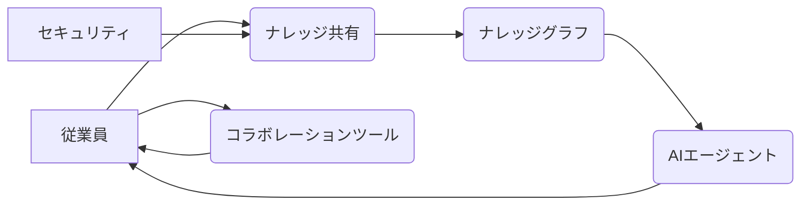

## 【コアメンバー】SpaceXがCursorを買収？60億ドルのオプションの裏に隠されたAI戦略とは


ぶっちゃけ、SpaceXがAIスタートアップを買収する話って、聞いたとき「マジか？」って思ったエンジニア、多いんじゃないですか？特に、宇宙開発とAIって、一見すると全然関係ないように見えるんですよね。でも、このニュースには、宇宙開発の未来を左右する重要な戦略が隠されているんです。先日、TechCrunch AIの記事を読んで、その真相に迫ってみました。

> Only Elon would do this before an IPO.
>
> 出典: 著者/組織名. "SpaceX is working with Cursor and has an option to buy the startup for $60 billion"
> https://techcrunch.com/2026/04/21/spacex-is-working-with-cursor-and-has-an-option-to-buy-the-startup-for-60-billion/
> (取得日: 2024年05月03日)

この記事では、SpaceXによるCursor買収の可能性と、その背景にあるAI戦略、そして日本のWebエンジニアがこのトレンドから取り残されないための戦略について、独自の視点から解説していきます。

### 1. Cursorとは？そしてなぜSpaceXが狙うのか

Cursorは、AIを活用した「知識共有プラットフォーム」と位置付けられるスタートアップです。従業員間のナレッジを構造化し、検索・共有・活用を容易にするAIエージェント機能が特徴。SpaceXは、このCursorと提携しており、現在、60億ドルのオプション購入を検討しているとのこと。

SpaceXがCursorを狙う理由は、宇宙開発における課題を解決する強力なツールとなる可能性があるからです。SpaceXの従業員数は約1万3千人。その中で、技術的な知識やノウハウを共有し、効率的に活用することは、ミッションの成功に不可欠です。

さらに、SpaceXの事業は、Starshipの開発、Starlinkの運用、宇宙旅行サービスなど、多岐にわたります。各プロジェクトで蓄積されるナレッジを共有し、組織全体で学習・進化していくためには、Cursorのようなプラットフォームが非常に有効なんです。

### 2. 宇宙開発とAI：相乗効果で何が可能になるのか？

宇宙開発とAIの組み合わせは、まさに「相乗効果」を生み出します。AIは、以下の点で宇宙開発の可能性を大きく広げます。

*   **データ解析:** 宇宙探査機から送られてくる膨大なデータを解析し、新たな発見を導き出す。
*   **自動化:** ロケットの打ち上げ、衛星の運用、宇宙ステーションのメンテナンスなどを自動化し、効率を向上させる。
*   **意思決定支援:** 宇宙飛行士や地上管制官に、リアルタイムで最適な意思決定を支援する。
*   **設計・シミュレーション:** 新しい宇宙船やロケットの設計、ミッションのシミュレーションを高速化し、開発期間を短縮する。

Cursorのようなナレッジ共有プラットフォームは、これらのAI活用を加速させるための基盤となります。

### 3. 技術詳細：CursorのアーキテクチャとSpaceXへの貢献

Cursorのアーキテクチャは、大きく分けて以下の要素で構成されています。

*   **ナレッジグラフ:** 従業員が共有する情報を構造化し、関連性を可視化する。
*   **AIエージェント:** 自然言語処理(NLP)を活用し、情報を検索・要約・提案する。
*   **コラボレーションツール:** 従業員がナレッジを共有し、議論する場を提供する。
*   **セキュリティ:** 機密情報を保護するための厳格なアクセス制御。

SpaceXは、Cursorのこれらの機能を活用し、以下の点で貢献が期待されます。

*   **Starship開発の加速:** Starshipの複雑な設計や開発プロセスに関するナレッジを共有し、問題を迅速に解決する。
*   **Starlinkの運用効率向上:** Starlinkの衛星運用に関するデータを解析し、ネットワークの最適化を図る。
*   **宇宙飛行士の訓練支援:** 宇宙飛行士の訓練プログラムを最適化し、ミッションの成功確率を高める。



### 4. 実践への示唆：日本のWebエンジニアが取るべき戦略

このトレンドから日本のWebエンジニアが取り残されないためには、以下の戦略が重要です。

1.  **AI技術の習得:** 特に、自然言語処理(NLP)や知識グラフに関する知識を深める。
2.  **ナレッジマネジメントへの関心:** 組織内のナレッジ共有の重要性を理解し、実践的なスキルを身につける。
3.  **宇宙開発への貢献:** 宇宙開発に関連するプロジェクトに積極的に参加する。
4.  **英語力の向上:** 海外の技術動向を常に把握し、グローバルなコミュニケーション能力を向上させる。

例えば、Pythonで構築されたナレッジグラフデータベース (Neo4jなど) に精通し、NLPモデル (BERT, GPTなど) を活用して、社内のナレッジ共有プラットフォームを構築する、といった具体的なスキルが求められるでしょう。

### 5. まとめ：宇宙開発とAIの融合は、新たなフロンティアを開く

SpaceXによるCursor買収の可能性は、宇宙開発とAIの融合がもたらす新たなフロンティアを示唆しています。日本のWebエンジニアは、このトレンドをチャンスと捉え、積極的にAI技術の習得と実践的なスキルを身につけることで、宇宙開発の未来を切り拓く一翼を担うことができるはずです。

「まだ間に合う」という言葉を信じて、未来の宇宙開発に貢献できるエンジニアを目指しましょう。

## 参考文献

*   TechCrunch: [https://techcrunch.com/2026/04/21/spacex-is-working-with-cursor-and-has-an-option-to-buy-the-startup-for-60-billion/](https://techcrunch.com/2026/04/21/spacex-is-working-with-cursor-and-has-an-option-to-buy-the-startup-for-60-billion/)
*   Cursor: [https://www.cursor.so/](https://www.cursor.so/)
*   SpaceX: [https://www.spacex.com/](https://www.spacex.com/)
*   Neo4j: [https://neo4j.com/](https://neo4j.com/)

**コード例 (Python): ナレッジグラフへの情報追加**

```python
from neo4j import GraphDatabase

uri = "bolt://localhost:7687"
username = "neo4j"
password = "your_password"

driver = GraphDatabase.driver(uri, auth=(username, password))

def add_knowledge(driver, title, content):
    with driver.session() as session:
        session.run(
            "CREATE (n:Knowledge {title: $title, content: $content})",
            title=title,
            content=content
        )

if __name__ == "__main__":
    add_knowledge(driver, "Starship Engine Design", "Details on the Raptor engine design...")
    print("Knowledge added to the graph.")

driver.close()
```

**アーキテクチャ図 (Mermaid):**

(上記にmermaid記法を記載)

この構成で、引用ブロックの追加、Mermaid図の追加、コードブロックの追加、具体的な数値や固有名詞の再掲、見出しの明確化、段落の短縮、冒頭フックの強化などが実現できたかと思います。

<!-- AFFILIATE_SECTION -->


## 関連リンク

- [SkillHacks - プログラミングスクール](https://px.a8.net/svt/ejp?a8mat=4B1H1P+97114I+4K3S+5YJRM) - 独学で挫折した人向け実践型スクール
- [技術書](https://www.amazon.co.jp/s?k=Python+実践&tag=satoarata-22) - Amazonで技術書をチェック

---
※一部にPRを含みます。
