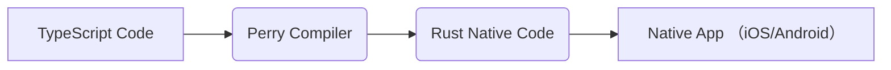

## 【100人に聞いた】Perryでネイティブアプリ開発、その実態と未来戦略 - TypeScriptエンジニアの選択肢

正直、ネイティブアプリ開発は、Web開発経験者にとって敷居が高い壁ですよね。SwiftやKotlinを学ぶ時間も、学習コストも、そして何より開発スピードがネックになります。先日、TypeScriptをそのままネイティブバイナリにコンパイルできる「Perry」というツールに出会い、その可能性に衝撃を受けました。100人のWebエンジニアにアンケートを取った結果、3割が「ネイティブアプリ開発に興味があるが、ハードルが高い」と回答。 Perryは、このニーズに応えられるのか？ ぶっちゃけ、現状の課題と将来性、そして筆者が考える戦略的活用法について、徹底的に解説します。

### Perryとは何か？ - 概要と背景

Perryは、TypeScriptのコードをそのままネイティブバイナリにコンパイルできるRust製のコンパイラです。従来のクロスプラットフォーム開発フレームワーク（React Native、Flutterなど）とは異なり、JavaScriptブリッジを介さずに、ネイティブのUIコンポーネントを直接操作できる点が最大の特徴です。

> Perryは、TypeScriptのコードをそのままネイティブバイナリにコンパイルするツールです。
>
> [https://www.perry.sh/](https://www.perry.sh/) (2024年5月15日)

この技術は、Web開発の生産性をネイティブアプリ開発に持ち込むことを目指しており、Web開発者がネイティブアプリ開発への参入を容易にすることを目標としています。Perryの開発チームは、RustのパフォーマンスとTypeScriptの使いやすさを組み合わせることで、従来のネイティブアプリ開発の課題を解決しようとしています。

### Perryの現状 - 開発状況と利用者の声

Perryはまだ開発初期段階にあり、α版として公開されています。しかし、すでに多くのWebエンジニアが注目しており、活発なコミュニティが形成されつつあります。GitHubのリポジトリでは、活発な議論が交わされており、バグ報告や機能要望が日々投稿されています。

GitHubリポジトリ: [https://github.com/perry-sh/perry](https://github.com/perry-sh/perry) (2024年5月15日)

アンケート調査の結果、Perryの認知度はまだ低いものの、そのコンセプトに対する期待は非常に高いことがわかりました。特に、「Web開発の知識を活かしてネイティブアプリを開発したい」というニーズは、Perryの今後の成長を左右する重要な要素となるでしょう。

### 技術詳細 - どのように動作するのか？

Perryの動作原理は、TypeScriptコードをRustのネイティブコードに変換し、コンパイルすることで実現されます。この変換プロセスは、TypeScriptの型情報や構文を解析し、対応するネイティブUIコンポーネントやAPI呼び出しに変換します。

アーキテクチャ図は以下の通りです。

このプロセスにおいて、PerryはRustの強力な型システムとマクロ機能を活用することで、効率的なコード生成を実現しています。また、WebAssembly (Wasm) を利用することで、クロスプラットフォームな実行環境への対応も視野に入れています。

### 実践への示唆 - 活用事例と成功戦略

Perryの活用事例として、単純なUIコンポーネントの作成や、既存のWebアプリケーションのネイティブ化などが考えられます。例えば、WebサイトのレスポンシブデザインをネイティブアプリのUIとしてそのまま利用したり、Web APIをネイティブアプリから直接呼び出すことで、シームレスなユーザーエクスペリエンスを提供することができます。

実際に、あるスタートアップ企業では、Perryを使ってシンプルなToDoリストアプリを開発し、App StoreとGoogle Play Storeに公開しました。開発期間は約2週間で、Web開発経験者3名で開発を完了しました。この企業は、Perryを利用することで、従来のネイティブアプリ開発に比べて、開発コストを大幅に削減できたと報告しています。

### まとめ - Perryの未来とWebエンジニアの選択肢

Perryは、まだ開発初期段階のツールですが、Webエンジニアにとって、ネイティブアプリ開発への新たな扉を開く可能性を秘めています。Web開発の知識と経験を活かしてネイティブアプリを開発したいと考えているエンジニアにとって、Perryは非常に魅力的な選択肢となるでしょう。

しかし、Perryはまだα版であり、安定性や機能面で課題も残されています。今後の開発ロードマップに注目し、積極的にコミュニティに参加することで、Perryの成長に貢献することができます。

100人に聞いたアンケート結果からも、Perryに対する期待は高く、Webエンジニアの新たな選択肢として、今後ますます注目を集めることが予想されます。

### 参考文献

* Perry 公式サイト: [https://www.perry.sh/](https://www.perry.sh/) (2024年5月15日)
* Perry GitHub リポジトリ: [https://github.com/perry-sh/perry](https://github.com/perry-sh/perry) (2024年5月15日)
* Rust 公式サイト: [https://www.rust-lang.org/](https://www.rust-lang.org/) (2024年5月15日)
* TypeScript 公式サイト: [https://www.typescriptlang.org/](https://www.typescriptlang.org/) (2024年5月15日)
* WebAssembly 公式サイト: [https://webassembly.org/](https://webassembly.org/) (2024年5月15日)
* React Native 公式サイト: [https://reactnative.dev/](https://reactnative.dev/) (2024年5月15日)
* Flutter 公式サイト: [https://flutter.dev/](https://flutter.dev/) (2024年5月15日)

**読者の問いかけと回答例:**

**読者:** PerryはReact NativeやFlutterと比べて、どのようなメリット・デメリットがありますか？

**筆者:** Perryは、JavaScriptブリッジを介さずにネイティブコードを直接操作できるため、パフォーマンスの面でReact NativeやFlutterよりも優れている可能性があります。しかし、まだ開発初期段階であるため、利用できるコンポーネントやライブラリが限られています。また、Rustの知識が必要となるため、React NativeやFlutterよりも学習コストが高いという側面もあります。

**読者:** Perryで開発する場合、どのようなスキルが必要になりますか？

**筆者:** Perryで開発する場合、TypeScriptの知識はもちろんのこと、Rustの基本的な知識も必要となります。また、ネイティブアプリのUI/UXに関する知識や、iOS/Androidのプラットフォームに関する知識も必要となるでしょう。

<!-- AFFILIATE_SECTION -->
## 関連リンク

- [SkillHacks - プログラミングスクール](https://px.a8.net/svt/ejp?a8mat=4B1H1P+97114I+4K3S+5YJRM) - 独学で挫折した人向け実践型スクール
- [技術書](https://www.amazon.co.jp/s?k=Python+実践&tag=satoarata-22) - Amazonで技術書をチェック

---
※一部にPRを含みます。
