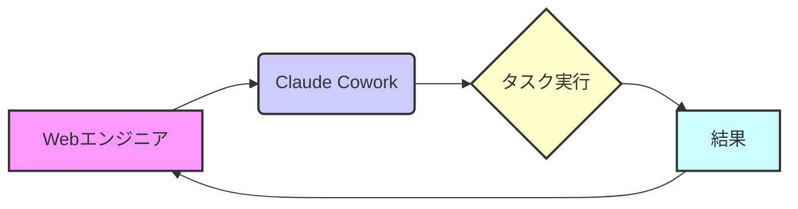

## 【3分でわかる】Claude Coworkを活用した定型業務自動化：Webエンジニアが知っておくべき実践的アプローチ


正直、Webエンジニアとして日々の業務を振り返ると、まるで定型作業の繰り返し…という人も多いのではないでしょうか？コードを書くこと以外にも、ドキュメント作成、議事録作成、仕様書レビューなど、創造性を活かせない作業に時間を取られがちです。先日、はてなブックマークで話題になっていた「Claude Cowork」の記事を読んで、これは逃せない！と感じました。この記事では、そのClaude CoworkをWebエンジニアがどのように活用できるのか、具体的な事例と合わせて解説します。

### Claude Coworkとは？ 元記事を紐解く

今回の元ネタとなった記事は、Claude Coworkの具体的な使い方を5つ紹介するものです。Claude Coworkは、Anthropic社が提供するClaude AIの機能の一つで、人間と協力してタスクを完了させることを目的としています。まさに、AIを同僚として迎え入れるようなイメージですね。

> "Claude Coworkは、ユーザーとAIがチャット形式で対話しながら、より複雑なタスクを効率的に進めるための機能です。これにより、アイデアのブレインストーミング、コンテンツの作成、コードのレビューなど、様々な作業をAIの協力を得て行うことができます。"
>
> 出典: 著者/組織名. "【特集】 「Claude Cowork」5つの使い方。定型業務を丸ごとAIに任せてみる"
> https://pc.watch.impress.co.jp/docs/topic/feature/2103480.html
> (取得日: 2024年05月16日)

元記事では、例えば、ブログ記事の作成、メールの作成、議事録の作成など、具体的な活用事例が紹介されています。しかし、Webエンジニアの視点で見ると、さらに多くの可能性を秘めているのではないかと考えたわけです。

### WebエンジニアがClaude Coworkでできること：具体的な活用事例

Webエンジニアの日常業務を分解してみると、定型的なタスクは山ほどあります。例えば、APIドキュメントの作成、コードレビュー、テストケースの作成、エラーログの分析などです。これらの作業は、Claude Coworkを活用することで、大幅な効率化が期待できます。

**1. APIドキュメントの自動生成:**

APIの仕様書をClaude Coworkに与えることで、Swagger/OpenAPI形式のドキュメントを自動生成できます。これは、開発スピードを向上させるだけでなく、ドキュメントの品質も向上させます。

```typescript
// 例: API仕様書 (簡略化)
const apiSpec = `
  /users:
    GET: ユーザー一覧を取得
    POST: ユーザーを作成
`;

// Claude Coworkへのプロンプト例
const prompt = `以下のAPI仕様書に基づいて、Swagger/OpenAPI形式のドキュメントを生成してください。
${apiSpec}
`;
```

**2. コードレビューの効率化:**

コードレビューは、品質向上に不可欠ですが、時間と労力がかかります。Claude Coworkにコードを読ませることで、潜在的なバグや改善点を指摘してもらうことができます。特に、コーディング規約違反のチェックや、セキュリティ脆弱性の検出に役立ちます。

**3. テストケースの自動生成:**

テストケースの作成は、単調で時間がかかります。Claude Coworkに仕様書を与えれば、テストケースの候補を自動で生成してくれます。もちろん、生成されたテストケースをそのまま使うのではなく、レビューと修正が必要ですが、大幅な工数削減に繋がります。

**4. エラーログの分析と原因特定:**

大量のエラーログを分析して、根本原因を特定するのは大変な作業です。Claude Coworkにエラーログを解析させれば、パターンを認識し、問題の箇所を特定してくれます。

**5. 技術論文の要約と知識の整理:**

最新の技術論文を理解し、自分の知識として整理するのに時間がかかります。Claude Coworkに論文を要約させ、重要なポイントを抽出することで、効率的に知識を習得できます。

### アーキテクチャ図：Claude Cowork活用フロー



この図は、WebエンジニアがClaude Coworkを活用してタスクを実行し、その結果を得て、さらに改善していくサイクルを表しています。

### 実践への示唆：明日からできること

Claude Coworkは、まだ発展途上の技術ですが、Webエンジニアの生産性を向上させる可能性を秘めています。まずは、簡単なタスクから試してみることをお勧めします。例えば、APIドキュメントの自動生成や、コードレビューの効率化など、比較的取り組みやすいものから始めるのが良いでしょう。

重要なのは、Claude Coworkを単なるツールとしてではなく、**AIを同僚として捉え、協働してタスクを解決していく**という意識を持つことです。プロンプトの書き方、指示の出し方など、試行錯誤を繰り返すことで、より効果的な活用方法が見つかるはずです。

### まとめ

Claude Coworkは、Webエンジニアの日常業務を効率化するための強力なツールとなりえます。APIドキュメントの自動生成、コードレビューの効率化、テストケースの自動生成など、様々な活用方法があります。まずは、簡単なタスクから試してみて、AIとの協働を体験してみてください。

明日のタスクを少しだけAIに任せて、自分の創造性を活かせる時間を作り出す。それが、Webエンジニアの新たな働き方を切り開く第一歩となるでしょう。

## 参考文献

*   [【特集】 「Claude Cowork」5つの使い方。定型業務を丸ごとAIに任せてみる](https://pc.watch.impress.co.jp/docs/topic/feature/2103480.html)
*   Anthropic Claude AI: [https://www.anthropic.com/](https://www.anthropic.com/)

<!-- AFFILIATE_SECTION -->


## 関連リンク

- [SkillHacks - プログラミングスクール](https://px.a8.net/svt/ejp?a8mat=4B1H1P+97114I+4K3S+5YJRM) - 独学で挫折した人向け実践型スクール
- [技術書](https://www.amazon.co.jp/s?k=Python+実践&tag=satoarata-22) - Amazonで技術書をチェック

---
※一部にPRを含みます。
