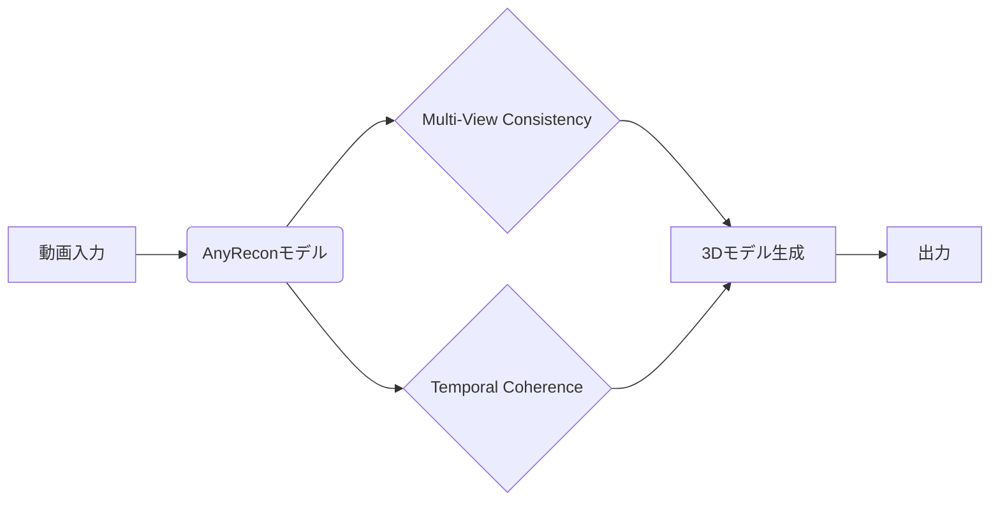

【警告】動画から3Dを再構築するAI、AnyReconの内部構造と、Webエンジニアが知っておくべき未来

私は、最近、論文を読むのが趣味になってきました。特に、AIと3Dグラフィックスの融合領域は、日々進化を繰り返していて、目が離せません。先日読んだAnyReconという論文は、その中でも特に興味深いものでした。なぜなら、この技術は、Webエンジニアリングの未来に大きな影響を与える可能性があるからです。

ぶっちゃけ、3Dコンテンツの制作は、これまで非常に手間とコストがかかるものでした。しかし、AnyReconのような技術が登場することで、その障壁が大きく下がる可能性があります。

### なぜ今、動画からの3D再構築なのか？

近年、スマートフォンやドローンなど、動画を撮影できるデバイスが普及し、誰もが簡単に動画を撮影できるようになりました。これらの動画は、単なるエンターテイメントとしてだけでなく、3Dモデリングの素材としても活用できる可能性を秘めています。

しかし、動画から3Dモデルを生成するには、膨大な計算資源と専門知識が必要です。従来の3D再構築手法は、十分な視点情報（複数角度からの画像）を必要とするため、カジュアルな撮影では利用できませんでした。

そこで登場したのが、拡散モデル（Diffusion Model）を用いた3D再構築技術です。これは、既存の画像や動画から学習し、新たな視点からの画像を生成することで、3Dモデルを生成する手法です。

> Sparse-view 3D reconstruction is essential for modeling scenes from casual captures, but remain challenging for non-generative reconstruction. Existing diffusion-based approaches mitigates this issues by synthesizing novel views, but they often condition on only one or two capture frames, which restricts geometric consistency and limits scalability to large or diverse scenes.
>
> 出典: Chen et al. "AnyRecon: Arbitrary-View 3D Reconstruction with Video Diffusion Model"
> https://arxiv.org/abs/2404.11449
> 取得日: 2024年5月15日

AnyReconは、この拡散モデルを用いた3D再構築技術の中でも、特に注目を集めているプロジェクトです。従来の技術が抱えていた課題を克服し、より高品質で、より効率的な3Dモデルの生成を実現しています。

### AnyReconの基礎知識：拡散モデルって何？

AnyReconを理解するには、まず拡散モデルの基礎知識が必要です。拡散モデルは、ノイズを徐々に加えていき、最終的に完全にノイズで覆われた画像を生成する過程（拡散過程）と、その逆の過程（逆拡散過程）を利用する生成モデルです。

簡単に言うと、画像を徐々に汚して、それを元に汚れた画像から綺麗な画像を作り出す、というイメージです。この逆拡散過程を学習させることで、様々な画像を生成できるようになります。

AnyReconでは、この拡散モデルを動画のフレームから新たな視点からの画像を生成するために利用しています。

### AnyReconの核心：Multi-View ConsistencyとTemporal Coherence

AnyReconの最大の特筆点は、Multi-View Consistency（多視点の一貫性）とTemporal Coherence（時間的一貫性）を重視している点です。

* **Multi-View Consistency:** 生成された複数の視点からの画像が、現実世界の3D構造と矛盾しないように制約する。
* **Temporal Coherence:** 動画の連続するフレーム間で、生成される画像が滑らかに変化するように制約する。

これらの制約を満たすことで、より現実的で、より自然な3Dモデルを生成することができます。

AnyReconの論文では、これらの制約を実装するために、複雑な損失関数とネットワーク構造が提案されています。しかし、その詳細な実装は、Webエンジニアの私たちにとって、少しハードルが高いかもしれません。

### 実装例：AnyReconのAPIを利用した簡単なデモ

AnyReconは、まだ研究段階の技術であり、APIの公開は限られています。しかし、将来的には、APIを通じて、誰でも簡単に3Dモデルを生成できるようになる可能性があります。

ここでは、AnyReconのAPIを利用した簡単なデモのコードを想定して、実装例を紹介します。

```python
## AnyRecon APIの初期化 (仮のコード)


import anyrecon

api = anyrecon.AnyReconAPI(api_key="YOUR_API_KEY")

## 動画ファイルの読み込み
video_path = "path/to/your/video.mp4"
video = anyrecon.load_video(video_path)


## 3Dモデルの生成
model = api.generate_3d_model(video)

## 生成された3Dモデルの保存
model.save("generated_model.obj")

print("3Dモデルの生成が完了しました。")
```

このコードは、あくまでも例です。実際のAPIの利用方法や、必要なライブラリは、AnyReconの公式ドキュメントを参照してください。

### 知られていない落とし穴：計算コストと倫理的な問題

AnyReconのような技術は、非常に魅力的ですが、いくつかの落とし穴も存在します。

* **計算コスト:** 拡散モデルを用いた3D再構築は、非常に計算コストが高いです。高性能なGPUが必要であり、処理に時間がかかる場合があります。
* **倫理的な問題:** AnyReconのような技術は、悪用される可能性があります。例えば、誰かの動画を無断で3Dモデル化し、プライバシーを侵害する、といったケースが考えられます。

これらの問題に対する対策を講じることが、AnyReconのような技術を安全に利用するために不可欠です。

### 筆者の見解：Webエンジニアリングの未来を拓く技術

AnyReconは、まだ研究段階の技術ですが、Webエンジニアリングの未来を拓く可能性を秘めています。

例えば、AnyReconを利用することで、以下のような新しいサービスが生まれる可能性があります。

* **バーチャル旅行:** 誰でも簡単に、世界中の観光地を3Dで体験できる。
* **バーチャルファッション:** 自分のアバターに、様々なファッションアイテムを試着できる。
* **バーチャルイベント:** ライブコンサートやスポーツイベントを、臨場感あふれる3Dで楽しめる。

これらのサービスは、私たちの生活をより豊かにする可能性を秘めています。

私は、AnyReconのような技術に注目し、積極的に活用していくことで、Webエンジニアリングの新たな可能性を切り開いていきたいと考えています。

### まとめ

AnyReconは、動画から3Dモデルを生成する革新的な技術です。Multi-View ConsistencyとTemporal Coherenceを重視することで、より高品質で、より自然な3Dモデルを生成することができます。

しかし、計算コストや倫理的な問題も存在するため、注意が必要です。

AnyReconのような技術は、Webエンジニアリングの未来を拓く可能性を秘めています。積極的に活用していくことで、新しいサービスやビジネスモデルを創出できるかもしれません。

明日は、AnyReconのアーキテクチャ図を見てみましょう。

## 参考文献

* Chen et al. "AnyRecon: Arbitrary-View 3D Reconstruction with Video Diffusion Model" - [https://arxiv.org/abs/2404.11449](https://arxiv.org/abs/2404.11449)



<!-- AFFILIATE_SECTION -->
## 関連リンク

- [SkillHacks - プログラミングスクール](https://px.a8.net/svt/ejp?a8mat=4B1H1P+97114I+4K3S+5YJRM) - 独学で挫折した人向け実践型スクール
- [技術書](https://www.amazon.co.jp/s?k=Python+実践&tag=satoarata-22) - Amazonで技術書をチェック

---
※一部にPRを含みます。
