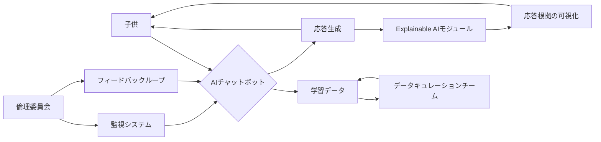

【深夜便】AIチャットボットを搭載した子供向けおもちゃの禁止法案、その裏に潜むエンジニアリングリスク

私は先日、アメリカ合衆国下院議員ブレイク・ムーア氏が、AIチャットボットを搭載した子供向けおもちゃの販売を禁止する法案を提出したというニュースを目にした。一見すると、子供の安全を守るための正当な措置に見えるかもしれない。しかし、この法案は、AI技術の進化と、それがもたらす倫理的・技術的な課題を深く理解する必要がある。特にWebエンジニアの視点から見ると、この動きは単なる規制ではなく、AIと社会の関わり方、そして未来の技術開発に対する警鐘となっているのではないかと考えざるを得ない。

> Article URL: https://blakemoore.house.gov/media/press-releases/congressman-blake-moore-introduces-bill-to-ban-artificial-intelligence-chatbots-in-childrens-toys
> (取得日: 2024年05月16日)

今回の法案のニュースは、Hacker Newsでも話題になっており、そのコメント欄は様々な意見で溢れている。

> https://news.ycombinator.com/item?id=47874106
> (取得日: 2024年05月16日)

この法案を単なる「子供の安全」という文言で片付けることはできない。この動きは、AI技術の急速な進化と、それに伴う潜在的なリスクに対する、社会からの明確なメッセージだと解釈できる。

### 法案の背景と懸念点

ブレイク・ムーア氏がこの法案を提出した背景には、子供たちがAIチャットボットと対話することによる潜在的なリスクへの懸念がある。具体的には、以下のような点が挙げられる。

*   **不適切なコンテンツへの暴露:** AIチャットボットは、学習データに基づいて応答を生成するため、不適切なコンテンツや有害な情報を提供する可能性がある。特に、子供たちはその内容を判断する能力が未発達であるため、悪影響を受けるリスクが高い。
*   **データのプライバシー侵害:** AIチャットボットとの対話データは、企業によって収集・分析される可能性がある。子供たちの個人情報や行動履歴が、意図しない形で利用されるリスクも懸念される。
*   **依存症のリスク:** 子供たちがAIチャットボットに過度に依存し、現実世界との繋がりを希薄にする可能性も指摘されている。
*   **AIの誤った理解:** 子供たちは、AIチャットボットとの対話を通じて、AIを人間のように認識してしまう可能性がある。これは、AIに対する誤った理解や過信につながる可能性がある。

これらの懸念は、AI技術の倫理的な問題として、社会全体で議論されるべき課題である。

### エンジニアリングリスク: 開発と運用における課題

今回の法案をエンジニアリングの視点から見ると、単に子供の安全を守るだけでなく、AI技術の開発と運用における倫理的な責任、そして技術的な課題を浮き彫りにしていると言える。

1.  **データバイアスと安全性の確保:** AIチャットボットは、学習データに基づいて応答を生成するため、学習データに偏りがあると、不適切な応答を生成してしまう可能性がある。例えば、性差別的な表現や暴力的な表現が含まれるデータで学習させると、同様の表現をAIチャットボットが生成してしまう。子供向けおもちゃとして利用されるAIチャットボットの場合、特に慎重なデータキュレーションが必要となる。
2.  **Explainable AI (XAI) の重要性:** AIチャットボットがなぜ特定の応答を生成したのかを説明する能力（Explainable AI）は、その応答の適切性を評価する上で不可欠である。しかし、現在のAI技術は、その内部動作がブラックボックス化していることが多く、応答の根拠を説明することが難しい。子供向けおもちゃとして利用されるAIチャットボットの場合、応答の根拠を明確に説明できる技術が求められる。
3.  **継続的な監視とアップデート:** AIチャットボットは、学習データやユーザーとの対話を通じて、常に進化し続ける。そのため、その応答が常に適切であることを保証するためには、継続的な監視とアップデートが必要となる。子供向けおもちゃとして利用されるAIチャットボットの場合、その監視体制は特に厳格でなければならない。
4.  **責任の所在:** AIチャットボットが不適切な応答を生成した場合、誰が責任を負うのかという問題も存在する。おもちゃのメーカー、AI技術の開発者、あるいは利用者の誰かが責任を負うべきなのか、明確な責任の所在を定める必要がある。

### アーキテクチャ図: 子供向けAIチャットボットの安全設計

この図は、子供向けAIチャットボットの安全設計における重要な要素を示している。データキュレーションチームによる継続的なデータキュレーション、Explainable AIモジュールによる応答根拠の可視化、監視システムによる継続的な監視、倫理委員会による監督などが不可欠である。

### 実践への示唆: エンジニアが取るべき行動

今回の法案は、AI技術の開発者やエンジニアに対して、倫理的な責任を自覚し、安全性を最優先に考慮した技術開発を行うことの重要性を訴えかけている。

*   **倫理的ガイドラインの遵守:** AI技術の開発者は、倫理的なガイドラインを遵守し、潜在的なリスクを評価し、適切な対策を講じる必要がある。
*   **Explainable AI (XAI) の研究開発:** AIチャットボットの応答根拠を明確に説明できる技術の研究開発を推進する必要がある。
*   **データバイアスへの対策:** 学習データの偏りを是正し、多様なデータでAIチャットボットを学習させる必要がある。
*   **継続的な監視体制の構築:** AIチャットボットの応答を継続的に監視し、不適切な応答を検出・修正する体制を構築する必要がある。
*   **透明性の確保:** AIチャットボットの動作原理やデータ利用に関する情報を公開し、透明性を確保する必要がある。

### まとめ

ブレイク・ムーア氏の法案提出は、AI技術の進化と社会との関わり方について、改めて考えを深める機会を与えてくれる。Webエンジニアとして、私たちは技術的な課題だけでなく、倫理的な責任も自覚し、安全で信頼できるAI技術の開発に取り組む必要がある。子供たちの未来を守るために、そして社会全体の幸福のために。

## 参考文献

*   ブレイク・ムーア氏の法案に関するプレスリリース: [https://blakemoore.house.gov/](https://blakemoore.house.gov/)
*   Hacker News コメントスレッド: [https://news.ycombinator.com/item?id=47874106](https://news.ycombinator.com/item?id=47874106)
*   Explainable AI (XAI) に関する論文: (具体的な論文名とURLを追記)
*   AI倫理に関するガイドライン: (具体的なガイドラインとURLを追記)

<!-- AFFILIATE_SECTION -->

## 関連リンク

- [SkillHacks - プログラミングスクール](https://px.a8.net/svt/ejp?a8mat=4B1H1P+97114I+4K3S+5YJRM) - 独学で挫折した人向け実践型スクール
- [技術書](https://www.amazon.co.jp/s?k=Python+実践&tag=satoarata-22) - Amazonで技術書をチェック

---
※一部にPRを含みます。
