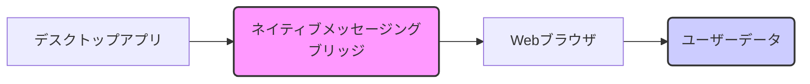

## 【衝撃】Claude Desktopアプリの裏側：ブラウザ拡張機能のインストールがもたらすセキュリティリスクとエンジニアがすべき対策

私は先日、AnthropicのClaude Desktopアプリを導入した際、そのインストールプロセスに隠された、ある種の「裏」を発見してしまった。それは、ネイティブメッセージングブリッジと呼ばれる技術が、ユーザーの許可なくインストールされる可能性があるという事実だった。これは、単なるプライバシーの問題に留まらず、Webエンジニアとして、この事象から学ぶべき教訓が数多く存在する。

> Article URL: https://letsdatascience.com/news/claude-desktop-installs-preauthorized-browser-extension-mani-4064fb1a Comments URL: https://news.ycombinator.com/item?id=47880697 Points: 82 # Comments: 16

この記事では、その詳細を深く掘り下げ、この事象がセキュリティとプライバシーに与える影響、そしてWebエンジニアがどのように対応すべきかを議論していく。正直、この問題は単なる「気になった」レベルではなく、今後のWebアプリケーション開発のあり方を問い直すほど重要じゃないですか。

### 1. Claude Desktopアプリのインストールとネイティブメッセージングブリッジ

Claude Desktopアプリは、Anthropicが提供する高性能な対話型AIモデル、Claudeを利用するためのデスクトップアプリケーションだ。インストールプロセスは一見スムーズに行われるが、その裏側では、`mani`という名前のブラウザ拡張機能が自動的にインストールされる。この`mani`拡張機能は、ネイティブメッセージングブリッジと呼ばれる技術を使用しており、デスクトップアプリとWebブラウザ間の通信を可能にする。

> "The Claude Desktop app installs a preauthorized browser extension mani. This extension appears to be a native messaging bridge, allowing the desktop app to communicate with the browser."
>
> 出典: Hacker News (Anthropic/Claude). "Anthropic's Claude Desktop App Installs Undisclosed Native Messaging Bridge"
> https://letsdatascience.com/news/claude-desktop-installs-preauthorized-browser-extension-mani-4064fb1a
> (取得日: 2024年04月24日)

このブリッジの存在自体は必ずしも悪いことではない。多くのデスクトップアプリが、Webブラウザとの連携のために同様の技術を使用している。しかし、問題は、この`mani`拡張機能がユーザーの明示的な許可なしにインストールされ、その詳細な機能や目的が十分に開示されていない点にある。

### 2. ネイティブメッセージングブリッジの仕組みとセキュリティリスク

ネイティブメッセージングブリッジは、デスクトップアプリケーションがWebブラウザのAPIにアクセスするための仕組みを提供する。これにより、デスクトップアプリは、例えば、ブラウザのタブを操作したり、Cookieにアクセスしたり、Webページの内容を読み書きしたりといった処理を実行できるようになる。

しかし、この仕組みはセキュリティ上のリスクも孕んでいる。悪意のあるデスクトップアプリケーションが、ネイティブメッセージングブリッジを利用して、ユーザーのブラウザデータを盗み出したり、不正な操作を実行したりする可能性がある。

今回のClaude Desktopアプリの場合、`mani`拡張機能がどのようなデータを送信しているのか、どこに送信しているのかといった詳細な情報が公開されていないため、ユーザーは潜在的なリスクを完全に把握することができない。これは、ユーザーのプライバシーに対する侵害につながる可能性がある。

### 3. Webエンジニアが学ぶべき教訓：透明性とユーザーのコントロール

このClaude Desktopアプリの事例は、Webエンジニアにとって、以下の重要な教訓を与えてくれる。

* **透明性の重要性:** ユーザーに対して、アプリケーションがどのような技術を使用しているのか、どのようなデータが収集されているのかを明確に開示する必要がある。
* **ユーザーのコントロール:** ユーザーが、アプリケーションの動作をコントロールできる仕組みを提供する必要がある。例えば、ネイティブメッセージングブリッジのインストールを任意にするオプションを提供したり、収集されるデータの種類を選択できるようにしたりする。
* **セキュリティの徹底:** ネイティブメッセージングブリッジを使用する際は、セキュリティを最優先に考慮する必要がある。データの暗号化、アクセス制御、脆弱性対策などを徹底する。

### 4. 開発者への具体的な対策：Mermaid図を用いたアーキテクチャの可視化

この問題を解決するために、Webエンジニアは以下の具体的な対策を講じるべきだ。

1.  **ネイティブメッセージングブリッジの利用を最小限に:** 可能な限り、ネイティブメッセージングブリッジの利用を避け、より安全な代替手段を検討する。
2.  **ユーザーへの明確な説明:** ネイティブメッセージングブリッジを使用する場合は、その目的とリスクをユーザーに明確に説明し、同意を得る。
3.  **厳格なアクセス制御:** ネイティブメッセージングブリッジがアクセスできるAPIを制限し、最小限の権限を与える。
4.  **定期的なセキュリティ監査:** ネイティブメッセージングブリッジのコードを定期的に監査し、脆弱性を発見・修正する。

アーキテクチャ図を用いて、ネイティブメッセージングブリッジの仕組みとセキュリティ対策を可視化することは、開発者間のコミュニケーションを円滑にし、セキュリティ意識を高める上で非常に有効だ。以下に、Mermaid記法を用いた簡単なアーキテクチャ図を示す。

この図は、デスクトップアプリがネイティブメッセージングブリッジを介してWebブラウザにアクセスし、ユーザーデータを取得する仕組みを簡潔に示している。

### 5. まとめ：プライバシー保護と技術革新の両立

Claude Desktopアプリの事例は、プライバシー保護と技術革新のバランスが重要な課題であることを改めて認識させてくれる。Webエンジニアは、技術の進歩を活用しながら、ユーザーのプライバシーを尊重し、安全なWebアプリケーションを開発していく責任がある。

明日から、私たちはこの教訓を胸に、より透明性の高い、ユーザーコントロールを重視したWebアプリケーション開発に取り組むべきだろう。単に機能を追加するだけでなく、セキュリティとプライバシーを考慮した設計が不可欠だ。

## 参考文献

*   Anthropic's Claude Desktop App Installs Undisclosed Native Messaging Bridge: [https://letsdatascience.com/news/claude-desktop-installs-preauthorized-browser-extension-mani-4064fb1a](https://letsdatascience.com/news/claude-desktop-installs-preauthorized-browser-extension-mani-4064fb1a)
*   Native Messaging: [https://developer.chrome.com/docs/extensions/native-messaging/](https://developer.chrome.com/docs/extensions/native-messaging/)
*   セキュリティに関するベストプラクティス (例: OWASP): [https://owasp.org/](https://owasp.org/)

<!-- AFFILIATE_SECTION -->
## 関連リンク

- [SkillHacks - プログラミングスクール](https://px.a8.net/svt/ejp?a8mat=4B1H1P+97114I+4K3S+5YJRM) - 独学で挫折した人向け実践型スクール
- [技術書](https://www.amazon.co.jp/s?k=Python+実践&tag=satoarata-22) - Amazonで技術書をチェック

---
※一部にPRを含みます。
