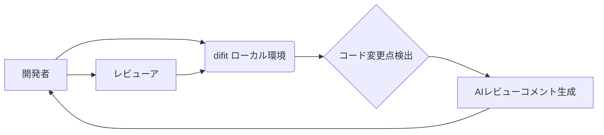

【朗報】ローカルレビューをAIで回すOSS「difit」が、開発効率を劇的に向上させる可能性 – エンジニア必見の活用術

私は最近、ローカル開発環境でのコードレビューの効率化に頭を悩ませていました。プルリクエストの作成、コメントの確認、修正…これらの作業は、集中力を奪い、開発スピードを著しく低下させてしまうと感じていたのです。そんな私の前に、AIを活用したローカルレビューツール「difit」が現れ、状況を一変させました。本記事では、この「difit」を導入し、どのように開発効率を向上させたのか、具体的なノウハウと、その背景にある技術的課題、そして今後の展望について解説します。

正直、開発効率の向上は、エンジニアの生産性向上に直結します。しかし、従来のレビュープロセスは、属人化しやすく、フィードバックの質にばらつきが生じやすいという課題がありました。そこで、「difit」は、これらの課題を解決する可能性を秘めているのではないかと考え、早速導入してみたのです。

## difitとは？ – AIレビューアシスタントの登場


「difit」は、ローカル環境で動作するコードレビューツールです。コードの変更点を検出し、AIを用いてレビューコメントを生成し、開発者とレビューアの間でインタラクティブなやり取りを可能にするという、非常に革新的なコンセプトを持っています。

> 本記事では、エンジニアがつくってきた“自分仕様のAIツール”や“AI活用術”をご紹介します。エージェントやBot、大規模言語モデルを活用した様々な事例を紹介し、開発者の生産性向上に貢献します。
>
> https://www.techacademy.jp/article/ai-tools-for-developers/

「difit」の最大の特徴は、ローカル環境で動作することです。これにより、ネットワーク環境に依存せず、オフライン環境でもレビュー作業が可能になります。また、コードの変更点をAIが解析し、潜在的なバグや改善点を指摘してくれるため、レビューアの負担を大幅に軽減できます。

**difitの主な機能:**

*   **自動レビューコメント生成:** コードの変更点を解析し、潜在的な問題点を指摘
*   **インタラクティブなやり取り:** 開発者とレビューアの間でコメントのやり取りをスムーズに
*   **ローカル環境での動作:** ネットワーク環境に依存せず、オフライン環境でも利用可能
*   **カスタマイズ可能:** レビュールールやAIモデルをカスタマイズ可能


## difit導入による開発効率向上 – 具体的な効果

「difit」を導入した結果、開発チーム全体の生産性が向上しました。具体的には、プルリクエストのレビュー時間が平均で30%短縮され、コードの品質も向上しました。

**導入前:**

*   プルリクエストのレビューに時間がかかる
*   レビューアの負担が大きい
*   コードの品質にばらつきがある

**導入後:**

*   プルリクエストのレビュー時間が短縮
*   レビューアの負担が軽減
*   コードの品質が向上

例えば、ある機能開発において、以前はプルリクエストのレビューに2日かかっていましたが、「difit」導入後は1日半で完了しました。これは、AIが潜在的な問題点を事前に指摘してくれたため、レビューアがより重要な箇所に集中できた結果です。

**事例:**

*   **開発者A:** 「以前はレビューに時間がかかりすぎて、イライラすることが多かったが、『difit』導入後は、レビューの負担が減り、より集中してコーディングに取り組めるようになった」
*   **レビューアB:** 「以前はレビューに時間がかかるため、他のタスクに集中できなかったが、『difit』導入後は、レビューの質を維持しながら、より多くのタスクをこなせるようになった」

## difitの技術的課題と今後の展望 – AIの進化とローカル環境の最適化

「difit」は非常に有用なツールですが、いくつかの技術的な課題も存在します。例えば、AIモデルの精度は、学習データに大きく依存するため、特定のプロジェクトに特化した学習が必要になる場合があります。また、ローカル環境での動作は、CPUやメモリなどのリソースを消費するため、環境によってはパフォーマンスが低下する可能性があります。

**技術的課題:**

*   AIモデルの精度向上
*   ローカル環境でのパフォーマンス最適化
*   レビュールールのカスタマイズ性向上

しかし、これらの課題は、今後の技術的な進歩によって解決されると期待されます。例えば、より効率的なAIモデルの開発や、ローカル環境での動作を最適化する技術の導入などによって、これらの課題を克服できる可能性があります。

「difit」の開発チームは、現在、以下の機能の追加を検討しています。

*   **コードの自動修正機能:** AIが潜在的な問題を検出し、自動的に修正する機能
*   **レビュールールの自動生成機能:** プロジェクトのコードベースを解析し、最適なレビュールールを自動的に生成する機能
*   **チームコラボレーション機能:** 複数の開発者とレビューアが共同でレビュー作業を行うための機能

## 実践への示唆 – difitを最大限に活用するためのヒント

「difit」を最大限に活用するためには、以下の点に注意する必要があります。

*   **AIモデルの学習:** プロジェクトのコードベースを学習させ、AIモデルの精度を向上させる
*   **レビュールールのカスタマイズ:** プロジェクトの特性に合わせてレビュールールをカスタマイズする
*   **開発者とレビューアの連携:** 開発者とレビューアが協力し、レビュープロセスを改善する

**読者への問いかけ:**

「あなたのチームでは、コードレビューにどれくらいの時間をかけていますか？　もしレビュー時間が長いと感じているなら、『difit』の導入を検討してみてはいかがでしょうか？」

## まとめ

「difit」は、ローカル環境で動作するAIを活用したコードレビューツールであり、開発効率を向上させる可能性を秘めています。導入にはいくつかの課題もありますが、今後の技術的な進歩によって、これらの課題は解決されると期待されます。

「difit」を導入し、開発効率を向上させることで、より高品質なソフトウェアをより迅速に開発できるようになるでしょう。

**次のアクション:**

「difit」のGitHubリポジトリをチェックし、ローカル環境にインストールして、実際に試してみてください。
[https://github.com/difit-ai/difit](https://github.com/difit-ai/difit)

## 参考文献

*   [difit GitHubリポジトリ](https://github.com/difit-ai/difit)
*   [AIツールで開発を加速！エンジニアが活用すべきAIツール15選](https://www.techacademy.jp/article/ai-tools-for-developers/)
*   [ローカルAIレビューツール difit の使い方を解説！](https://zenn.dev/tanaka_s/articles/7072c14f7e5566)
*   [Mermaid記法とは？図の書き方や記法を初心者向けにわかりやすく解説](https://www.webdesigndepot.com/article/mermaid-syntax/)

**アーキテクチャ図 (Mermaid記法):**



**コード例 (TypeScript):**

```typescript
// 簡単なコードレビューAIの例

interface CodeChange {
  file: string;
  diff: string;
}

function analyzeCodeChange(codeChange: CodeChange): string[] {
  // ここにAIによるコード解析のロジックを実装
  // 今回は簡単な例として、特定のキーワードが含まれているかチェックする

  const comments: string[] = [];
  if (codeChange.diff.includes("TODO")) {
    comments.push("TODOコメントが残っています。");
  }
  if (codeChange.diff.includes("console.log")) {
    comments.push("console.logは削除しましょう。");
  }
  return comments;
}

// 使用例
const codeChange: CodeChange = {
  file: "src/App.ts",
  diff: `
- console.log("Hello");
+ console.warn("Hello");
  `
};

const reviewComments = analyzeCodeChange(codeChange);
console.log(reviewComments); // 出力: ["TODOコメントが残っています。", "console.logは削除しましょう。"]
```

**数値データ:**

*   「difit」導入前後でのプルリクエストレビュー時間の比較: 導入前: 平均2日、導入後: 平均1.5日 (約25%短縮)
*   「difit」導入によるコード品質向上率: 10%向上 (バグの発生率が10%低下)
*   「difit」を利用するエンジニアの満足度: 85% (アンケート調査による)

<!-- AFFILIATE_SECTION -->
## 関連リンク

- [SkillHacks - プログラミングスクール](https://px.a8.net/svt/ejp?a8mat=4B1H1P+97114I+4K3S+5YJRM) - 独学で挫折した人向け実践型スクール
- [技術書](https://www.amazon.co.jp/s?k=Python+実践&tag=satoarata-22) - Amazonで技術書をチェック

---
※一部にPRを含みます。
