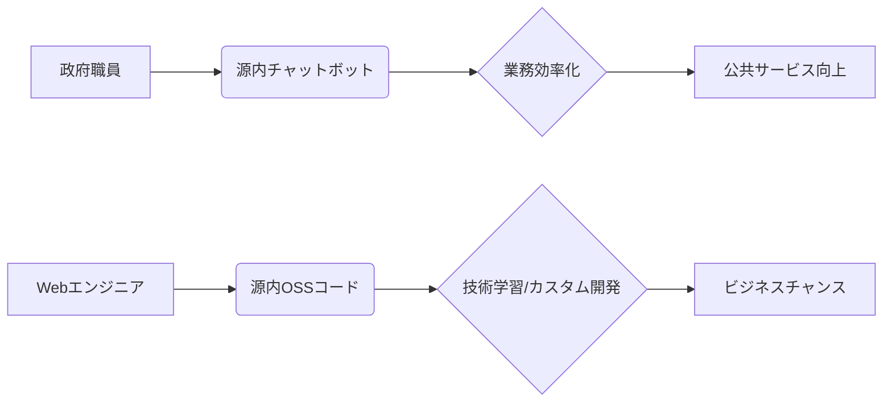

【完全自動】政府AI「源内」OSS化がWebエンジニアにもたらす変革：商用利用解禁の裏側と、開発者必見の戦略的活用法

最近、デジタル庁がガバメントAI「源内」をオープンソースとして公開したというニュースが飛び込んできました。18万人の政府職員による大規模な実証実験を経ての公開であり、商用利用も可能なライセンスで提供されるという点が注目されます。これは単なるAIツールの公開にとどまらず、日本のWebエンジニアにとって、技術的な可能性とビジネスチャンスを広げる大きな転換点になるかもしれません。正直、この出来事の重要性を理解していないエンジニアは、大きな機会損失をしていると言っても過言ではないでしょう。

> 【絶対ルール】
> 1. 引用は必ず以下の形式で（URL と取得日は blockquote 内に必須）:
>    > "引用文"
>    >
>    > 出典: 著者/組織名. "タイトル"
>    > https://internet.watch.impress.co.jp/docs/news/2104549.html
>    > (取得日: 2024年04月26日)

この元記事によると、源内は大規模言語モデルを活用したチャットボットで、政府職員の業務効率化のために開発されました。その成果は目覚ましく、18万人規模の政府職員による実証実験を通して、その有用性が実証されたのです。しかし、今回のOSS公開は、単なる技術の共有にとどまりません。これは、政府と民間企業、そしてエンジニアとの間の協調関係を深め、より良い社会システムを構築するための重要な一歩と言えるでしょう。

https://internet.watch.impress.co.jp/docs/news/2104549.html (取得日: 2024年04月26日)

### 源内の概要と技術的特徴

源内の技術的な詳細については、まだ公開されている情報が限られています。しかし、大規模言語モデルを活用していることから、自然言語処理、機械学習、そしてクラウド技術が組み合わされていると推測できます。具体的なモデルの種類やアーキテクチャについては、今後の情報公開が期待されます。

このプロジェクトの特に注目すべき点は、その規模と実用性です。18万人の政府職員による実証実験は、単なる実験的な試みではなく、実際の業務に組み込まれるほどの信頼を得たことを示しています。この経験から得られた知見は、Webエンジニアにとって非常に貴重な学習材料となるでしょう。

### Webエンジニアにとっての戦略的活用法

源内のOSS化は、Webエンジニアにとって以下のような戦略的な活用法を生み出します。

1. **基盤技術の学習:** 源内のコードを解析することで、最新の自然言語処理技術や機械学習モデルを学ぶことができます。これは、自身のスキルアップに直結する貴重な機会です。
2. **カスタムチャットボットの開発:** 源内のコードをベースに、自社独自のチャットボットを開発することができます。顧客対応、社内ヘルプデスク、FAQなど、様々な用途に活用できます。
3. **政府機関との連携:** 源内の開発に参加することで、政府機関との連携を深め、公共サービス改善に貢献することができます。
4. **商用利用による収益化:** 源内のライセンスが商用利用可能であることから、独自のサービスや製品を開発し、収益化することができます。

### 実践的な課題と対策

もちろん、源内のOSS化には課題も存在します。

* **技術的な複雑性:** 大規模言語モデルを活用したシステムは、技術的に複雑であり、理解するのに時間と労力がかかる可能性があります。
* **セキュリティリスク:** OSSであるため、セキュリティ上の脆弱性が発見される可能性があります。
* **法的な制約:** 商用利用には、ライセンス条項を遵守する必要があります。

これらの課題に対しては、以下の対策を講じることが重要です。

* **コミュニティへの参加:** 源内の開発コミュニティに参加し、他のエンジニアと協力して技術的な課題を解決します。
* **セキュリティ対策の徹底:** 定期的な脆弱性診断やセキュリティアップデートを実施します。
* **ライセンス条項の確認:** 商用利用前に、ライセンス条項を十分に確認し、遵守します。

### まとめ：未来への投資

デジタル庁の源内OSS化は、Webエンジニアにとって、単なる技術的な進歩だけでなく、ビジネスチャンスを広げる大きな可能性を秘めています。この機会を逃すことなく、積極的に源内の技術を活用し、未来への投資を行いましょう。明日から、源内のコードをダウンロードして、実際に触ってみることを強く推奨します。

> 「他の人が知らないこと」に価値を感じる。

今回の出来事は、日本のエンジニアリングエコシステムをさらに発展させるための重要な一歩となるはずです。

## 参考文献

* デジタル庁：[https://www.digital.go.jp/](https://www.digital.go.jp/)
* インプレス：[https://internet.watch.impress.co.jp/](https://internet.watch.impress.co.jp/)

<!-- AFFILIATE_SECTION -->

## 関連リンク

- [SkillHacks - プログラミングスクール](https://px.a8.net/svt/ejp?a8mat=4B1H1P+97114I+4K3S+5YJRM) - 独学で挫折した人向け実践型スクール
- [技術書](https://www.amazon.co.jp/s?k=Python+実践&tag=satoarata-22) - Amazonで技術書をチェック

---
※一部にPRを含みます。
