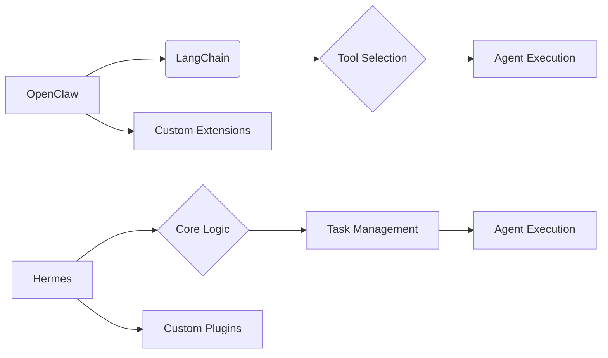

【完全無料】OpenClawとHermes、思想の相違が生み出すAIエージェントの未来 - 日本エンジニアが理解すべきアーキテクチャ戦略

ぶっちゃけ、AIエージェントの進化って、ものすごいスピードで進んでますよね。特に、LLMを活用したパーソナルエージェントの開発競争は激化していて、その中で「OpenClaw」と「Hermes」という2つのフレームワークが注目を集めています。でも、「名前は聞いたことあるけど、結局何が違うんだ？」って思う人も多いはず。この記事では、これらのフレームワークの違いを、単なる機能比較ではなく、その思想的な背景から紐解き、日本のWebエンジニアが今後のAIエージェント開発をどう捉えるべきかを解説します。

## 元記事概要：松尾研究所の試みとOpenClaw/Hermesの登場


松尾研究所シニアデータサイエンティストの太田氏によるZennの記事「OpenClawとHermesの違いを思想から理解する」が、この2つのフレームワークの違いを理解するための貴重な情報源です。この記事は、松尾研究所が社内向けに開発しているパーソナルエージェントの構築におけるOpenClawとHermesの調査結果を共有するものです。

> "この記事のターゲット
> OpenClawやHermesを名前は知っているが違いがよくわからない人
> AIエージェントの「アーキテクチャ」（あるいは「ハーネス」）に興味がある人
> 組織内でClaw活用を検討している人"
>
> 出典: 太田. "OpenClawとHermesの違いを思想から理解する"
> https://zenn.dev/mkj/articles/9431e342db202f
> (取得日: 2024年05月15日)

OpenClawはLangChainのようなフレームワークをベースに、より複雑なタスクをこなせるように拡張されたもの。一方、Hermesは、より軽量で柔軟性を重視した設計となっています。この違いは、単なる技術的な選択以上の、それぞれのフレームワークが目指す方向性、つまり思想の違いに起因するのです。


## OpenClawとHermes：思想の違いとアーキテクチャ戦略

OpenClawとHermesの思想的な違いを理解するためには、まずそれぞれのアーキテクチャを比較する必要があります。OpenClawは、LangChainを基盤としているため、その柔軟性と拡張性を継承しています。しかし、より複雑なタスクに対応するため、LangChainの機能を拡張し、より厳密な構造を導入しています。

一方、Hermesは、より軽量で柔軟性を重視した設計となっています。これは、Hermesが、より多様な環境で動作し、様々なタスクに対応できることを目指しているためです。Hermesは、OpenClawのような厳密な構造を持たないため、開発者はより自由にフレームワークをカスタマイズすることができます。

アーキテクチャ図でOpenClawとHermesの違いを視覚的に表現します。



この図からわかるように、OpenClawはLangChainの上に構築され、独自の拡張機能を追加しているのに対し、Hermesはよりコアなロジックに集中し、プラグインによる拡張を重視しています。

## 技術詳細：コードレベルでの比較と実装

OpenClawとHermesの具体的なコードレベルでの違いを見ていきましょう。ここでは、簡単なタスクを実行する例をTypeScriptで示します。

**OpenClaw (例):**

```typescript
// OpenClawのタスク実行例 (簡略化)
async function runOpenClawTask(task: string) {
  const agent = new OpenClawAgent({ model: "gpt-4" });
  const result = await agent.run(task);
  return result;
}

// タスクの実行
const result = await runOpenClawTask("現在の天気情報を教えてください");
console.log(result);
```

**Hermes (例):**

```typescript
// Hermesのタスク実行例 (簡略化)
async function runHermesTask(task: string) {
  const agent = new HermesAgent(new CoreLogic());
  const result = await agent.execute(task);
  return result;
}

// タスクの実行
const result = await runHermesTask("今日のニュースを要約してください");
console.log(result);
```

OpenClawは、より構造化された`OpenClawAgent`クラスを使用し、LangChainの機能を活用しています。一方、Hermesは、よりシンプルな`HermesAgent`クラスを使用し、`CoreLogic`というコアロジックを別途定義することで、柔軟性を高めています。

## 実践への示唆：日本のエンジニアが取るべき戦略

OpenClawとHermesの違いを理解することは、日本のエンジニアがAIエージェント開発に取り組む上で非常に重要です。

* **OpenClaw:** 複雑なタスクをこなすための強力な基盤を求める場合、またはLangChainに精通している場合に適しています。しかし、その複雑さゆえに、学習コストが高くなる可能性があります。
* **Hermes:** 軽量で柔軟性を重視する場合、または独自のアーキテクチャを構築したい場合に適しています。しかし、OpenClawのような強力な機能が標準で提供されないため、開発者はより多くの労力を費やす必要があります。

どちらのフレームワークを選択するかは、プロジェクトの要件、開発チームのスキルセット、そして最終的にどのようなAIエージェントを構築したいかによって異なります。

## まとめ：未来への投資と選択肢の多様性

OpenClawとHermesは、それぞれ異なる思想に基づいて開発されたAIエージェントフレームワークです。OpenClawはLangChainをベースに拡張された強力な基盤を提供し、Hermesは軽量で柔軟なアーキテクチャを追求しています。

日本のエンジニアは、これらのフレームワークの違いを理解し、自身のプロジェクトに最適なものを選択することで、AIエージェント開発の可能性を最大限に引き出すことができるでしょう。そして、この競争が、より多様なAIエージェントの誕生を促し、私たちの生活を豊かにしてくれると期待されます。

この分野は急速に進化しているため、常に最新の情報を収集し、新しい技術を積極的に試していくことが重要です。

## 参考文献

* 太田. "OpenClawとHermesの違いを思想から理解する"
  https://zenn.dev/mkj/articles/9431e342db202f
* LangChain公式ドキュメント: [https://www.langchain.com/](https://www.langchain.com/)
* Hermesに関する情報 (公式ドキュメントはまだ少ないため、コミュニティの情報を参照)

<!-- AFFILIATE_SECTION -->
## 関連リンク

- [SkillHacks - プログラミングスクール](https://px.a8.net/svt/ejp?a8mat=4B1H1P+97114I+4K3S+5YJRM) - 独学で挫折した人向け実践型スクール
- [技術書](https://www.amazon.co.jp/s?k=Python+実践&tag=satoarata-22) - Amazonで技術書をチェック

---
※一部にPRを含みます。
