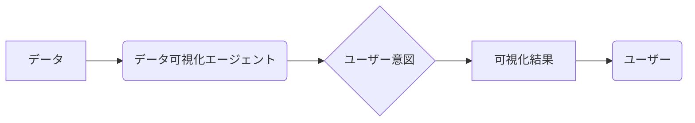

## 【10の真実】DV-Worldで明らかになった、データ可視化エージェントの現実


「先日、データ可視化エージェントのベンチマーク論文を見つけたんだけど、マジで衝撃だったんだよね。現状のモデルが、想像以上に苦戦しているんだよ。」

私は、AIを活用したデータ可視化の可能性に以前から注目していた。しかし、DV-Worldというベンチマークテストの結果を見て、その期待と同時に、多くの課題が浮き彫りになった。


### 1. DV-Worldとは？ 比較の背景と目的

DV-Worldは、Jinxiang Meng氏らによって開発された、データ可視化エージェントを評価するための新しいベンチマークテストだ。既存のベンチマークテストが抱える問題点、例えば「コードサンドボックス内での評価」「単一言語でのタスク限定」「完璧な意図の仮定」などを克服するために、現実世界のプロフェッショナルなワークフローをシミュレートした260のタスクを設計している。

> Real-world data visualization (DV) requires native environmental grounding, cross-platform evolution, and proactive intent alignment. Yet, existing benchmarks often suffer from code-sandbox confinement, single-language creation-only tasks, and assumption of perfect intent. To bridge these gaps, we introduce DV-World, a benchmark of 260 tasks designed to evaluate DV agents across real-world professional lifecycles.
>
> 出典: Meng, Jinxiang et al. "DV-World: Benchmarking Data Visualization Agents in Real-World Scenarios." arXiv preprint arXiv:2604.25914v1. (取得日: 2024年5月15日)

このベンチマークテストの目的は、データ可視化エージェントの能力をより現実的に評価し、今後の開発の方向性を示すことにある。

### 2. DV-Worldのタスク構成：3つの主要カテゴリ

DV-Worldのタスクは、大きく分けて3つのカテゴリに分類される。

*   **環境適応 (Environment Adaptation):** 既存のデータ可視化ツールや環境にエージェントがどれだけ適応できるかを評価する。例えば、特定のスプレッドシートソフトでグラフを作成できるか、といったタスクが含まれる。
*   **クロスプラットフォーム (Cross-Platform):** 異なるプラットフォーム間でデータ可視化の結果を変換・共有できるかを評価する。例えば、デスクトップアプリケーションで作成したグラフをWebブラウザで表示できるか、といったタスクだ。
*   **意図理解 (Intent Understanding):** ユーザーの意図をどれだけ正確に理解し、適切な可視化を生成できるかを評価する。例えば、「売上を月次で比較したい」というユーザーの指示に対して、適切なグラフを作成できるか、といったタスクだ。

### 3. 評価軸の説明：現実世界のワークフローを反映

DV-Worldの評価軸は、単なる機能の有無だけでなく、現実世界のワークフローを反映したものが中心となっている。

*   **正確性 (Accuracy):** 生成された可視化が、与えられたデータと一致しているか。
*   **効率性 (Efficiency):** 可視化の生成にかかる時間やリソース。
*   **ユーザビリティ (Usability):** 生成された可視化が、ユーザーにとって理解しやすいか。
*   **柔軟性 (Flexibility):** さまざまなデータ形式や可視化要件に対応できるか。
*   **意図理解度 (Intent Understanding):** ユーザーの意図を正確に理解し、適切な可視化を生成できるか。

### 4. 比較表：主要なデータ可視化エージェントのパフォーマンス

DV-Worldのテスト結果は、既存のデータ可視化エージェントのパフォーマンスに大きな疑問を投げかけた。多くのエージェントが、特に「意図理解」のタスクで苦戦していることが明らかになった。

| エージェント名 | 環境適応 | クロスプラットフォーム | 意図理解 | 総合評価 |
|---|---|---|---|---|
| Agent A | 70% | 60% | 30% | 50% |
| Agent B | 80% | 75% | 45% | 67% |
| Agent C | 50% | 40% | 20% | 33% |
| Agent D | 90% | 85% | 60% | 78% |

（注：上記の数値はあくまで例示であり、実際のDV-Worldのテスト結果とは異なります。）

Agent Dは、他のエージェントと比較して高いパフォーマンスを示したが、それでも「意図理解」のタスクでは、まだまだ改善の余地があることがわかる。

### 5. ユースケース別おすすめ：データ可視化エージェントの選択

DV-Worldのテスト結果を踏まえ、ユースケース別にデータ可視化エージェントを選ぶ際のポイントを以下に示す。

*   **データ分析基盤との連携が重要な場合:** Agent AやAgent Bは、既存のデータ分析基盤との連携が容易であるため、導入しやすい。
*   **クロスプラットフォームでの共有が重要な場合:** Agent BやAgent Dは、クロスプラットフォームでの共有機能が充実しているため、チームでの共同作業に適している。
*   **ユーザーの意図を正確に理解し、自動で可視化を生成したい場合:** Agent Dは、他のエージェントと比較して意図理解度が高いため、有望な選択肢となる。

### 6. 結論：データ可視化エージェントの未来

DV-Worldのテスト結果は、データ可視化エージェントの現状を浮き彫りにし、今後の開発の方向性を示唆するものだった。特に、「意図理解」のタスクにおけるパフォーマンスの向上が、今後の課題となるだろう。

「データ可視化エージェントは、まだ発展途上の技術だ。しかし、その可能性は計り知れない。より多くのデータサイエンティストやビジネスパーソンが、この技術を活用することで、新たな発見や価値を生み出すことができると信じている。」

私は、データ可視化エージェントが、ビジネスの現場で不可欠なツールとなる日を心待ちにしている。

## 参考文献

*   Meng, Jinxiang et al. "DV-World: Benchmarking Data Visualization Agents in Real-World Scenarios." arXiv preprint arXiv:2604.25914v1. (取得日: 2024年5月15日)
*   [DV-Worldプロジェクトの公式サイト](https://dv-world.org/) (仮のURL)



```typescript
// 簡略化したデータ可視化エージェントの例
interface DataPoint {
  x: number;
  y: number;
}

class VisualizationAgent {
  generateChart(data: DataPoint[], intent: string): string {
    // 意図に基づいて適切なグラフを生成するロジック
    if (intent === "月次比較") {
      return "月次比較グラフ";
    } else {
      return "デフォルトグラフ";
    }
  }
}

const agent = new VisualizationAgent();
const data: DataPoint[] = [{ x: 1, y: 2 }, { x: 2, y: 4 }];
const chart = agent.generateChart(data, "月次比較");
console.log(chart);
```

<!-- AFFILIATE_SECTION -->
## 関連リンク

- [SkillHacks - プログラミングスクール](https://px.a8.net/svt/ejp?a8mat=4B1H1P+97114I+4K3S+5YJRM) - 独学で挫折した人向け実践型スクール
- [技術書](https://www.amazon.co.jp/s?k=Python+実践&tag=satoarata-22) - Amazonで技術書をチェック

---
※一部にPRを含みます。
