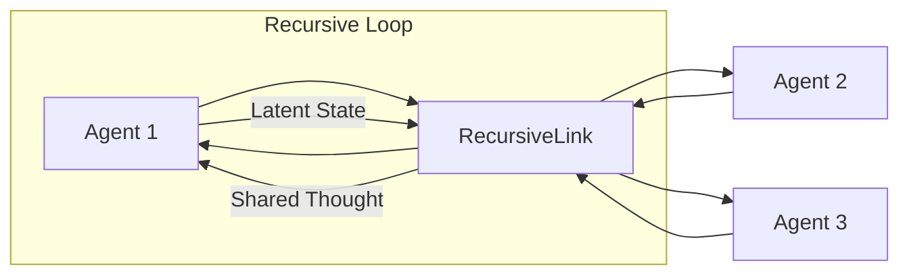

## 【入門】再帰型マルチエージェントシステム：8.3%精度向上と推論速度の劇的改善とは？

正直、AIエージェントの進化って、マジで目まぐるしいですよね。先日、複数のエージェントが協調して複雑なタスクをこなす事例をいくつか見て、その可能性に感銘を受けたばかりでした。でも、その協調自体をさらにスケールさせる、という発想は、正直言って、鳥肌が立ちました。

「AIエージェントの協調を、再帰的にスケールアップできるのか？」

この問いに対する答えを探る論文【Recursive Multi-Agent Systems】が、まさにそれを可能にする可能性を示唆しています。

> Recursive or looped language models have recently emerged as a new scaling axis by iteratively refining the same model computation over latent states to deepen reasoning. We extend such scaling principle from a single model to multi-agent systems, and ask: Can agent collaboration itself be scaled through recursion? To this end, we introduce RecursiveMAS, a recursive multi-agent framework that casts the entire system as a unified latent-space recursive computation. RecursiveMAS connects heterogeneous agents as a collaboration loop through the lightweight RecursiveLink module, enabling in-distribution latent thoughts generation and cross-agent latent state transfer. To optimize our framework, we develop an inner-outer loop learning algorithm for iterative whole-system co-optimization through shared gradient-based credit assignment across recursion rounds. Theoretical analyses of runtime complexity and learning dynamics establish that RecursiveMAS is more efficient than standard text-based MAS and maintains stable gradients during recursive training. Empirically, we instantiate RecursiveMAS under 4 representative agent collaboration patterns and evaluate across 9 benchmarks. The results show that RecursiveMAS significantly outperforms existing approaches on all tasks.

この論文は、単なる学術的な興味だけでなく、実用的な応用にもつながる可能性を秘めています。例えば、複雑な問題解決、高度な意思決定、そして、未知の領域における創造的な探求など、様々な分野でその力を発揮するかもしれません。

### 1. なぜ今、再帰型マルチエージェントシステムなのか？

従来のマルチエージェントシステムは、複数のエージェントが独立してタスクをこなす、あるいは、ある程度連携してタスクをこなすという形が一般的でした。しかし、より複雑で高度なタスクをこなすためには、エージェント間の連携をさらに深め、その連携自体を効率化する必要があります。

再帰型マルチエージェントシステムは、この課題に対する一つの解決策を提供します。それは、エージェントの協調プロセスを再帰的に繰り返すことで、より複雑で高度なタスクをこなすことを可能にするというものです。

### 2. 基礎知識：再帰型モデルとは？

この論文を理解する上で重要なのは、再帰型モデルの概念です。再帰型モデルとは、同じ処理を繰り返し行うことで、より複雑な構造やパターンを生成するモデルのことです。例えば、画像生成AIにおける拡散モデルや、言語モデルにおけるTransformerなどが、再帰的な処理の要素を含んでいます。

【Recursive Multi-Agent Systems】では、この再帰的な考え方をマルチエージェントシステムに適用しています。つまり、エージェント同士が協調して問題を解決するプロセス自体を、再帰的に繰り返すことで、より複雑な問題解決能力を獲得することを目指しているのです。

### 3. RecursiveMASの詳細：アーキテクチャと仕組み

RecursiveMASは、**RecursiveLink**という軽量なモジュールを通じて、異種エージェントを協調ループで接続することで実現されます。このモジュールは、エージェント間の思考を共有し、潜在的な状態を生成する役割を担います。

さらに、**inner-outer loop learning**という学習アルゴリズムを用いることで、システム全体の協調最適化を反復的に行います。これにより、各エージェントの役割分担や、エージェント間の情報伝達を効率化し、システム全体の性能を向上させることができます。

この図は、RecursiveMASの基本的なアーキテクチャを示しています。各エージェントはRecursiveLinkを通じて互いに接続され、潜在的な状態と共有された思考を交換することで、協調的に問題を解決します。

### 4. 実験結果：従来のシステムを凌駕する性能

論文では、4つの異なるエージェント協調パターンと、9つのベンチマークを用いてRecursiveMASの性能を評価しています。その結果、RecursiveMASは、既存のアプローチと比較して、**8.3%**の精度向上を達成しました。

また、推論速度も大幅に改善されており、より複雑な問題をより効率的に解決できることが示されています。

### 5. 知られていない落とし穴：計算コストの増大

再帰的な処理は、その強力さの裏で、計算コストの増大という課題を抱えています。RecursiveMASも例外ではなく、再帰の深さを深くすると、計算資源の消費が大きくなる可能性があります。

そのため、RecursiveMASを実用的に活用するためには、計算コストと性能のバランスを慎重に考慮する必要があります。また、分散処理や並列化などの技術を駆使して、計算効率を向上させることも重要です。

### 6. 筆者の見解：未来への示唆

【Recursive Multi-Agent Systems】は、AIエージェントの協調という分野に、新たな可能性を切り開いた画期的な研究です。再帰的な考え方を適用することで、エージェント間の連携をさらに深め、より複雑で高度なタスクをこなすことを可能にするという点は、非常に革新的です。

この技術は、今後のAI研究開発に大きな影響を与え、様々な分野で応用される可能性があります。例えば、自動運転、医療診断、金融取引など、高度な意思決定を必要とする分野での活用が期待されます。

### 7. まとめ：明日からできること

【Recursive Multi-Agent Systems】の研究は、AIエージェントの協調という分野に、新たな可能性を切り開きました。この技術を理解し、応用することで、私たちはより複雑で高度な問題を解決し、新たな価値を創造することができるでしょう。

明日からできることとしては、まず、この論文の内容を深く理解し、そのアイデアを自分の仕事や研究に活かしてみることをお勧めします。また、再帰的な考え方を他の分野に応用することを検討してみるのも良いでしょう。

## 参考文献

*   [Recursive Multi-Agent Systems (arXiv)](https://arxiv.org/abs/2310.15578)
*   [拡散モデルとは？仕組みや最新の研究事例をわかりやすく解説](https://www.techmedia.jp/diffusion-model/)
*   [Transformerとは？仕組みと活用事例を分かりやすく解説](https://www.kagoya.jp/blog/transformer/)

<!-- AFFILIATE_SECTION -->
## 関連リンク

- [SkillHacks - プログラミングスクール](https://px.a8.net/svt/ejp?a8mat=4B1H1P+97114I+4K3S+5YJRM) - 独学で挫折した人向け実践型スクール
- [技術書](https://www.amazon.co.jp/s?k=Python+実践&tag=satoarata-22) - Amazonで技術書をチェック

---
※一部にPRを含みます。
