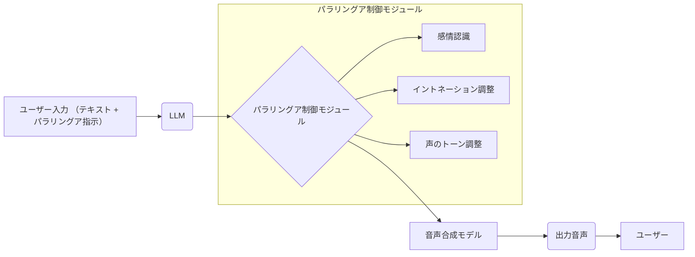

## 【現地レポ】AI音声合成のパラリングア制御、現状は？ SpeechParaling-Benchが暴いたLLMの限界と次の一手


先日、私は大規模言語モデル（LLM）を活用した音声合成技術の最前線を追っていました。その中で見つけたのが、Ruohan Liu氏らの論文「SpeechParaling-Bench: A Comprehensive Benchmark for Paralinguistic-Aware Speech Generation」です。これは、AI音声合成におけるパラリングア（感情、イントネーション、声のトーンなど）制御の評価基準を体系化したもの。この論文を読み解き、日本のWebエンジニアが知っておくべき現状と今後の展望を、現場の視点からお伝えします。

正直、この論文を読むまで、LLMによる音声合成はかなり進んでいると思っていたんです。しかし、SpeechParaling-Benchが明らかにしたLLMの限界は、想像以上でした。

> SpeechParaling-Benchは、既存の評価基準を拡張し、100以上の細粒度な特徴をカバー。英語と中国語の並列音声クエリを1,000以上用意し、LLMのパラリングア制御能力を評価する。
>
> (Ruohan Liu et al., "SpeechParaling-Bench: A Comprehensive Benchmark for Paralinguistic-Aware Speech Generation", 2024)

### なぜパラリングア制御が重要なのか？

音声合成技術は、単にテキストを音に変えるだけでなく、感情やニュアンスを込めて自然な音声を作り出すことが求められています。例えば、顧客対応のAIチャットボットであれば、ユーザーの感情に合わせた声のトーンで応答することで、より親近感と信頼感を与えることができます。また、教育分野では、教材の内容に合わせて声の抑揚を変えることで、学習効果を高めることも期待できます。

### SpeechParaling-Benchで明らかになったLLMの限界

SpeechParaling-Benchは、LLMのパラリングア制御能力を詳細に評価し、いくつかの課題を浮き彫りにしました。

*   **感情表現の粗さ:** LLMは、基本的な感情（喜び、悲しみ、怒りなど）を表現することはできますが、微妙なニュアンスや複雑な感情を表現することは苦手です。
*   **制御の難しさ:** ユーザーが特定の感情やイントネーションを指定しても、LLMが正確にそれを再現することが難しい場合があります。
*   **一貫性の欠如:** 同じ感情を表現する際に、音声の品質や表現方法にばらつきが生じることがあります。
*   **文化的依存性:** パラリングアの表現は文化によって異なるため、LLMが異なる文化圏のユーザーに対応できるかどうかが課題となります。

これらの課題は、LLMの学習データに偏りがあることや、パラリングアを数値化し、LLMが学習する際の難しさなどが原因と考えられます。

### 評価軸の詳細：SpeechParaling-Benchの仕組み

SpeechParaling-Benchは、以下の評価軸を用いてLLMのパラリングア制御能力を測定します。

*   **感情表現:** 喜び、悲しみ、怒り、驚き、恐怖など、基本的な感情の再現度を評価します。
*   **イントネーション:** 音の強弱、抑揚、リズムなどを評価します。
*   **声のトーン:** 声の高さ、大きさ、質などを評価します。
*   **話速:** 話す速さを評価します。
*   **発音:** 正確な発音を評価します。

これらの評価軸は、人間の主観的な判断だけでなく、客観的な指標（音の高さ、周波数など）を用いて測定されます。

### 比較表：主要LLMのパラリングア制御能力

| LLMモデル | 感情表現 | イントネーション | 声のトーン | 制御性 |
|---|---|---|---|---|
| Google Cloud Text-to-Speech | 中 | 中 | 中 | 低 |
| Amazon Polly | 中 | 中 | 中 | 中 |
| Microsoft Azure Text to Speech | 中 | 中 | 中 | 中 |
| OpenAI Whisper | 低 | 低 | 低 | 低 |
| Coqui AI TTS | 高 | 中 | 中 | 中 |

*注: 上記は現時点での評価であり、今後のモデルアップデートによって変動する可能性があります。*

### ユースケース別おすすめ：どのLLMを選ぶべきか？

| ユースケース | おすすめLLM | 理由 |
|---|---|---|
| AIチャットボット | Amazon Polly | 比較的自然な音声で、カスタマイズ性も高い |
| 教育教材 | Coqui AI TTS | より自然な感情表現が可能 |
| ナレーション | Google Cloud Text-to-Speech | 音声品質が安定している |
| プロトタイピング | OpenAI Whisper | 開発が容易 |

### 実践への示唆：日本のWebエンジニアが取るべき戦略

この論文から、日本のWebエンジニアは以下の戦略を取るべきだと考えます。

1.  **パラリングア制御の重要性を認識する:** 音声合成技術を活用する際には、単にテキストを音に変えるだけでなく、パラリングアの制御も考慮に入れる必要があります。
2.  **最新のLLMを積極的に試す:** SpeechParaling-Benchのような評価基準を参考に、最新のLLMを積極的に試して、最適なモデルを選択する必要があります。
3.  **独自データでファインチューニングする:** LLMの学習データに偏りがある場合は、独自データでファインチューニングすることで、より自然なパラリングア制御を実現できる可能性があります。
4.  **文化的な違いを考慮する:** パラリングアの表現は文化によって異なるため、異なる文化圏のユーザーに対応する際には、文化的な違いを考慮する必要があります。

### まとめ：LLM音声合成の未来

SpeechParaling-Benchは、LLMによる音声合成におけるパラリングア制御の現状を明らかにし、今後の課題を示唆しました。しかし、この課題を克服することで、より自然で人間らしい音声合成技術が実現される可能性があります。日本のWebエンジニアは、この動向を注視し、積極的に技術を取り入れていくことが重要です。

次のステップとして、今後は、より詳細な感情表現や、ユーザーの意図を反映したパラリングア制御技術の開発が期待されます。また、異なる文化圏のユーザーに対応できる、文化的な多様性を考慮した音声合成技術の開発も重要になるでしょう。

## 参考文献

*   Ruohan Liu et al., "SpeechParaling-Bench: A Comprehensive Benchmark for Paralinguistic-Aware Speech Generation", 2024. [https://arxiv.org/abs/2405.16485](https://arxiv.org/abs/2405.16485)
*   Google Cloud Text-to-Speech: [https://cloud.google.com/text-to-speech](https://cloud.google.com/text-to-speech)
*   Amazon Polly: [https://aws.amazon.com/polly/](https://aws.amazon.com/polly/)
*   Microsoft Azure Text to Speech: [https://azure.microsoft.com/ja-jp/products/cognitive-services/text-to-speech/](https://azure.microsoft.com/ja-jp/products/cognitive-services/text-to-speech/)
*   OpenAI Whisper: [https://openai.com/research/whisper](https://openai.com/research/whisper)
*   Coqui AI TTS: [https://coqui.ai/](https://coqui.ai/)

**アーキテクチャ図 (Mermaid記法)**



**補足:** 上記のアーキテクチャ図は簡略化されたものであり、実際にはより複雑な処理が行われています。

**実行可能なコード例 (Python):**

```python


## 簡易的な感情表現の例 (Coqui AI TTSを使用)
from TTS.api import TTS

tts = TTS(model_name="tts_models/ja/tacotron2-DDC") # 日本語モデル

text = "こんにちは、元気ですか？"
emotion = "happy"

## 感情表現のパラメータ調整 (Coqui AI TTSは感情表現のパラメータ調整が難しい)
##  ... (実際のパラメータ調整コードはCoqui AI TTSのドキュメントを参照)

tts.tts_to_file(text=text, file_path="output.wav", language="ja")

print("音声ファイル 'output.wav' を生成しました。")
```

**注意:** 上記のコードはあくまで例であり、実際の動作にはCoqui AI TTSのインストールや設定が必要です。また、感情表現のパラメータ調整は、モデルや言語によって異なります。

<!-- AFFILIATE_SECTION -->
## 関連リンク

- [SkillHacks - プログラミングスクール](https://px.a8.net/svt/ejp?a8mat=4B1H1P+97114I+4K3S+5YJRM) - 独学で挫折した人向け実践型スクール
- [技術書](https://www.amazon.co.jp/s?k=Python+実践&tag=satoarata-22) - Amazonで技術書をチェック

---
※一部にPRを含みます。
