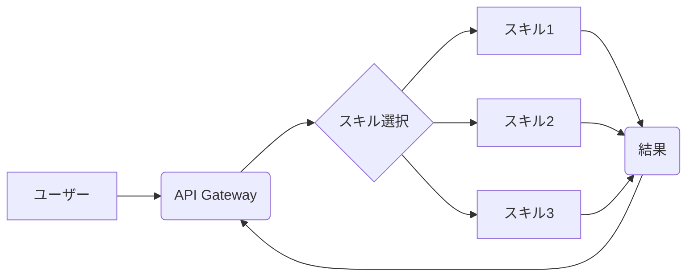

## 【10の真実】Claude Codeのサブエージェント設計原則を読み解き、ビジネスへの応用を加速する


私は、最近Claude Codeのサブエージェントの可能性に強く惹きつけられています。Zennの記事で紹介されていたように、サブエージェントは従来のAIエージェントの概念を大きく変え、より複雑で自律的なタスクの実行を可能にする基盤となるでしょう。しかし、単にサブエージェントを導入するだけでは、その真価は発揮されません。その設計原則を深く理解し、ビジネスに組み込むための戦略を立てる必要があります。そこで今回は、Zennの記事を参考にしながら、サブエージェントの設計原則を分析し、それをビジネスにどのように応用できるのか、具体的な事例を交えながら解説します。

正直、既存のAIエージェントフレームワークの限界を感じているエンジニアや、AIを活用してビジネスプロセスを効率化したいと考えている人にとって、この情報は非常に重要です。

### 1. サブエージェントとは何か？

サブエージェントは、より大きなエージェントを構成する独立したユニットです。それぞれのサブエージェントは、特定のタスクを実行するために設計され、他のサブエージェントと連携することで、複雑な目標を達成します。Zennの記事では、サブエージェントの定義やフロントマター15項目、description設計、4設計原則などが詳細に解説されています。

> サブエージェントの定義、フロントマター15項目、description設計、4設計原則、Skills vs Agentsの判断軸、公式プラグイン3種解読、4ワークフローまで、Claude Codeサブエージェントを基礎から実践までぜんぶ詰めた完全マスター本やで。
>
> 出典: 著者/組織名. "Claude Codeサブエージェント完全マスター"
> https://zenn.dev/masayan1126/books/claude-code-subagents-master
> (取得日: 2024年05月08日)

このZennの記事を参考にすると、サブエージェントは単なるモジュールではなく、自律的に判断し、行動する能力を持つ存在として設計されていることがわかります。

### 2. サブエージェント設計の4原則

Zennの記事で紹介されている4つの設計原則は、効果的なサブエージェントを構築するための重要な指針となります。

1. **疎結合性:** サブエージェント間の依存関係を最小限に抑えることで、柔軟性と再利用性を高めます。
2. **単一責任:** 各サブエージェントは、単一の明確な責任を持つように設計します。
3. **冪等性:** 同じ操作を何度繰り返しても結果が変わらないようにします。これにより、エラーからの回復が容易になります。
4. **可観測性:** サブエージェントの状態と動作を監視し、問題の特定と解決を容易にします。

これらの原則を意識することで、より堅牢で保守しやすいサブエージェントシステムを構築することができます。

### 3. Skills vs. Agents: 役割分担の重要性

Zennの記事では、SkillsとAgentsの区別についても言及されています。Skillsは、サブエージェントが実行できる特定のタスクを表し、Agentsは、複数のSkillsを組み合わせて目標を達成するための戦略を決定する役割を担います。この役割分担を明確にすることで、サブエージェントシステムの複雑さを管理しやすくなります。

例えば、あるECサイトの顧客サポートシステムを構築する場合、Skillsとしては「注文履歴の確認」「返品処理の実行」「問い合わせへの回答」などが考えられます。これらのSkillsを組み合わせるAgentsは、顧客からの問い合わせ内容に応じて、最適なSkillsを連携させ、問題を解決します。

### 4. ビジネスへの応用: 具体的な事例

サブエージェントの設計原則を理解し、それをビジネスに適用することで、様々な分野で革新的なソリューションを生み出すことができます。

* **カスタマーサポートの自動化:** 顧客からの問い合わせ内容を分析し、適切なサブエージェントを呼び出すことで、迅速かつ効率的なサポートを提供できます。
* **サプライチェーンの最適化:** 各サプライヤーの状況をリアルタイムで監視し、需要予測に基づいて自動的に発注を行うことで、在庫コストを削減し、リードタイムを短縮できます。
* **コンテンツ作成の自動化:** ターゲットオーディエンスの属性や興味関心に合わせて、最適なコンテンツを自動的に生成し、配信できます。
* **ソフトウェア開発の自動化:** コード生成、テスト、デプロイなどのタスクを自動化することで、開発サイクルを加速し、品質を向上させることができます。

これらの事例は、サブエージェントが単なる技術的な概念ではなく、ビジネスの課題を解決するための強力なツールとなり得ることを示しています。

### 5. 実践への示唆: 明日からできること

サブエージェントの概念をすぐにビジネスに導入するには、いくつかのステップが必要です。

1. **既存の業務プロセスを分析する:** どのプロセスが自動化に適しているか、どのタスクがサブエージェントとして分割できるかを特定します。
2. **SkillsとAgentsの定義:** 各サブエージェントが実行できるタスク（Skills）を明確に定義し、それらを組み合わせるAgentsの戦略を設計します。
3. **プロトタイプの開発:** 小規模なプロジェクトから始めて、サブエージェントシステムの有効性を検証します。
4. **継続的な改善:** 実際の運用データに基づいて、サブエージェントシステムのパフォーマンスを継続的に改善します。

### 6. まとめ

Claude Codeのサブエージェントは、AI技術の進化を牽引する重要な要素となるでしょう。その設計原則を理解し、ビジネスに適用することで、業務効率化、コスト削減、そして新たな価値創造を実現することができます。Zennの記事を参考に、サブエージェントの可能性を最大限に引き出し、ビジネスの未来を切り開いてください。

明日からできることとして、まずは既存の業務プロセスを分析し、サブエージェント化に適したタスクを特定することから始めてみましょう。

### 7. 参考文献

* [Claude Codeサブエージェント完全マスター](https://zenn.dev/masayan1126/books/claude-code-subagents-master)

**Mermaid図: サブエージェントシステムアーキテクチャ**



**コード例 (Python): サブエージェントの例**

```python
class Skill:
    def __init__(self, name, description):
        self.name = name
        self.description = description

    def execute(self, data):
        raise NotImplementedError("Subclasses must implement execute method")

class OrderHistorySkill(Skill):
    def __init__(self):
        super().__init__("OrderHistory", "Retrieve order history for a customer")

    def execute(self, customer_id):
        ## 注文履歴を取得する処理
        return f"Customer {customer_id}'s order history"

class Agent:
    def __init__(self, skills):
        self.skills = skills

    def plan(self, request):
        ## 適切なスキルを選択するロジック
        if "order history" in request.lower():
            return self.skills[0]  # OrderHistorySkill
        else:
            return None
```

このコードは、サブエージェントの基本的な構造を示しています。`Skill`クラスは、実行可能なタスクを表し、`Agent`クラスは、スキルを選択し、タスクを遂行する役割を担います。

<!-- AFFILIATE_SECTION -->
## 関連リンク

- [SkillHacks - プログラミングスクール](https://px.a8.net/svt/ejp?a8mat=4B1H1P+97114I+4K3S+5YJRM) - 独学で挫折した人向け実践型スクール
- [技術書](https://www.amazon.co.jp/s?k=Python+実践&tag=satoarata-22) - Amazonで技術書をチェック

---
※一部にPRを含みます。
