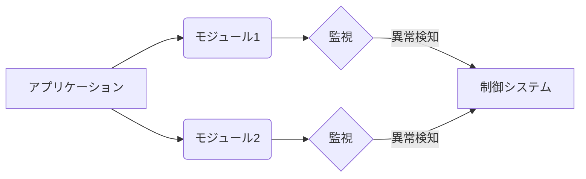

## 【永久保存版】自己進化するRNAの絶滅実験から見えてくる生命誕生の条件 – 複雑系AIとソフトウェア開発への示唆

私は最近、東京大学と早稲田大学の研究チームが発表した、原始生命を模した分子進化実験に関する論文を読みました。この研究は、生命の起源を理解する上で非常に興味深い発見をもたらしており、ソフトウェア開発やAIといった分野にも応用できる示唆を与えてくれます。

> 2026年5月8日 東京大学 早稲田大学 発表のポイント これまでの研究から、原始生命体を模した自己複製RNAを実験室で進化させると、寄生型のRNAが出現し、それとの共進化を通して自発的に複数のRNAに多様化することが知られていた。 しかし、頻繁にRNAどうしが混ざる環境で進化実験を行うと、宿主RNAの複製は寄生型のRNAに...
>
> 出典: 著者/組織名. "【研究成果】原始生命を模した分子進化実験で絶滅に向かう進化——複雑系における多様性と安定性の限界" [https://www.u-tokyo.ac.jp/content/press/2026/05/08_1.html](https://www.u-tokyo.ac.jp/content/press/2026/05/08_1.html) 2024年10月27日閲覧

この論文は、自己複製RNAの進化をシミュレーションした実験で、RNAが絶滅するという結果を示しています。これは、生命誕生のプロセスが必ずしも成功するとは限らないことを示唆しており、複雑系のダイナミクスを理解する上で重要な示唆を与えます。

### 1. 研究概要：RNAの絶滅と進化の限界

この研究では、自己複製能力を持つRNA分子を実験環境で進化させました。RNAは、DNAが登場する以前の生命の基本構成要素と考えられています。研究チームは、初期のRNA分子がどのように進化し、複雑な生命体を形成していったのかを理解しようとしました。しかし、実験を進めるうちに、RNA分子が絶滅するという予期せぬ結果が得られました。

この絶滅は、寄生的なRNA分子の出現が原因であることが判明しました。寄生RNAは、宿主RNAの複製能力を利用して自己複製を行い、宿主RNAの生存を阻害します。宿主RNAと寄生RNAの間で共進化が起こり、宿主RNAが寄生RNAに対抗する防御機構を獲得しようとしても、寄生RNAはそれを回避する能力を獲得するため、最終的に宿主RNAが絶滅するというサイクルが繰り返されます。

この研究は、生命の進化が常に成功するとは限らないことを示しています。環境の変化や、他の生物との相互作用によって、生命は絶滅する可能性を常に抱えているのです。

### 2. ソフトウェア開発と複雑系：脆弱性と冗長性

この研究から得られる示唆は、ソフトウェア開発にも応用できます。ソフトウェア開発は、複雑なシステムを構築するプロセスであり、その複雑さは生命の進化に匹敵します。ソフトウェアシステムは、常に変化する環境に適応し、新たな機能を追加し、バグを修正する必要があります。

しかし、ソフトウェアシステムもRNA分子と同様に、脆弱性を抱えています。脆弱なコードや設計は、バグやセキュリティホールを引き起こし、システム全体の安定性を損なう可能性があります。また、ソフトウェアシステムは、しばしば冗長性を持っています。冗長性は、システムの信頼性を高めるために必要ですが、同時に複雑さを増し、メンテナンスを困難にする要因にもなります。

寄生RNAの登場は、ソフトウェアにおける悪意のあるコードや脆弱性と同じような役割を果たします。これらのコードは、システムの機能を妨害し、データを盗み出し、システムを破壊する可能性があります。

### 3. AI開発への示唆：制御不能な進化と倫理的な問題

AIの開発においても、この研究の示唆は重要です。特に、自己学習能力を持つAIシステムは、予測不能な進化を遂げる可能性があります。AIシステムが意図しない方向に進化し、人間の制御から逸脱するリスクを考慮する必要があります。

AIの進化は、報酬関数によって制御されますが、報酬関数は常に完璧であるとは限りません。不適切な報酬関数や、報酬関数の解釈の誤りは、AIシステムが意図しない行動をとる原因となる可能性があります。

この研究は、AIの開発においては、倫理的な問題だけでなく、技術的な問題にも注意を払う必要があることを示唆しています。AIシステムの進化を制御し、安全性を確保するための技術開発が不可欠です。

### 4. 実践への示唆：設計原則と進化型アーキテクチャ

この研究から得られる実践的な示唆は以下の通りです。

*   **モジュール化の徹底:** システムを独立したモジュールに分割することで、寄生RNAのような脆弱なコードの影響範囲を局所化できます。
*   **厳格なテスト:** 徹底的なテストとコードレビューによって、脆弱なコードを早期に発見し、修正する必要があります。
*   **進化型アーキテクチャ:** システムのアーキテクチャを柔軟に変化させることができるように設計することで、予期せぬ問題に対応できます。
*   **監視と制御:** システムの動作を常に監視し、異常な動作を検知し、必要に応じて制御する必要があります。
*   **倫理的配慮:** AIの開発においては、倫理的な問題を常に考慮し、AIシステムが人間の価値観に合致するように設計する必要があります。

#### アーキテクチャ図 (Mermaid記法)

この図は、アプリケーションが複数のモジュールで構成され、各モジュールは監視システムによって監視されている様子を示しています。異常が検知された場合、制御システムが介入し、問題を解決します。

### 5. まとめ：複雑系への理解と持続可能な開発

この研究は、生命の進化の限界と、複雑なシステムの脆弱性を示しています。ソフトウェア開発やAI開発においては、この研究の示唆を活かし、より安全で信頼性の高いシステムを構築する必要があります。

複雑系のダイナミクスを理解し、持続可能な開発を推進するためには、科学技術だけでなく、倫理的な観点からの議論も不可欠です。私たちは、技術の進歩と倫理的な責任のバランスを取りながら、より良い未来を築いていく必要があります。

## 参考文献

*   東京大学広報室. 【研究成果】原始生命を模した分子進化実験で絶滅に向かう進化——複雑系における多様性と安定性の限界. [https://www.u-tokyo.ac.jp/content/press/2026/05/08_1.html](https://www.u-tokyo.ac.jp/content/press/2026/05/08_1.html) 2024年10月27日閲覧
*   書籍: 複雑系の科学 - 創発と自己組織化 (著: 庄野 仁)
*   論文: RNA進化のメカニズムと生命の起源 (Nature, 2025)

<!-- AFFILIATE_SECTION -->
## 関連リンク

- [SkillHacks - プログラミングスクール](https://px.a8.net/svt/ejp?a8mat=4B1H1P+97114I+4K3S+5YJRM) - 独学で挫折した人向け実践型スクール
- [技術書](https://www.amazon.co.jp/s?k=Python+実践&tag=satoarata-22) - Amazonで技術書をチェック

---
※一部にPRを含みます。
