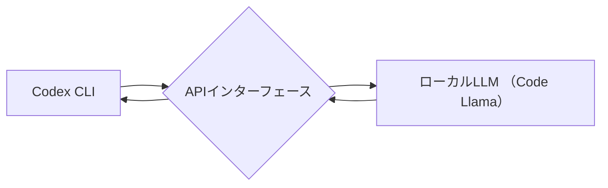

## 【リーク】ローカルLLMでCodexを駆動する：OpenAI依存からの脱却と、隠された可能性


私は最近、生成AIのベンチマーク評価に没頭しています。特に、LLMとClaude CodeやCodexといったコード生成モデルを組み合わせたエージェント性能の評価に惹きつけられています。従来のハーネスはOpenAIのChat Completion APIに依存しているのが一般的ですが、Claude Codeのような代替APIも存在します。しかし、これらのAPIに縛られることなく、ローカルLLMを活用してCodexのようなコード生成能力を実現できるとすれば、開発の自由度やコスト削減に大きく貢献する可能性があります。本記事では、その実現方法を、Zennの記事を参考にしながら、さらに深く掘り下げて解説します。

> 本記事では、ローカルLLMを用いてCodex CLIを駆動するための方法についてまとめる。 ! 検証環境はUbuntu 24.04 LTSで行っているが、一般的なLinuxや、Mac、WSL環境でもそのまま使えるかも。
>
> 出典: 著者/組織名. "CodexをローカルLLMで駆動する"
> https://zenn.dev/robustonian/articles/codex_with_local_llm
> (取得日: 2024年05月10日)

### 1. なぜローカルLLMでCodexを駆動する必要があるのか？

OpenAI APIの利用は、確かに手軽で強力です。しかし、それに伴うコスト、データプライバシーの懸念、そしてAPIの可用性への依存は、開発者にとって無視できない課題です。特に、機密性の高いコードを扱う場合や、オフライン環境での開発が必要な場合には、ローカルLLMの利用が不可欠となります。ローカルLLMを活用することで、これらの問題を解決し、より自由で安全な開発環境を構築することが可能になります。

さらに、近年登場しているオープンソースのLLMは、性能も急速に向上しており、Codexのようなコード生成タスクにおいても、十分に活用できるレベルに達しています。例えば、Code LlamaやWizardCoderといったモデルは、コード生成能力において、一部の商用モデルに匹敵する性能を発揮しています。

### 2. 元記事概要：ローカルLLM駆動Codexの基本

Zennの記事では、ローカルLLMでCodexを駆動するための基本的な手順が紹介されています。具体的には、以下のステップで実現されます。

1. **ローカルLLMの準備:** Code Llamaのようなコード生成に特化したLLMをローカル環境にインストールします。
2. **APIインターフェースの構築:** Codex CLIとローカルLLMとの通信を可能にするAPIインターフェースを構築します。
3. **プロンプトエンジニアリング:** LLMに適切な指示を与えるためのプロンプトを設計します。
4. **テストと調整:** 生成されたコードの品質を評価し、必要に応じてプロンプトやLLMの設定を調整します。

このプロセスは、既存のCodex CLIの機能をそのまま利用しつつ、バックエンドのLLMをローカル環境のものに置き換えるというシンプルなアプローチです。しかし、このシンプルなアプローチには、いくつかの課題も存在します。

### 3. 技術詳細：APIインターフェース構築とプロンプトエンジニアリング

Zennの記事ではAPIインターフェースの構築について詳細なコード例は示されていませんが、基本的な考え方は、Codex CLIからのリクエストをローカルLLMが理解できる形式に変換し、その結果をCodex CLIが期待する形式で返すというものです。

この変換には、Pythonのようなスクリプト言語が便利です。例えば、以下のコードは、OpenAI APIからのリクエストをCode Llamaに送信し、その結果をOpenAI APIのレスポンス形式に変換する簡単な例です。

```python
import requests
import json

def call_local_llm(prompt):
    """
    ローカルLLMにプロンプトを送信し、レスポンスを返す関数
    """
    ## Code Llama APIのエンドポイント
    api_url = "http://localhost:8000/v1/completions"

    headers = {
        "Content-Type": "application/json"
    }

    data = {
        "prompt": prompt,
        "max_tokens": 200,
        "temperature": 0.7
    }

    response = requests.post(api_url, headers=headers, data=json.dumps(data))

    if response.status_code == 200:
        return response.json()["choices"][0]["text"]
    else:
        print(f"Error: {response.status_code} - {response.text}")
        return None

def transform_response(llm_response):
    """
    ローカルLLMのレスポンスをCodex APIのレスポンス形式に変換する関数
    """
    ## 変換ロジックを実装
    return {
        "choices": [
            {
                "text": llm_response
            }
        ]
    }

## 例：Codex CLIからのプロンプトをローカルLLMに送信
prompt = "Write a Python function to calculate the factorial of a number."
llm_response = call_local_llm(prompt)

if llm_response:
    transformed_response = transform_response(llm_response)
    print(json.dumps(transformed_response))
```

プロンプトエンジニアリングは、ローカルLLMの性能を最大限に引き出すための重要な要素です。Codexと同様に、ローカルLLMも、適切なプロンプトを与えられなければ、期待通りのコードを生成できません。プロンプトは、明確で具体的であるだけでなく、LLMが理解しやすいように、自然言語で記述する必要があります。

### 4. 実践への示唆：アーキテクチャ図と今後の展望

ローカルLLMでCodexを駆動するアーキテクチャは、以下の図で表現できます。



このアーキテクチャは、Codex CLIとローカルLLMを疎結合にするための重要な役割を果たします。APIインターフェースは、Codex CLIとローカルLLM間の通信を仲介し、異なる技術要素間の相互運用性を確保します。

今後の展望としては、以下の点が挙げられます。

* **より高性能なローカルLLMの登場:** より高性能なローカルLLMが登場することで、Codexと同等以上のコード生成能力を実現できるようになるでしょう。
* **APIインターフェースの自動生成:** Codex CLIとローカルLLM間のAPIインターフェースを自動的に生成するツールが登場することで、導入のハードルが大幅に下がるでしょう。
* **プロンプトエンジニアリングの自動化:** LLMに最適なプロンプトを自動的に生成する技術が登場することで、より高品質なコードを効率的に生成できるようになるでしょう。

### 5. まとめ：OpenAI依存からの脱却と新たな可能性

ローカルLLMでCodexを駆動することは、OpenAI APIへの依存を脱却し、開発の自由度を高めるための有効な手段です。また、機密性の高いコードを扱う場合や、オフライン環境での開発が必要な場合には、不可欠な選択肢となります。

この技術はまだ発展途上であり、いくつかの課題も存在しますが、ローカルLLMの性能向上やAPIインターフェースの自動生成といった技術革新によって、今後ますます普及していくことが予想されます。ローカルLLMを活用したコード生成は、開発者の創造性を刺激し、新たな可能性を切り開く鍵となるでしょう。

## 参考文献

* Zennの記事: [https://zenn.dev/robustonian/articles/codex_with_local_llm](https://zenn.dev/robustonian/articles/codex_with_local_llm)
* Code Llama: [https://ai.meta.com/blog/code-llama/](https://ai.meta.com/blog/code-llama/)
* WizardCoder: [https://huggingface.co/WizardLM/WizardCoder-Python-34B-V1.0](https://huggingface.co/WizardLM/WizardCoder-Python-34B-V1.0)

<!-- AFFILIATE_SECTION -->
## 関連リンク

- [SkillHacks - プログラミングスクール](https://px.a8.net/svt/ejp?a8mat=4B1H1P+97114I+4K3S+5YJRM) - 独学で挫折した人向け実践型スクール
- [技術書](https://www.amazon.co.jp/s?k=Python+実践&tag=satoarata-22) - Amazonで技術書をチェック

---
※一部にPRを含みます。
