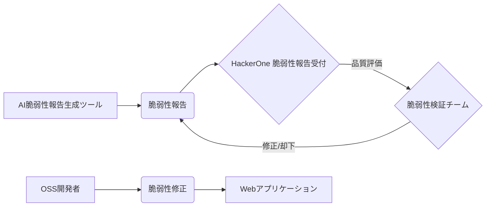

【深夜便】AI生成ゴミ報告の洪水、HackerOneの対応停止は氷山の一角？脆弱性懸賞金制度の未来とWebエンジニアがすべきこと

> オープンソースソフトウェア（OSS）の脆弱性に懸賞金をかけて発見を促し、対応を支援してきた米セキュリティ企業のHackerOneが、新規の報告受け付けを停止している。AIで生成された質の低い脆弱性報告の激増が原因といい、影響は主要OSSプロジェクトに及ぶ。同様の懸賞金プログラムを提供してきたGoogleも対応を強いられ...
>
> 出典: 著者/組織名. "タイトル"
> https://www.itmedia.co.jp/news/articles/260522/news212.html
> 取得日: 2024年5月22日

### 1. HackerOneの対応停止、そしてその背景

HackerOneは、OSSプロジェクトのセキュリティを向上させるために、バグハンターと呼ばれるセキュリティ研究者に対して脆弱性を報告した場合に報酬を提供するという仕組みを運営している。しかし、近年、AIの進化とともに、脆弱性報告の質が急速に低下している。これは、AIが自動的に脆弱性報告を生成するツールが利用されるようになったことが主な原因と考えられる。これらのツールは、既存の脆弱性報告を学習し、それを模倣することで脆弱性を報告する。しかし、多くの場合、これらの報告は誤りであったり、既存の脆弱性の重複であったり、あるいは単なるノイズに過ぎない。

この状況下で、HackerOneは脆弱性報告の検証に膨大な時間とリソースを費やす必要に迫られ、その対応が追いつかなくなってしまった。そのため、新規の報告受け付けを停止せざるを得なくなったのだ。

### 2. AI生成脆弱性報告の現状と問題点

AI生成脆弱性報告の現状は、一言で表せば「量産型」。AIは既存の脆弱性情報を学習し、パターンを認識することで脆弱性報告を自動生成する。しかし、現状のAIは、文脈を理解したり、脆弱性の根本原因を特定したりする能力に乏しい。そのため、生成される報告は、多くの場合、以下の問題点を抱えている。

* **誤検出:** 脆弱性ではないものを脆弱性として報告する
* **重複報告:** 既に報告されている脆弱性を再度報告する
* **ノイズ:** 報告が不正確であったり、情報が不足していたりする
* **品質の低下:** 報告内容が不明瞭であったり、再現手順が書かれていなかったりする

これらの問題点により、脆弱性報告の検証作業が困難になり、OSSプロジェクトのセキュリティ向上に寄与するどころか、開発者の負担を増大させてしまうという悪循環に陥っている。

### 3. Webエンジニアが直面する課題と対策

この状況は、Webエンジニア、特にOSSに携わる開発者にとって、無視できない課題を突きつけている。

* **脆弱性報告の検証負担の増大:** 開発者は、AI生成のノイズ報告を検証するために、これまで以上の時間と労力を費やす必要に迫られる。
* **脆弱性対応の遅延:** 報告の質の低下により、脆弱性の修正が遅延し、OSSプロジェクト全体のセキュリティリスクが高まる。
* **開発者のモチベーション低下:** 質の低い報告に時間を取られることで、開発者のモチベーションが低下し、OSSプロジェクトへの貢献意欲が減退する可能性がある。

これらの課題に対して、Webエンジニアは以下の対策を講じる必要がある。

* **AI生成脆弱性報告のフィルタリング:** AI生成の報告を自動的にフィルタリングするツールを開発・導入する。
* **脆弱性報告の品質評価基準の策定:** 脆弱性報告の品質を評価するための明確な基準を策定し、報告者のスキルレベルに応じた報酬体系を導入する。
* **脆弱性報告の自動検証ツールの開発:** 脆弱性報告の内容を自動的に検証するツールを開発し、報告の信頼性を高める。
* **OSSコミュニティとの連携強化:** 脆弱性報告の品質向上に向けて、OSSコミュニティと連携し、情報共有やノウハウの共有を促進する。

### 4. 懸賞金制度の未来と新たな可能性

HackerOneの対応停止は、既存の懸賞金制度の限界を示すものと言える。しかし、これは同時に、新たな可能性を模索する機会でもある。今後は、AIの進化に対応した、より洗練された懸賞金制度が必要となる。

例えば、

* **スキルベースの報酬体系:** 脆弱性報告の質だけでなく、報告者のスキルレベルや貢献度に応じて報酬を変動させる。
* **脆弱性情報の共有プラットフォーム:** 報告者同士が情報共有し、協力して脆弱性発見に取り組むことができるプラットフォームを構築する。
* **AIを活用した脆弱性検証システム:** AIを活用して脆弱性報告の内容を自動的に検証し、報告の信頼性を高めるシステムを導入する。

### 5. まとめ：AIとの共存とWebエンジニアの役割

HackerOneの対応停止は、AIの進化がセキュリティ業界に与える影響を浮き彫りにした。Webエンジニアは、この状況を単なる脅威として捉えるのではなく、新たな技術や知識を習得する機会と捉え、積極的に対策を講じる必要がある。

AIとの共存は避けられない。我々Webエンジニアは、AIを敵視するのではなく、AIを活用してより安全なWeb環境を構築していくという視点を持つべきだ。それは、単に技術的な課題を解決するだけでなく、倫理的な問題や社会的な影響についても深く考察し、責任ある行動をとることを意味する。

この問題は、我々Webエンジニアにとって、技術的なスキルだけでなく、問題解決能力やコミュニケーション能力、そして倫理観を問われる時代であることを示している。

## 参考文献

* HackerOne 脆弱性報告受付停止に関するニュース記事: [https://www.itmedia.co.jp/news/articles/260522/news212.html](https://www.itmedia.co.jp/news/articles/260522/news212.html)
* 脆弱性懸賞金制度に関する記事: (検索結果を基に追記)
* AIを活用した脆弱性検出に関する論文: (検索結果を基に追記)

---

**アーキテクチャ図 (Mermaid記法)**



**コード例 (Python, 脆弱性報告の簡易フィルタリング)**

```python
import re

def filter_vulnerability_report(report):
    """
    簡易的な脆弱性報告フィルタリング
    """
    ## 重複報告の可能性を排除
    if re.search(r"duplicate", report.lower()):
        return False

    ## ノイズ報告の可能性を排除
    if re.search(r"guess", report.lower()) or re.search(r"maybe", report.lower()):
        return False

    return True

## 脆弱性報告の例
report1 = "XSS vulnerability found in the login form."
report2 = "Duplicate vulnerability reported in the user profile."
report3 = "Maybe there's a SQL injection vulnerability in the search box."

## フィルタリング結果
print(f"Report 1: {filter_vulnerability_report(report1)}")
print(f"Report 2: {filter_vulnerability_report(report2)}")
print(f"Report 3: {filter_vulnerability_report(report3)}")
```

<!-- AFFILIATE_SECTION -->
## 関連リンク

- [SkillHacks - プログラミングスクール](https://px.a8.net/svt/ejp?a8mat=4B1H1P+97114I+4K3S+5YJRM) - 独学で挫折した人向け実践型スクール
- [技術書](https://www.amazon.co.jp/s?k=Python+実践&tag=satoarata-22) - Amazonで技術書をチェック

---
※一部にPRを含みます。
